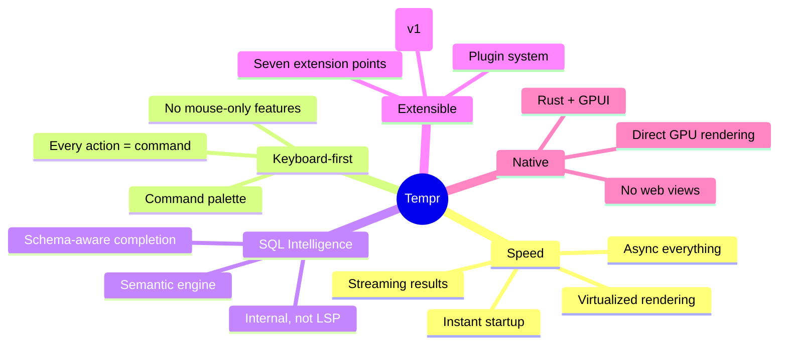
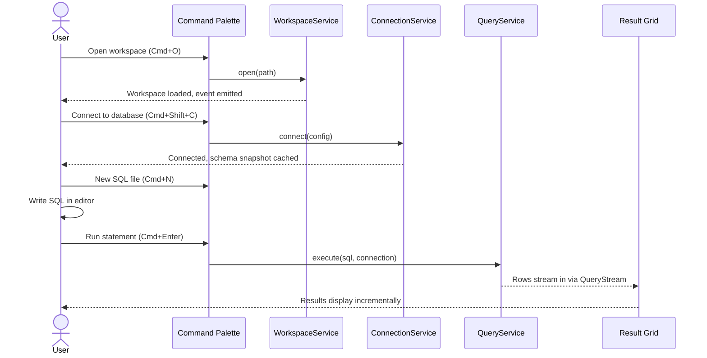

# Vision

## Purpose

Tempr exists because no current database IDE combines native performance with a keyboard-first, developer-centric workflow. The database tooling landscape is dominated by Electron-based applications (DBeaver, Beekeeper), JVM-based suites (DataGrip, DBeaver Community), and mouse-driven GUIs that treat SQL as an afterthought. Developers who live in Zed, Vim, or terminal environments have no database IDE that meets their expectations for speed, keyboard accessibility, and extensibility.

Tempr fills this gap: a native Rust Database IDE that pairs Zed's speed, UX, and keyboard-first philosophy with DataGrip's deep SQL intelligence.

## Responsibilities

This document governs:

- Product identity and positioning ("Zed + DataGrip", not "DBeaver rewritten in Rust")
- Target user definition
- Product pillars that all downstream architecture decisions serve
- Non-goals that constrain scope
- Product invariants that no other document may violate

## Design Rationale

### Why Zed as the UX North Star

Zed demonstrated that a text editor can be simultaneously fast, beautiful, and keyboard-first — without Electron. Its command palette culture, modal editing philosophy, and instant responsiveness set the standard for developer tools. Tempr adopts these principles because database work is fundamentally text-based: writing SQL, navigating schemas, inspecting results. The interaction model is closer to editing than to browsing.

### Why DataGrip as the Intelligence North Star

DataGrip proved that deep SQL intelligence — schema-aware completion, statement-level execution, refactoring — transforms database productivity. Its completion engine understands table aliases, CTEs, and column types. Tempr takes this intelligence further by building it as an internal semantic engine rather than an external process, eliminating latency and enabling richer context.

### Why Not DBeaver

DBeaver is a capable, universal database tool. It is also Electron-based, mouse-driven, and designed for administration rather than developer workflow. Tempr is explicitly not a DBA administration suite. We optimize for the developer who writes SQL daily, not the administrator who manages database instances.

## Product Pillars

### Speed

Performance is a product feature, not an engineering metric. Tempr must start instantly, respond to every keystroke without delay, stream query results as they arrive, and maintain a low memory footprint even with large schemas. All I/O is async. All rendering is virtualized. Background tasks never block the UI thread. The startup budget is strict: no synchronous I/O before the first frame renders except the workspace manifest.

### Keyboard-First

Every action in Tempr is available through a command. The command palette is not a fallback — it is the primary navigation mechanism. Mouse interaction is supported but never required. Every interactive element must be keyboard-reachable. Actions triggered by mouse always have a keyboard equivalent registered as a `Command`. This pillar drives the `CommandService` architecture and the palette-first UX.

### SQL Intelligence

Tempr's completion engine understands SQL semantics, not just syntax. It resolves table aliases, tracks CTE scope, expands star expressions, and provides type-aware completions — all from an in-memory catalog cache, never by querying the database at completion time. The engine is built internally, not as an external LSP, to eliminate process-boundary latency and enable direct access to the workspace's semantic context.

### Extensibility

Everything in Tempr is extensible through a plugin system: database drivers, completion providers, themes, commands, panels, result renderers, and AI providers. Core features are implemented as static plugins using the same API, ensuring the plugin surface is battle-tested and designed for real use. The plugin model is registration-based: plugins hand capabilities to the host, never receiving direct access to the service registry.

### Native

Tempr is built with Rust and GPUI. There is no web view, no Electron shell, no managed runtime. Native compilation delivers instant startup, minimal memory overhead, and direct GPU access for rendering. The Rust-only constraint means no FFI boundaries for UI, no GC pauses, and a single toolchain across the entire stack. GPUI provides GPU-accelerated, retained-mode rendering with the flexibility of immediate-mode composition.

## Interfaces

### Product Invariants

These are non-negotiable constraints that every architecture document must respect:

- **No blocking the UI thread.** All I/O, computation exceeding trivial cost, and database operations run on async runtimes. The main thread renders and dispatches events.
- **No feature reachable only by mouse.** Every user action must be expressible as a `Command` with a keybinding. The command palette lists all available actions.
- **No business logic in UI components.** Views call services. Services contain logic. Services publish events. Views subscribe to events. This separation is absolute.
- **No synchronous database calls during completion.** The semantic engine works exclusively from cached schema data. This is a hard real-time constraint (< 5 ms budget).
- **No external processes for intelligence.** No LSP server, no sidecar, no JSON-RPC hop. The semantic engine runs in-process.
- **No non-Rust plugins at v1.** Plugin authors write Rust crates. Dynamic loading (WASM, dylib) is a future consideration.
- **No workspace data leaves the machine without explicit user action.** No telemetry, no cloud sync, no phoning home. Workspaces are local files.

## Data Flow

### Primary User Journey

The canonical user journey that validates every architecture decision:

## Future Considerations

- **Additional databases:** MySQL, SQLite, and other engines via the driver abstraction layer
- **Plugin marketplace:** community-contributed plugins, themes, and drivers
- **Collaboration features:** real-time multi-cursor editing of SQL files (inspired by Zed's collaboration)
- **AI-assisted SQL:** natural language to SQL conversion, query optimization suggestions
- **Cross-platform packaging:** Linux (.deb, .rpm, AppImage), macOS (.dmg, Homebrew), Windows (MSI, Scoop)

## Open Questions

- **Name and branding:** "Tempr" is a working name. Final branding, logo, and domain need selection before any public visibility.
- **License choice:** AGPL, GPL, or MIT/Apache dual license? The license affects plugin ecosystem viability and community adoption.
- **Telemetry policy:** Even anonymized usage telemetry requires explicit opt-in and transparency. The policy must be defined before any release.
- **Beta program:** Closed alpha → open beta timeline and channel strategy.

## Related Documents

- [Software Architecture](02-architecture.md) — how the pillars translate to system structure
- [Roadmap](16-roadmap.md) — phased delivery plan
- [ADR-0001](adr/0001-gpui-for-ui.md) — GPUI selection rationale
- [ADR-0002](adr/0002-rust-only.md) — Rust-only constraint rationale
