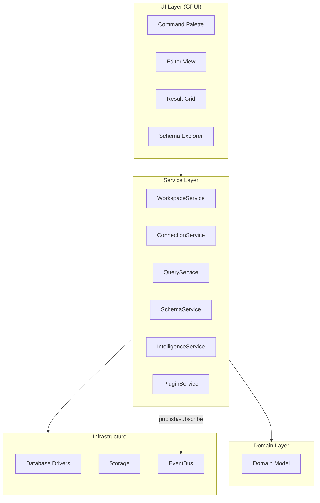
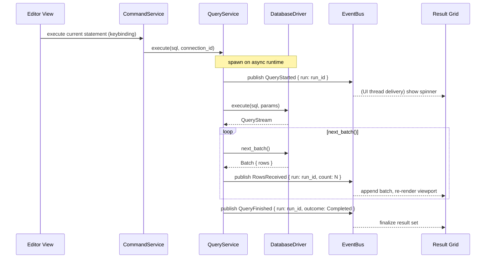

# Software Architecture

## Purpose

This document is the single top-level view of the Tempr system. It defines the layer boundaries, the dependency rule, and the service/event topology that every other architecture document and every implementation crate must respect. All lower-level documents (domain model, services, event system, GPUI, project layout) inherit their constraints from this one.

## Responsibilities

- Define the four system layers and their responsibilities: **UI (GPUI views)**, **Services**, **Domain**, and **Infrastructure**.
- Enforce the **dependency rule**: dependencies point downward only. The UI layer may depend on Services; Services may depend on Domain and Infrastructure; Domain has no dependencies on any other layer. **No business logic ever lives inside UI components.** This separation is absolute — it is the single most important architectural invariant in the system.
- Own the canonical list of services (detailed in [05-services.md](05-services.md)): `WorkspaceService`, `ConnectionService`, `QueryService`, `SchemaService`, `IntelligenceService`, `HistoryService`, `CommandService`, `PluginService`, `SettingsService`, `LayoutService`.
- Define the event-driven communication pattern: services publish and subscribe to events through the `EventBus`; UI components subscribe to events to update their state; services never call UI code directly.
- Establish the threading model: the GPUI main thread owns rendering and event dispatch; async runtimes own I/O and computation.

## Design Rationale

### Why Service-Oriented + Event-Driven

A service-oriented architecture with an internal event bus was chosen for three reasons:

1. **Testability without UI.** Services are plain `Send + Sync` Rust structs with `async` methods. They can be constructed, wired together, and tested in a synchronous or multi-threaded test harness without instantiating a single GPUI `App` or `Window`. Event-driven communication between services means a test can subscribe to events and assert outcomes without mocking views.

2. **Plugin extensibility.** The plugin system (see [08-plugin-api.md](08-plugin-api.md)) allows third-party code to register new services, drivers, completion providers, and result renderers. A service registry with trait-based contracts means plugins can be slotted into the architecture without modifying core code. The event bus gives plugins a natural integration surface: they publish and subscribe to the same `AppEvent` enum as core services.

3. **Decoupling.** Services communicate through events rather than direct calls wherever possible. A `QueryService` that publishes `QueryStarted`, `RowsReceived`, and `QueryFinished` events does not know (or care) which subscribers consume them — the `HistoryService` records them, the `ResultGrid` renders them, the `StatusBar` displays progress. Adding a new subscriber requires no changes to the publishing service.

### Why Not a Flat Monolith

A flat monolith — all logic in a single crate, views calling into shared state directly — is simpler to start but impossible to test, reason about, or extend. The brief's product pillars (speed, keyboard-first, SQL intelligence, extensibility, native) demand a system where:

- A new database driver can be added by implementing a trait and registering it (no editing of query execution logic).
- The completion engine can be tested against cached schema data without a running database or a visible UI.
- A plugin can contribute a command without touching the command palette implementation.

The upfront cost of layering pays for itself at the first integration test and every time a plugin is loaded.

### Why Not an Actor Framework (Actix, Riker, etc.)

Actor frameworks provide strong isolation and message-passing discipline, but they introduce complexity that Tempr does not need:

- **Lifecycle overhead.** Actor supervision, restart strategies, and mailbox backpressure add ceremony without benefit for a desktop application where services share a process and a single event bus.
- **Type erasure.** Messages in actor systems are typically `Box<dyn Any>` or similar, losing compile-time type safety. Tempr's `AppEvent` enum provides exhaustive match checking and clear documentation of the event surface.
- **Testing friction.** Actor-based tests require message channels, timeouts, and eventual-assertion patterns. Service methods returning `Result<T, E>` are testable with straightforward `assert_eq!` calls.

Services in Tempr are plain `Arc<T>` structs with `async` methods. They share the `EventBus` for publish/subscribe communication and call each other directly for request/response patterns (e.g., `QueryService` calls `ConnectionService` to borrow a connection). This gives the decoupling of events where it matters and the simplicity of direct calls where it does not.

### Contrast with Zed's GPUI Architecture

Zed's GPUI applications (the editor itself, the terminal, the assistant panel) typically organize around a single `Workspace` entity that owns child views (panes, panels) and a set of global models shared through `AppContext::global()`. Zed does not have an explicit service layer or a top-level event bus — views communicate through model handles and direct method calls on shared entities.

Tempr diverges from this pattern intentionally:

- **Explicit service layer.** Zed's implicit architecture works well for a text editor where the domain is well-understood and bounded. Tempr's domain spans database connections, query execution, schema caching, plugin lifecycle, and SQL intelligence — concerns that benefit from named, testable service boundaries.
- **Event bus for cross-cutting concerns.** Zed uses `Model::subscribe` for view-to-model observation. Tempr adds a system-wide `EventBus` so that a single event (e.g., `QueryFinished`) can fan out to history, grid, status bar, and plugins without wiring each pair explicitly.
- **Service registry over globals.** Instead of `AppContext::global::<MyService>()`, Tempr uses a `ServiceRegistry` that enforces lifecycle order and provides a single entry point for dependency resolution. This matters for plugin isolation: a plugin never accesses `ServiceRegistry` directly; it receives a scoped `PluginContext` with only the registration handles it needs.

The GPUI view layer in Tempr follows Zed's patterns closely — views are stateless shells that render from immutable snapshots, update state through subscriptions, and delegate logic to services.

## Interfaces

### Layer Diagram



### Service Contract

Every service is registered in the `ServiceRegistry` at application startup. The `Service` trait defines the minimal contract:

```rust
/// Every service is registered and discoverable by typed handle.
pub trait Service: 'static + Send + Sync {
    fn name(&self) -> &'static str;
}

/// Central registry constructed at startup. Services never call UI;
/// UI calls services; services emit events through the EventBus.
pub struct ServiceRegistry { /* ... */ }

impl ServiceRegistry {
    pub fn register<T: Service>(&self, service: Arc<T>);

    /// Panics if T is not registered — this is a startup-time programming
    /// error, not a runtime recovery scenario.
    pub fn get<T: Service>(&self) -> Arc<T>;
}
```

Services are constructed in dependency order during startup (see [05-services.md](05-services.md) for the exact sequence). The registry is populated before the first GPUI window opens.

### Event Bus Contract

Events are the backbone of cross-service and service-to-UI communication:

```rust
/// The canonical event enum. Every variant carries IDs, never large
/// payloads — data travels through handles (e.g., QueryStream).
pub enum AppEvent {
    WorkspaceOpened { id: WorkspaceId },
    ConnectionStateChanged { id: ConnectionId, state: ConnectionState },
    QueryStarted { run: QueryRunId },
    RowsReceived { run: QueryRunId, count: usize },
    QueryFinished { run: QueryRunId, outcome: QueryOutcome },
    SchemaRefreshed { connection: ConnectionId, snapshot: SchemaSnapshotId },
    BufferChanged { file: SqlFileId },
}

/// In-process event bus. Publish is non-blocking; subscribers receive
/// events asynchronously but ordering is preserved per-publisher.
pub struct EventBus { /* ... */ }

impl EventBus {
    pub fn publish(&self, event: AppEvent);
    pub fn subscribe(
        &self,
        filter: EventFilter,
        handler: impl Fn(&AppEvent) + Send + 'static,
    ) -> Subscription;
}

/// Dropping a Subscription unsubscribes (RAII pattern).
pub struct Subscription { /* ... */ }
```

For detailed delivery semantics, see [06-event-system.md](06-event-system.md).

## Data Flow

### User Runs a Query: Sequence

The canonical interaction that validates the layer diagram and the event-driven pattern. A user types SQL in the editor and presses the run keybinding:



Key properties of this flow:

- The `EditorView` does not execute SQL. It emits a command via `CommandService`.
- The `QueryService` runs on the async runtime (not the GPUI main thread), so query execution never blocks rendering.
- The `ResultGrid` receives events on the GPUI main thread (via `EventBus` delivery semantics described in [06-event-system.md](06-event-system.md)) and re-renders only its visible viewport.
- Data travels through handles: the `QueryStream` is owned by `QueryService`; events carry only IDs; the grid reads batches through a shared `RowStore` (see [13-result-grid.md](13-result-grid.md)).

### Threading Model

```
┌────────────────────────────────────────────┐
│              GPUI Main Thread              │
│  Rendering · Event dispatch · Input        │
│  UI subscribers receive AppEvent here      │
└──────────────┬─────────────────────────────┘
               │ service calls (async)
               ▼
┌────────────────────────────────────────────┐
│          Async Runtime (tokio/smol)        │
│  Database I/O · Schema refresh · Cache I/O │
│  Plugin execution · Background analysis    │
└────────────────────────────────────────────┘
```

- The **GPUI main thread** renders every frame, processes input events, and delivers `AppEvent` notifications to UI subscribers (views call `EventBus::subscribe` with a handler that runs on the main thread).
- The **async runtime** (see Open Questions) runs all service methods, database driver I/O, schema snapshotting, cache reads/writes, and any computation that exceeds trivial cost. Services spawn work on this runtime via an async handle injected at construction.
- Crossing the boundary: service methods are `async` and called from the UI thread via GPUI's `AppContext::spawn`. Results are delivered back asynchronously. Long-running streams (e.g., `QueryStream`) are polled on the async runtime with state synchronized to the UI thread via events.

### Startup Sequence

1. Parse CLI arguments and config files.
2. Construct the `EventBus` (no-op until subscribers register).
3. Construct the `ServiceRegistry`.
4. Build services in dependency order (see [05-services.md](05-services.md)), injecting the `EventBus` and async runtime handle.
5. Open the workspace (last workspace or welcome screen).
6. Initialize the GPUI application, create the main window, and start the frame loop.

Shutdown reverses this order: services drain and flush, then the event bus is dropped.

## Future Considerations

- **Multi-window support.** Each window would share the same `ServiceRegistry` and `EventBus` but maintain independent `LayoutService` state. The threading model remains unchanged: one GPUI main thread per window, single shared async runtime.
- **Headless mode.** A CLI mode that processes SQL files without opening a GPUI window — made possible by the service layer having zero GPUI dependencies. The `main` binary would construct the service registry, call service methods programmatically, and print results to stdout.
- **Remote workspace protocol.** Placing the service layer behind an IPC or WebSocket boundary would allow a remote agent (CI pipeline, AI assistant) to interact with the same workspace and event model. This is explicitly future work; v1 is local-only.
- **Event persistence for debugging.** Recording all `AppEvent` instances to a ring buffer that can be inspected via a dev-tools panel. Feasible because events carry IDs, not payloads.

## Open Questions

- **Async runtime: smol vs tokio.** Zed uses `smol` (via the `async-task` and `blocking` crates), and aligning with Zed would minimize dependency surface and follow established patterns in the GPUI ecosystem. However, `tokio` has significantly broader ecosystem support — `sqlx`, `tokio-postgres`, `tower`, and most database and networking crates are tokio-first. This decision directly affects `09-database-engine.md` (the PostgreSQL driver choice) and should be resolved there or in a future ADR. The architecture is abstracted behind a thin runtime handle, making the swap tractable.
- **Crash/panic isolation for plugins.** A plugin that panics inside a service call could tear down the entire process. Options: (a) `catch_unwind` at the plugin boundary, converting panics to `PluginError::Panic`; (b) running plugins on a separate thread pool with process-level isolation (heavyweight); (c) WASM-based isolation in a future version. The v1 approach is `catch_unwind` + a documented stability contract, but the strategy should be formalized in [08-plugin-api.md](08-plugin-api.md) or a companion ADR.
- **Service supervision.** If a service enters an unrecoverable state (e.g., `ConnectionService` loses its database pool due to a config error), should the framework restart it, fail the operation, or propagate an event for the UI to display? Current leaning: fail-fast with a user-visible error event, because automatic restart risks compounding state corruption.

## Related Documents

- [Domain Model](03-domain-model.md) — core entities that travel through these layers
- [Services](05-services.md) — the full service catalog with per-service contracts and lifecycle
- [Event System](06-event-system.md) — delivery semantics, subscription lifetime, payload rules
- [GPUI](11-gpui.md) — view-layer conventions, how views subscribe to events and call services
- [Project Layout](14-project-layout.md) — crate map showing which crates implement each layer
- [ADR-0006](adr/0006-service-oriented-architecture.md) — locked decision: why service-oriented architecture
- [ADR-0007](adr/0007-internal-event-bus.md) — locked decision: why an internal event bus over direct coupling
