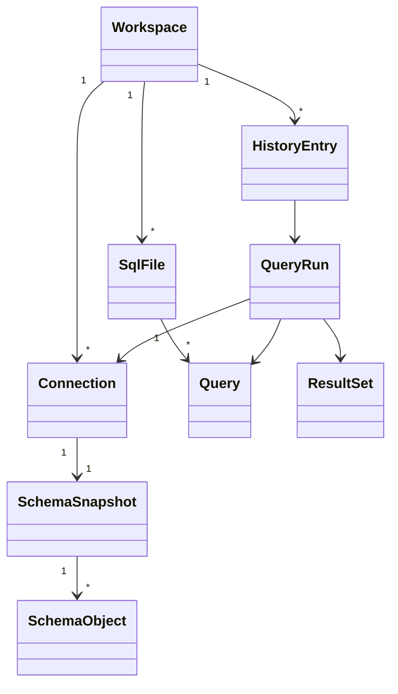

# Domain Model

## Purpose

This document defines the canonical vocabulary for the Tempr codebase. Every service, module, and downstream specification references these names. If a term appears here, it means exactly what this page says—no ambiguity, no synonyms.

Tempr is a native Rust database IDE (think "Zed + DataGrip"). The domain model describes the thing's we're building and the relationships between them. It is deliberately minimal: just enough to anchor every other document in the system.

## Responsibilities

The domain model owns:

- **Naming** — every entity has one canonical name used everywhere.
- **Relationships** — how entities reference each other (IDs vs. ownership).
- **Invariants** — what must be true (e.g. a `QueryRun` always has exactly one `ResultSet`).
- **Boundaries** — what is *not* in the domain model (UI state, transport, rendering).

It does **not** describe persistence, networking, or UI layout—those live in [Storage](07-storage.md), [Database Engine](09-database-engine.md), and [SQL Intelligence](12-sql-intelligence.md) respectively.

## Entity Catalog

### Workspace

The unit of everything. A workspace contains connections, SQL files, query history, result sets, layout state, user settings, search indexes, and cache metadata. It maps 1-to-1 with a directory on disk (the `~/.tempr/workspaces/<name>` folder, or whatever the user chooses). All other entities live inside a workspace; nothing exists outside one.

### Connection

A named database endpoint: a configuration bundle plus a *reference* to a secret (never the secret itself). A connection carries host, port, database name, user, driver type (`postgres`, `mysql`, `sqlite`), and a secret-vault key that the secret store resolves at runtime. Connections belong to exactly one workspace.

### SqlFile

A user-authored SQL file within the workspace. Each file has a name, a path relative to the workspace root, and a content hash (for dirty detection). Files are the primary editing surface—the user writes queries here.

### Query

A statement extracted from an `SqlFile` or from the command palette. A `Query` is *not* an execution; it is the text plus minimal context (the source file, the offset range within that file, and a fingerprint derived from the normalized SQL). Queries are ephemeral value objects—they don't persist on their own but are referenced by `QueryRun` and `HistoryEntry`.

### QueryRun

One execution of a `Query` against a `Connection`. A `QueryRun` is the historical record: it captures the query text at the moment of execution, the connection used, a timestamp, and the outcome (success, error, or cancelled). QueryRuns are append-only; they never mutate.

### ResultSet

The result of a `QueryRun`. Contains column metadata (name, type, nullable, ordinal) and the row data stored as a columnar `Vec<Vec<Value>>`. A `ResultSet` is always paired 1-to-1 with a `QueryRun` and is immutable after creation.

### SchemaObject hierarchy

The structural metadata for a database. `SchemaObject` is a tagged enum with these variants:

| Variant | Key fields |
|---------|-----------|
| **Table** | schema, name, estimated row count |
| **View** | schema, name, definition SQL |
| **Column** | parent object, name, data type, nullable, ordinal position, default |
| **Index** | parent table, name, columns, unique flag, index type (btree/hash/gin/…) |
| **Function** | schema, name, parameters (name + type), return type, language |

Schema objects are organized in a flat list attached to a `SchemaSnapshot`; the parent-child relationships are implicit (a `Column`'s `parent_id` points to its `Table` or `View`).

### HistoryEntry

A workspace-level record linking a `QueryRun` to its broader context: which `SqlFile` it came from (if any), the timestamp, and the duration. History entries are the user's "recently executed" list. They live at the workspace level, not inside any file, so a query run from the command palette still appears.

## ER / Class Diagram



Reading the diagram:

- A **Workspace** owns many `Connection`s, `SqlFile`s, and `HistoryEntry`s.
- An **SqlFile** can produce many `Query`s (each paragraph / statement in the file).
- A **QueryRun** references exactly one `Query` and one `Connection`, and owns one `ResultSet`.
- A **HistoryEntry** points to a `QueryRun` and carries the file / timestamp context.
- A **Connection** has exactly one `SchemaSnapshot` (refreshed on demand).
- A **SchemaSnapshot** contains many `SchemaObject`s (the tree of tables, columns, etc.).

## Interfaces

Rust struct sketches for the core entities. All IDs use the newtype pattern (`FooId(Uuid)`) rather than raw `Uuid`s, so the compiler catches accidental swaps.

```rust
// ── Workspace ────────────────────────────────────────────────

#[derive(Debug, Clone)]
pub struct Workspace {
    pub id: WorkspaceId,
    pub name: String,
    pub root_path: PathBuf,
    pub connections: Vec<Connection>,
    pub files: Vec<SqlFile>,
    pub history: Vec<HistoryEntry>,
    pub settings: WorkspaceSettings,
}

#[derive(Debug, Clone, Copy, PartialEq, Eq, Hash)]
pub struct WorkspaceId(pub Uuid);

// ── Connection ───────────────────────────────────────────────

#[derive(Debug, Clone)]
pub struct Connection {
    pub id: ConnectionId,
    pub name: String,
    pub driver: Driver,
    pub host: String,
    pub port: u16,
    pub database: String,
    pub username: String,
    pub secret_ref: SecretRef,          // vault key, never the secret
    pub schema_snapshot: Option<SchemaSnapshot>,
}

#[derive(Debug, Clone, Copy, PartialEq, Eq, Hash)]
pub struct ConnectionId(pub Uuid);

#[derive(Debug, Clone, Copy, PartialEq, Eq)]
pub enum Driver {
    Postgres,
    MySQL,
    SQLite,
}

#[derive(Debug, Clone)]
pub struct SecretRef {
    pub vault_key: String,
}

// ── SqlFile ──────────────────────────────────────────────────

#[derive(Debug, Clone)]
pub struct SqlFile {
    pub id: SqlFileId,
    pub name: String,
    pub relative_path: PathBuf,
    pub content_hash: [u8; 32],         // SHA-256 for dirty detection
}

#[derive(Debug, Clone, Copy, PartialEq, Eq, Hash)]
pub struct SqlFileId(pub Uuid);

// ── Query ────────────────────────────────────────────────────

#[derive(Debug, Clone)]
pub struct Query {
    pub id: QueryId,
    pub text: String,
    pub source_file: Option<SqlFileId>,
    pub offset_start: usize,
    pub offset_end: usize,
    pub fingerprint: [u8; 32],          // normalized SQL hash
}

#[derive(Debug, Clone, Copy, PartialEq, Eq, Hash)]
pub struct QueryId(pub Uuid);

// ── QueryRun ─────────────────────────────────────────────────

#[derive(Debug, Clone)]
pub struct QueryRun {
    pub id: QueryRunId,
    pub query: Query,
    pub connection_id: ConnectionId,
    pub started_at: DateTime<Utc>,
    pub finished_at: Option<DateTime<Utc>>,
    pub outcome: RunOutcome,
    pub result_set: Option<ResultSet>,
}

#[derive(Debug, Clone, Copy, PartialEq, Eq, Hash)]
pub struct QueryRunId(pub Uuid);

#[derive(Debug, Clone, PartialEq, Eq)]
pub enum RunOutcome {
    Success,
    Error(String),
    Cancelled,
}

// ── ResultSet ────────────────────────────────────────────────

#[derive(Debug, Clone)]
pub struct ResultSet {
    pub columns: Vec<ColumnMeta>,
    pub rows: Vec<Vec<Value>>,
    pub total_rows: usize,
    pub truncated: bool,
}

#[derive(Debug, Clone)]
pub struct ColumnMeta {
    pub name: String,
    pub data_type: String,
    pub nullable: bool,
    pub ordinal: usize,
}

// ── SchemaSnapshot ───────────────────────────────────────────

#[derive(Debug, Clone)]
pub struct SchemaSnapshot {
    pub connection_id: ConnectionId,
    pub version: u64,
    pub fetched_at: DateTime<Utc>,
    pub objects: Vec<SchemaObject>,
}

// ── SchemaObject ─────────────────────────────────────────────

#[derive(Debug, Clone)]
pub enum SchemaObject {
    Table {
        id: SchemaObjectId,
        schema: String,
        name: String,
        estimated_rows: Option<u64>,
    },
    View {
        id: SchemaObjectId,
        schema: String,
        name: String,
        definition: String,
    },
    Column {
        id: SchemaObjectId,
        parent_id: SchemaObjectId,
        name: String,
        data_type: String,
        nullable: bool,
        ordinal: usize,
        default: Option<String>,
    },
    Index {
        id: SchemaObjectId,
        parent_table_id: SchemaObjectId,
        name: String,
        columns: Vec<String>,
        unique: bool,
        index_type: String,
    },
    Function {
        id: SchemaObjectId,
        schema: String,
        name: String,
        parameters: Vec<(String, String)>,
        return_type: String,
        language: String,
    },
}

#[derive(Debug, Clone, Copy, PartialEq, Eq, Hash)]
pub struct SchemaObjectId(pub Uuid);

// ── HistoryEntry ─────────────────────────────────────────────

#[derive(Debug, Clone)]
pub struct HistoryEntry {
    pub id: HistoryEntryId,
    pub query_run_id: QueryRunId,
    pub source_file: Option<SqlFileId>,
    pub timestamp: DateTime<Utc>,
    pub duration_ms: u64,
}

#[derive(Debug, Clone, Copy, PartialEq, Eq, Hash)]
pub struct HistoryEntryId(pub Uuid);
```

## Design Rationale

### Why QueryRun is separate from Query

`Query` is a value object representing the *intent*: the SQL text, where it came from, and a fingerprint. `QueryRun` is the *event*: one execution against a real connection, with a timestamp and outcome.

Separating them gives two critical properties:

1. **Re-run semantics** — the user can re-run a query after the source file changes. The `QueryRun` preserves the *exact text executed*, so the history is faithful. If `Query` and `QueryRun` were the same thing, editing a file would mutate historical records.
2. **History fidelity** — every row in the history list is an immutable record of what happened, not a reference to something that might change.

### Why SchemaSnapshot is immutable and versioned

Completion, inline type hints, and schema browsing all work off a local cache of the database structure. That cache is a `SchemaSnapshot`:

- **Immutable** — once fetched, it never mutates. A new fetch produces a new snapshot with an incremented `version`. This eliminates race conditions in the completion engine and sidebar rendering.
- **Versioned** — the version counter lets the UI know when to re-index without polling. The completion engine pins to a snapshot version; stale data is explicitly tolerated until a refresh completes.
- **Owned by Connection** — each connection has at most one snapshot. The snapshot is refreshed on demand (user action or interval), not on every query.

## Data Flow

All domain structs derive `Clone + Send` so they can be moved across threads. Services *own* the domain data; the UI receives immutable snapshots via channel or broadcast.

```text
┌──────────┐   owned    ┌───────────┐   clone+send   ┌──────────┐
│ Service  │ ──────────►│  Domain   │ ──────────────►│   UI     │
│ (writer) │            │  structs  │                │ (reader) │
└──────────┘            └───────────┘                └──────────┘
     │                       │                           │
     │  mutate               │  snapshot                 │  render
     ▼                       ▼                           ▼
  append-only           immutable                   read-only
  history log           cache                       view model
```

- **Services** are the sole mutators. They write `QueryRun`s to the history log, refresh `SchemaSnapshot`s, and update `SqlFile` content hashes.
- **Domain structs** are cloned and sent across thread boundaries. Because they are `Clone`, the UI never holds a mutable reference to live service data.
- **UI** receives snapshots via a broadcast channel (`tokio::sync::broadcast` or similar). It renders read-only views and never writes back into domain objects directly—user intent goes back through the service layer as commands.

This ownership model keeps the system free of shared-mutable-state bugs while remaining responsive to real-time updates.

## Future Considerations

- **Workspace serialization** — the `Workspace` struct will need a `serde` derive (or a dedicated `WorkspaceManifest` type) for save/load to disk.
- **Query parameters** — `Query` may grow a `parameters: Vec<QueryParam>` field to support prepared-statement substitution.
- **Connection pooling** — `Connection` currently describes config only; pool state will live in the service layer, not the domain struct.
- **Schema diffing** — `SchemaSnapshot` could gain a `diff(other: &SchemaSnapshot) -> SchemaDiff` method to drive migration tooling.
- **Multi-database joins** — cross-connection queries would require a new `FederatedQuery` entity bridging two `QueryRun`s.

## Open Questions

1. **Identity of a Query across file edits** — if the user edits a file but the SQL text at a given offset range stays the same, is it the same `Query`? The fingerprint approach (hash of normalized SQL) suggests yes, but offset ranges will differ. Should the identity be fingerprint-only, or should we treat offset as part of the identity?

2. **Soft-delete vs. hard-delete of history** — `QueryRun`s are append-only today, but users may want to purge history. Should we use soft-delete (a `deleted_at: Option<DateTime>` field) to keep the append-only guarantee, or hard-delete rows and accept the gap in IDs?

3. **SchemaSnapshot refresh strategy** — should refresh be event-driven (after every DDL statement detected in a query result), timer-based, or user-initiated only?

4. **ResultSet row limits** — how large should an untruncated `ResultSet` be allowed to grow before we enforce server-side LIMIT or client-side truncation?

## Related Documents

- [Storage](07-storage.md) — persistence layer, file format, database schema for workspace data.
- [Database Engine](09-database-engine.md) — connection protocols, query execution pipeline, secret resolution.
- [SQL Intelligence](12-sql-intelligence.md) — rendering of domain entities in the editor, sidebar, and result grid.
- [Database Engine](09-database-engine.md) — detailed lifecycle from SQL text to `QueryRun` and `ResultSet`.
