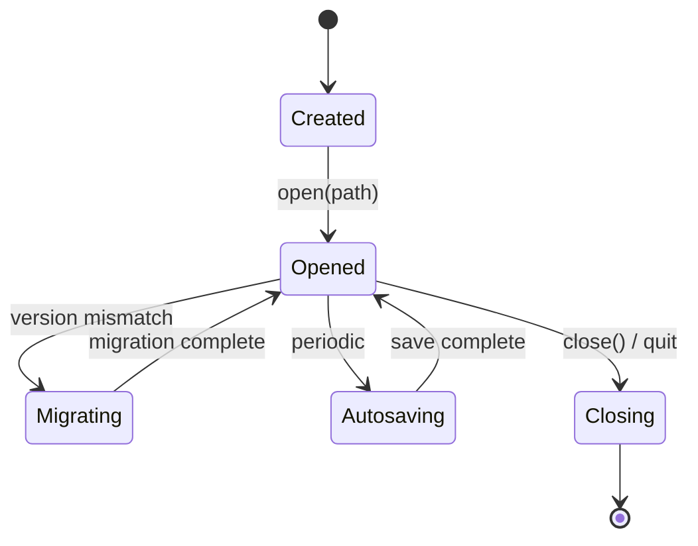
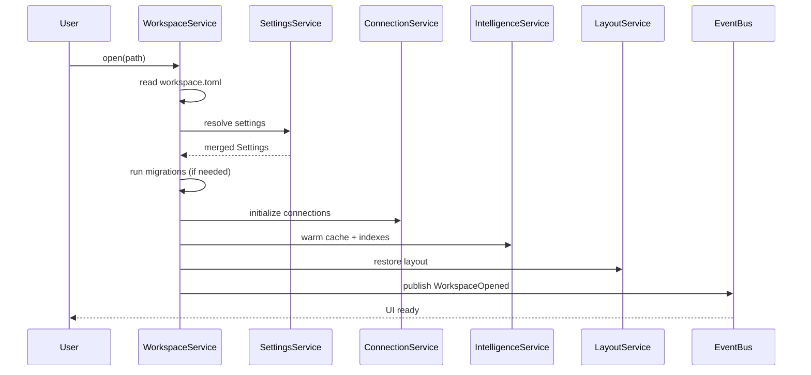

# 04 — Workspace Model

## Purpose

The workspace is the fundamental organizational unit in Tempr. It is not an optional abstraction layered on top of files; it is the container in which all user activity occurs. Every action — querying a database, browsing a schema, reviewing history — happens inside exactly one open workspace.

The app always runs inside a single workspace. There is no "home screen" that allows cross-workspace querying or browsing. When the user launches Tempr with no workspace, they see a welcome screen that presents two choices: create a new workspace or open an existing one. No other functionality is accessible until a workspace is opened. This constraint simplifies the entire runtime model: services resolve to one workspace at a time, settings are resolved from exactly one workspace, and the layout belongs to exactly one workspace.

This design is mandated by [ADR-0005](adr/0005-workspace-first.md): the workspace is the unit of everything. See also the [Architecture](02-architecture.md) document for how the workspace integrates with the broader system.

## Responsibilities

A workspace owns eight first-class members. Each has a distinct lifecycle and ownership boundary.

### Connections

A workspace stores a collection of connection definitions — database URLs, credentials references, and per-connection display names. Connection definitions are persisted inside the workspace directory and are owned entirely by it. Connections are not shared across workspaces; if the same database is needed in two workspaces, two connection definitions exist. This deliberate redundancy keeps workspace self-contained and avoids hidden cross-workspace coupling. Credential references (e.g., keyring paths or environment variable names) are stored; actual secrets are never persisted in plaintext within the workspace. See [Storage](07-storage.md) for credential handling details.

Connections are managed by `ConnectionService`, which resolves them from the workspace's connection definitions at open time and keeps them alive for the lifetime of the workspace.

### SQL Files

SQL files are the user's authored queries, organized within the workspace directory tree. They are ordinary files on disk — not abstracted into a database or hidden behind a proprietary format. The workspace indexes them for search and intelligence features but does not lock or transform them. Users can edit SQL files outside of Tempr and the workspace picks up changes on the next focus event. SQL files are versioned with the workspace if the workspace directory is git-managed.

### History

History is the append-only log of every query executed within the workspace, including execution time, row counts, error states, and duration. History is persisted as structured data inside the workspace directory. It is not duplicated externally; a workspace is the only thing that can read or query its own history. History records reference connection names and SQL file paths (if the query was sourced from a file) but do not store raw connection strings or credentials.

### Results

Result sets are the output of query execution. They are held in memory during active use and selectively persisted to the workspace's cache directory for retrieval in the same session or across sessions. The workspace owns result caching; results from one workspace are never visible in another. Large result sets are serialized to disk with a size threshold and eviction policy to prevent unbounded memory growth.

### Layout

Layout is the complete UI state: open panels, split positions, focused editor, visible sidebars, and tab order. It is persisted as a single structured file within the workspace. When the workspace opens, layout is restored to the last saved state. Layout is workspace-scoped; closing a workspace and reopening it restores exactly the same arrangement. Layout changes are saved on workspace close and periodically during autosave. `LayoutService` manages this member.

### Settings

Settings are the resolved configuration for the workspace. They follow a three-layer resolution order: application defaults are the lowest layer, user-level overrides (stored in the user's home directory) sit on top, and workspace-level overrides (stored in the workspace directory) win last. This layering means a workspace can customize editor behavior, keybindings, or theme without affecting other workspaces, while still inheriting sane defaults. `SettingsService` resolves and provides the merged settings. The settings format is human-readable TOML.

### Cache

Cache is the workspace-local materialization of expensive-to-compute data: schema snapshots, table statistics, autocomplete indexes, and query plan caches. The cache is owned by the workspace and stored inside it. It is rebuilt lazily on workspace open and updated incrementally during use. The cache directory is explicitly designed to be deletable without data loss — if a user or script removes it, it is rebuilt from authoritative sources (the connected databases and the workspace's SQL files). Cache entries include version metadata so stale entries are discarded on upgrade. `SchemaService` and `IntelligenceService` are the primary consumers.

### Indexes

Indexes are the structured representations that power fast search and navigation within the workspace: a full-text index of SQL files, a symbol index of CTEs and named queries, and a connection index mapping connection names to their metadata. Indexes are persisted alongside the workspace and updated incrementally when files change. Like cache, indexes are rebuildable from source data and are not authoritative — they are derived. `IntelligenceService` owns index construction and querying.

## Workspace Lifecycle

A workspace follows a well-defined lifecycle from creation through daily use to eventual closure.

1. **Create** — the user provides a directory path and a name. Tempr initializes the workspace structure: a `workspace.toml` manifest, an empty `connections/` directory, a `sql/` directory, and the `cache/` and `indexes/` directories. No databases are connected yet; the workspace is born empty.

2. **Open** — the user opens an existing workspace by pointing to its directory (or selecting it from the recent list). Tempr reads the `workspace.toml` manifest, resolves settings through the three-layer cascade, instantiates all services, and begins the warm-up sequence: connections are established in the background, cache and indexes are loaded or rebuilt, and the layout is restored. The workspace is now interactive.

3. **Migrate** — if the workspace's format version in `workspace.toml` is older than the current Tempr version, an automatic migration runs. Migrations are idempotent and versioned: each has a number and a direction. The workspace format is bumped in `workspace.toml` after migration. Rollback is not supported; the format is designed to be simple enough that forward migration is always safe and rarely needed.

4. **Autosave** — while the workspace is open, Tempr periodically saves state: layout changes, history entries, modified SQL files (if auto-save is enabled), cache updates, and index increments. Autosave is non-blocking and silent. The autosave interval is configurable in settings.

5. **Close** — when the workspace is closed (or the app exits), all services are shut down in reverse order of initialization. Connections are drained, final state is persisted, and the workspace directory is left in a clean, reopenable state.



## Interfaces

The workspace is accessed through `WorkspaceService`, which manages its lifecycle and provides access to the active workspace instance.

```rust
pub struct WorkspaceService {
    workspace: Option<Arc<Workspace>>,
    settings: Arc<SettingsService>,
    layout: Arc<LayoutService>,
}

impl WorkspaceService {
    /// Open an existing workspace at the given directory path.
    /// Reads workspace.toml, runs migrations if needed, warms caches,
    /// and publishes a WorkspaceOpened event.
    pub async fn open(path: &Path) -> Result<Workspace, WorkspaceError>;

    /// Create a new workspace at the given path with the given name.
    /// Initializes the directory structure and writes workspace.toml.
    pub async fn create(path: &Path, name: &str) -> Result<Workspace, WorkspaceError>;

    /// Returns the currently active workspace. Panics if no workspace is open.
    /// Callers must check `is_open()` first or handle the None case.
    pub fn current(&self) -> Arc<Workspace>;

    /// Persist all workspace state: layout, history, cache, indexes.
    /// Non-blocking; queues the save on a background thread.
    pub async fn save(&self) -> Result<(), WorkspaceError>;
}
```

`WorkspaceError` enumerates the failure modes: `NotFound`, `MigrationFailed`, `Corrupted`, `PermissionDenied`, and `AlreadyOpen`. Each carries enough context for the UI to present a meaningful message.

## Design Rationale

### Workspace as a directory, not a single file

A workspace is a directory on disk, not an opaque blob or single file. This choice has three concrete benefits:

- **Git-friendly.** The workspace directory can be committed to version control. SQL files, connection definitions, and workspace settings are all plain text. A team can share a workspace via git without a custom sync protocol. Secrets (connection passwords) are stored via references, not values, so the repository is safe to push.

- **Human-inspectable.** Every piece of data the workspace holds is readable with standard tools. A user can `cat workspace.toml` to see settings, `ls sql/` to see their files, and `git diff` to see what changed. There is no binary format to reverse-engineer and no proprietary serialization.

- **Partial-corruption survivable.** If one file in the workspace is corrupted — a truncated cache file, a malformed index — the rest of the workspace is unaffected. The user (or Tempr) can delete the corrupted file and rebuild it. A single-file workspace format would mean one bit-flip corrupts everything.

### Settings layering

Settings are resolved in strict precedence order:

1. **Application defaults** — hardcoded in the Tempr binary. These are the sane baseline: editor font size, default timeout, default theme.
2. **User settings** — stored in `~/.config/tempr/settings.toml`. These are the user's personal preferences that apply across all their workspaces.
3. **Workspace settings** — stored in `<workspace>/workspace.toml`. These override both layers for this workspace only.

This layering means a user can set their preferred theme globally and override it per-workspace for projects that use a different style. It also means workspaces are portable: a workspace with no settings overrides inherits the user's defaults, and a workspace with explicit settings works for anyone who opens it (modulo personal preferences that are not overridden).

## Data Flow

When a workspace is opened, the following sequence executes:

1. **Read `workspace.toml`** — the manifest is parsed. It contains the workspace name, format version, and pointers to connection definitions and settings.

2. **Resolve settings** — `SettingsService` merges the three layers: application defaults, user settings, and the workspace's own settings from the manifest.

3. **Run migrations (if needed)** — if the manifest version is older than the current format, migrations are applied sequentially. Each migration is a pure transformation of the workspace directory.

4. **Instantiate services** — `ConnectionService`, `QueryService`, `SchemaService`, `HistoryService`, `IntelligenceService`, `LayoutService`, `CommandService`, and `PluginService` are created with the resolved workspace context.

5. **Warm background tasks** — background tasks are spawned to load metadata without blocking the UI: connections are established, schema snapshots are fetched, indexes are loaded or rebuilt, and the result cache is hydrated from disk.

6. **Restore layout** — `LayoutService` reads the persisted layout file and reconstructs the UI state: which panels are open, where splits are positioned, and which file is focused.

7. **Publish `WorkspaceOpened` event** — the event bus broadcasts `WorkspaceOpened` with the workspace ID. Subscribers (sidebar, status bar, plugin host) react to initialize their views.



## Future Considerations

- **Multi-window support.** The current model assumes one workspace per application instance. If multi-window is added, each window would open its own workspace, and the `WorkspaceService` would need to manage multiple active workspaces with a focus-tracking mechanism. This is discussed in the Open Questions section.

- **Workspace templates.** Pre-configured workspace scaffolds — for example, a "Postgres + dbt" template that comes with connection settings, SQL file structure, and intelligence configuration pre-populated. Templates would be stored outside the workspace and copied at create time.

- **Workspace export/import.** The ability to package a workspace (minus secrets and cache) into a portable archive for sharing. This would strip credential references that cannot be resolved by the recipient and re-build cache on import.

- **Plugin-scoped workspace data.** Plugins may need to store their own data within the workspace. A `plugins/` subdirectory with a clear API boundary would prevent plugin data from polluting the core workspace structure.

## Open Questions

1. **Multi-window = multi-workspace?** If Tempr supports multiple windows, does each window own its own workspace, or can multiple windows share one workspace with independent layouts? Sharing one workspace across windows would require locking and synchronization for history and cache writes. Separate workspaces per window is simpler but means the user cannot view two aspects of the same workspace simultaneously. This needs a dedicated ADR.

2. **Workspace sharing and checked-in workspaces.** Since workspaces are git-friendly, teams may commit workspace directories to shared repositories. This raises questions: should Tempr detect shared workspaces and disable history recording (to avoid noisy diffs)? How are connection credentials handled — should the workspace template include a `.gitignore` that excludes credential files? Should there be a "shared workspace" mode that suppresses personal overrides?

3. **Secret handling in shared workspaces.** Connection definitions store references to secrets, not secrets themselves. But the resolution mechanism (environment variables, keyring entries) must be documented and standardized. Should the workspace manifest declare which secrets it needs so Tempr can prompt the user on open? Should there be a `.env` convention within the workspace directory?

## Related Documents

- [02 — Architecture](02-architecture.md) — how the workspace fits into the application layer structure.
- [05 — Services](05-services.md) — the canonical service definitions referenced throughout this document.
- [06 — Event System](06-event-system.md) — the concrete data structures and schemas for workspace members.
- [07 — Storage](07-storage.md) — how workspace data is persisted, including credential handling and cache eviction.
