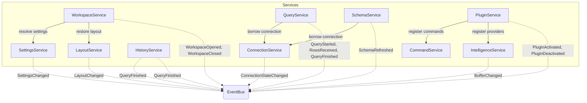
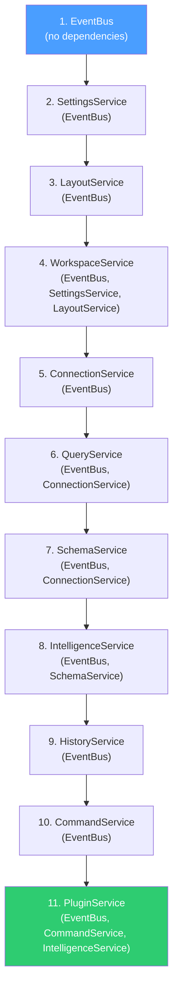

# Services

> The service catalog — contracts, rules, lifecycle, and dependency topology for every canonical service in the Tempr system.

---

## Purpose

This document is the authoritative catalog of every service in Tempr. It defines the responsibility boundary, owned state, key async method signatures, event surface, and consumed events for each of the ten canonical services. It also establishes the hard rules that govern all service behavior: business logic never lives in UI components; services communicate via events wherever possible; direct calls are reserved for request/response semantics; every public service method is async; and services are `Send + Sync`, with the UI layer holding them behind `Arc<dyn ...>` or typed `Arc<T>`.

This document, together with [Event System](06-event-system.md) and the per-domain documents (09–13), forms the complete specification of Tempr's runtime behavior. The canonical service names defined here are reused verbatim across every other architecture document — inventing parallel names is not permitted.

---

## Responsibilities

### Hard Rules (binding on all services)

These rules are not guidelines; they are architectural invariants. Any violation is a bug.

1. **No business logic in UI components.** GPUI views are stateless shells that render from immutable snapshots, call service methods, and subscribe to events. If logic can be unit-tested without a window open, it belongs in a service, not a view.

2. **Services communicate via events; direct calls only for request/response.** When a service needs to notify others of a state change, it publishes an `AppEvent` to the `EventBus`. When a service needs to synchronously retrieve data from another service, it calls that service's method directly. This hybrid model gives decoupling where it matters (fan-out, UI updates, plugin hooks) and simplicity where it does not (querying a connection state, fetching a setting value).

3. **All public service methods are async.** No service method blocks the calling thread. I/O, database access, and computation that exceeds trivial cost execute on the async runtime. The GPUI main thread never stalls waiting on a service response.

4. **Services are `Send + Sync`.** Every service type implements both traits. The UI layer holds services as `Arc<T>` (typed) or `Arc<dyn Service>` (erased). No service holds a `Rc`, `Cell`, `RefCell`, or any non-`Send` type.

5. **Events carry IDs, not payloads.** Events carry the minimum data needed to identify what changed (`QueryRunId`, `ConnectionId`). Large data (rows, schema snapshots, result sets) travels through handles (`QueryStream`, `SchemaSnapshot`). This keeps allocation pressure low and event delivery predictable.

---

### WorkspaceService

`WorkspaceService` owns the lifecycle of the currently open workspace — open, create, save, close — and provides access to the active `Workspace` instance. It is the first service constructed and the last shut down. When no workspace is open (the welcome screen), `WorkspaceService` is in a null state and all other services are quiescent.

**Owned state:** `Option<Arc<Workspace>>` (the active workspace; `None` before open), workspace path, format version, migration state.

**Key async methods:**

```rust
impl WorkspaceService {
    pub async fn open(path: &Path) -> Result<Workspace, WorkspaceError>;
    pub async fn create(path: &Path, name: &str) -> Result<Workspace, WorkspaceError>;
    pub fn current(&self) -> Arc<Workspace>;
    pub async fn save(&self) -> Result<(), WorkspaceError>;
    pub async fn close(&self) -> Result<(), WorkspaceError>;
    pub fn is_open(&self) -> bool;
}
```

**Events published:** `WorkspaceOpened { id: WorkspaceId }`, `WorkspaceClosed { id: WorkspaceId }`, `WorkspaceMigrated { id: WorkspaceId, from: u32, to: u32 }`.

**Events consumed:** none — `WorkspaceService` is the root of the service graph; it publishes events that other services react to, but it does not subscribe to other services' events.

---

### ConnectionService

`ConnectionService` manages database connections — establishing pools, tracking connection state, handling reconnection on failure, and providing a borrowing interface so that `QueryService` and `SchemaService` can obtain a connection handle for a given `ConnectionId`. It resolves connection definitions from the workspace's `workspace.toml` at open time, delegates secret resolution to the OS keychain, and publishes state changes as events so the UI and other services can react without polling.

**Owned state:** connection pool map (`ConnectionId → DriverConnection`), per-connection state (`Connecting`, `Connected`, `Reconnecting`, `Failed`), reconnection backoff state.

**Key async methods:**

```rust
impl ConnectionService {
    pub async fn connect(&self, id: ConnectionId) -> Result<(), ConnectionError>;
    pub async fn disconnect(&self, id: ConnectionId) -> Result<(), ConnectionError>;
    pub fn state(&self, id: ConnectionId) -> ConnectionState;
    pub async fn borrow(&self, id: ConnectionId) -> Result<Arc<dyn DriverConnection>, ConnectionError>;
    pub async fn reconnect(&self, id: ConnectionId) -> Result<(), ConnectionError>;
}
```

**Events published:** `ConnectionStateChanged { id: ConnectionId, state: ConnectionState }`, `ConnectionFailed { id: ConnectionId, error: String }`.

**Events consumed:** `WorkspaceOpened` (triggers initial connection of all defined connections), `WorkspaceClosed` (triggers drain and disconnect of all pools).

---

### QueryService

`QueryService` is the execution engine: it takes a SQL text and a connection, constructs a `QueryRun`, executes the statement against the driver, and streams results back through a `QueryStream`. It publishes lifecycle events (`QueryStarted`, `RowsReceived`, `QueryFinished`) that the result grid, history service, status bar, and plugins all consume. It never buffers an entire result set in memory — rows arrive in bounded batches and are appended to the `RowStore` as they arrive.

**Owned state:** active `QueryRun` map (`QueryRunId → QueryStream`), execution semaphore (limits concurrent queries per connection), cancellation handles.

**Key async methods:**

```rust
impl QueryService {
    pub async fn execute(
        &self,
        sql: &str,
        connection_id: ConnectionId,
        source_file: Option<SqlFileId>,
    ) -> Result<QueryRunId, QueryError>;

    pub async fn cancel(&self, run_id: QueryRunId) -> Result<(), QueryError>;

    pub fn active_runs(&self) -> Vec<QueryRunId>;
}
```

**Events published:** `QueryStarted { run: QueryRunId }`, `RowsReceived { run: QueryRunId, count: usize }`, `QueryFinished { run: QueryRunId, outcome: QueryOutcome }`.

**Events consumed:** `ConnectionStateChanged` (disables execution against connections in `Failed` or `Reconnecting` state).

---

### SchemaService

`SchemaService` triggers and tracks schema refreshes for each connection, holds the latest `SchemaSnapshot` per connection in memory, and publishes `SchemaRefreshed` events so that the intelligence engine and schema explorer can update without polling. It delegates the actual introspection to the database driver via `ConnectionService::borrow` and persists refreshed snapshots to the catalog cache (see [Storage](07-storage.md)). Schema refreshes are triggered on three occasions: connection established, explicit user action, and detected DDL change (future).

**Owned state:** in-memory snapshot map (`ConnectionId → SchemaSnapshot`), refresh task handles, staleness timestamps.

**Key async methods:**

```rust
impl SchemaService {
    pub async fn refresh(&self, connection_id: ConnectionId) -> Result<SchemaSnapshot, SchemaError>;
    pub fn snapshot(&self, connection_id: ConnectionId) -> Option<Arc<SchemaSnapshot>>;
    pub fn version(&self, connection_id: ConnectionId) -> Option<u64>;
    pub async fn refresh_all(&self) -> Result<(), SchemaError>;
}
```

**Events published:** `SchemaRefreshed { connection: ConnectionId, snapshot: SchemaSnapshotId }`.

**Events consumed:** `ConnectionStateChanged` (triggers refresh when a connection reaches `Connected` state), `QueryFinished` (future: triggers refresh if DDL was detected in the query result).

---

### IntelligenceService

`IntelligenceService` owns the `SemanticEngine` — the internal completion, diagnostics, and hover pipeline that gives Tempr its "DataGrip" half. It receives `BufferChanged` events from the editor and `SchemaRefreshed` events from the schema service, maintains an up-to-date `CatalogCache` (populated from `SchemaSnapshot`s, never from live database queries), and serves completion requests within a sub-5ms latency budget. Plugins can contribute additional completion providers via `CommandContribution` registration through the `PluginService`; `IntelligenceService` fans out requests to all registered providers and merges results.

**Owned state:** `SemanticEngine` instance, `CatalogCache` (interned table/column/alias data), registered `CompletionProvider` list (populated by `PluginService` during activation).

**Key async methods:**

```rust
impl IntelligenceService {
    pub fn complete(&self, req: &CompletionRequest) -> Vec<CompletionItem>;
    pub fn hover(&self, buffer: &BufferSnapshot, offset: usize) -> Option<HoverInfo>;
    pub fn diagnostics(&self, buffer: &BufferSnapshot) -> Vec<Diagnostic>;
    pub fn definition(&self, buffer: &BufferSnapshot, offset: usize) -> Option<SchemaObjectId>;
    pub fn register_provider(&self, provider: Arc<dyn CompletionProvider>);
}
```

**Events published:** `DiagnosticsUpdated { file: SqlFileId, count: usize }` (future: for gutter diagnostic indicators).

**Events consumed:** `BufferChanged { file: SqlFileId }` (triggers incremental re-analysis), `SchemaRefreshed { connection: ConnectionId, snapshot: SchemaSnapshotId }` (triggers catalog cache rebuild for that connection).

---

### HistoryService

`HistoryService` records every `QueryRun` into the workspace's append-only history log and provides search and re-run capabilities. It subscribes to `QueryFinished` events, persists history entries to the SQLite store (see [Storage](07-storage.md)), and exposes a queryable interface for the history panel and command palette "re-run recent" action. History records include the query text at the moment of execution, connection reference, timestamp, duration, and outcome — ensuring historical fidelity even when source files change.

**Owned state:** SQLite history store handle (`HistoryStore`), in-memory recent-queries cache (last N entries for fast palette access).

**Key async methods:**

```rust
impl HistoryService {
    pub async fn recent(&self, connection_id: ConnectionId, limit: u32) -> Result<Vec<HistoryEntry>, HistoryError>;
    pub async fn search(&self, pattern: &str, limit: u32) -> Result<Vec<HistoryEntry>, HistoryError>;
    pub async fn rerun(&self, entry_id: HistoryEntryId) -> Result<QueryRunId, HistoryError>;
    pub async fn record(&self, run: &QueryRun) -> Result<(), HistoryError>;
}
```

**Events published:** `HistoryRecorded { entry: HistoryEntryId }`.

**Events consumed:** `QueryFinished { run: QueryRunId, outcome: QueryOutcome }` (triggers `record()` with the completed `QueryRun` data).

---

### CommandService

`CommandService` is the registry of every user action in the system. Every action — executing a query, opening the palette, toggling a panel, refreshing schema — is a `Command` with an `id`, `title`, optional `keybinding`, and a `handler` closure. This is what makes the command palette first-class: the palette is simply a searchable view over the `CommandService`'s registry. Commands are contributed by core code (at startup) and by plugins (via `CommandContribution` during activation), making the palette extensible without modifying its implementation.

**Owned state:** command registry (`CommandId → Command`), keybinding map (`KeyBinding → CommandId`), active palette state (future: fuzzy-match cache).

**Key async methods:**

```rust
impl CommandService {
    pub fn register(&self, command: CommandContribution);
    pub async fn execute(&self, id: CommandId) -> Result<(), CommandError>;
    pub fn commands(&self) -> Vec<CommandMeta>;
    pub fn by_keybinding(&self, binding: &KeyBinding) -> Option<CommandId>;
    pub fn title(&self, id: CommandId) -> &str;
}
```

**Events published:** `CommandExecuted { id: CommandId }`.

**Events consumed:** none directly — `CommandService` is invoked by the UI (palette, keybindings, gutter buttons) and by other services that trigger commands programmatically.

A `CommandContribution` is the registration record that core code and plugins submit:

```rust
pub struct CommandContribution {
    pub id: CommandId,
    pub title: String,
    pub keybinding: Option<KeyBinding>,
    pub category: CommandCategory,   // e.g. "Query", "View", "Edit"
    pub handler: Box<dyn Fn(CommandContext) -> BoxFuture<'static, Result<(), CommandError>> + Send + Sync>,
}
```

Commands contributed by plugins are namespaced (`plugin_id::command_id`) to prevent collisions and are unregistered on plugin deactivation.

---

### PluginService

`PluginService` discovers, activates, deactivates, and manages the lifecycle of plugins. At v1, plugins are static (compiled-in Rust crates registered at startup — see [Plugin API](08-plugin-api.md)); dynamic loading (WASM or dylib) is a future consideration. `PluginService` receives the `ServiceRegistry` (read-only) and an `EventBus` handle during activation, and provides each plugin with a scoped `PluginContext` that exposes only the registration APIs the plugin needs — plugins never access the `ServiceRegistry` directly. On deactivation, plugin-contributed commands, completion providers, and panels are removed from their respective registries.

**Owned state:** plugin manifest list, activation state map (`PluginId → PluginState`), registered extension points (commands, providers, panels, themes).

**Key async methods:**

```rust
impl PluginService {
    pub async fn activate_all(&self) -> Result<(), PluginError>;
    pub async fn activate(&self, id: PluginId) -> Result<(), PluginError>;
    pub async fn deactivate(&self, id: PluginId) -> Result<(), PluginError>;
    pub fn active_plugins(&self) -> Vec<PluginMeta>;
    pub fn is_active(&self, id: PluginId) -> bool;
}
```

**Events published:** `PluginActivated { id: PluginId }`, `PluginDeactivated { id: PluginId }`, `PluginFailed { id: PluginId, error: String }`.

**Events consumed:** `WorkspaceOpened` (triggers activation of all discovered plugins), `WorkspaceClosed` (triggers deactivation in reverse order).

---

### SettingsService

`SettingsService` resolves and provides the merged, layered settings for the current workspace. Settings follow a three-layer cascade: application defaults (hardcoded), user-level overrides (`~/.config/tempr/settings.toml`), and workspace-level overrides (`.tempr/settings.toml` within the workspace directory). Later layers win. `SettingsService` publishes change notifications whenever a layer is modified so that subscribing services and views can react (e.g., theme change triggers re-render, font size change triggers editor re-layout).

**Owned state:** resolved `Settings` snapshot, layer file watches (inotify/FSEvents), per-layer `HashMap` of overrides.

**Key async methods:**

```rust
impl SettingsService {
    pub fn get<T: SettingKey>(&self, key: T) -> T::Value;
    pub async fn set_user(&self, key: &str, value: toml::Value) -> Result<(), SettingsError>;
    pub async fn set_workspace(&self, key: &str, value: toml::Value) -> Result<(), SettingsError>;
    pub fn subscribe(&self, filter: SettingFilter, handler: impl Fn(&SettingsDiff) + Send + 'static) -> Subscription;
}
```

**Events published:** `SettingsChanged { layer: SettingsLayer, diff: SettingsDiff }`.

**Events consumed:** `WorkspaceOpened` (triggers re-resolution of the three-layer cascade for the newly opened workspace), `WorkspaceClosed` (resets to user-level only).

---

### LayoutService

`LayoutService` persists and restores the complete UI state: which panels are open, where splits are positioned, which editor tab is focused, sidebar visibility, and dock order. Layout is workspace-scoped — closing a workspace and reopening it restores the exact same arrangement. Changes are persisted on workspace close and periodically during autosave. Layout is restored before the workspace is considered "interactive" so the user sees their familiar arrangement on open.

**Owned state:** current `LayoutState` snapshot (panel positions, tab order, focus), dirty flag (unsaved changes).

**Key async methods:**

```rust
impl LayoutService {
    pub fn current(&self) -> LayoutState;
    pub async fn save(&self) -> Result<(), LayoutError>;
    pub async fn restore(&self) -> Result<LayoutState, LayoutError>;
    pub fn update(&self, delta: LayoutDelta);
}
```

**Events published:** `LayoutChanged { delta: LayoutDelta }`.

**Events consumed:** `WorkspaceOpened` (triggers `restore()` to load the persisted layout), `WorkspaceClosed` (triggers final `save()`).

---

## Interfaces

### Service Registration and Lookup

Every service is registered in the `ServiceRegistry` at application startup. The `Service` trait defines the minimal contract:

```rust
/// Every service is registered and discoverable by typed handle.
pub trait Service: 'static + Send + Sync {
    fn name(&self) -> &'static str;
}

/// Central registry constructed at startup. Services never call UI;
/// UI calls services; services emit events through the EventBus.
pub struct ServiceRegistry {
    inner: RwLock<HashMap<TypeId, Box<dyn Any + Send + Sync>>>,
}

impl ServiceRegistry {
    pub fn register<T: Service>(&self, service: Arc<T>) {
        self.inner.write().insert(TypeId::of::<T>(), service);
    }

    /// Panics if T is not registered — this is a startup-time programming
    /// error, not a runtime recovery scenario.
    pub fn get<T: Service + 'static>(&self) -> Arc<T> {
        self.inner.read()
            .get(&TypeId::of::<T>())
            .and_then(|b| b.downcast_ref::<Arc<T>>())
            .cloned()
            .expect("service not registered")
    }
}
```

The registry is populated before the first GPUI window opens. The `EventBus` is constructed first and injected into every service at construction time. Services hold `Arc<EventBus>` and call `publish()` and `subscribe()` directly.

### Service Dependency Graph

The diagram below shows which services hold direct references to other services (solid arrows = direct calls for request/response) and which services communicate only through the `EventBus` (dashed lines = event subscription, no direct reference).



Reading the diagram:

- `QueryService` and `SchemaService` call `ConnectionService::borrow` directly — this is a synchronous request/response pattern where a connection handle is needed to execute work.
- `WorkspaceService` calls `SettingsService` and `LayoutService` directly to resolve settings and restore layout during the open sequence.
- `PluginService` calls `CommandService` and `IntelligenceService` directly during plugin activation to register contributed commands and completion providers.
- All other cross-service communication flows through the `EventBus` — services publish events and other services subscribe without holding direct references to the publisher.

---

## Design Rationale

### Why a service registry over global singletons or dependency injection frameworks

Global singletons (`static` items, `lazy_static!`, `OnceLock`) make service access convenient but create three problems: they are impossible to test in isolation (you cannot substitute a mock `ConnectionService` without patching a global), they hide dependency relationships (any module can call `ConnectionService::connect()` without declaring the dependency), and they complicate shutdown ordering (a global can be dropped at any time, potentially after its dependents).

Dependency injection frameworks (e.g., `shaku`, `dependency-injector`) solve the testability and dependency-declaration problems but introduce macro-heavy boilerplate, trait-object indirection at every lookup, and a mental model that Rust developers find alien. The ceremony does not match the simplicity of Tempr's needs: ten services, a single construction site, one binary.

The `ServiceRegistry` is the middle ground: a plain `HashMap<TypeId, Box<dyn Any>>` populated at startup, providing typed lookup via `get::<T>()`. Dependencies are declared implicitly by which services are constructed and which `Arc<T>` handles they store — the compiler enforces that a service cannot call another service's methods without holding a reference to it. Tests construct a fresh `ServiceRegistry`, populate it with real or mock services, and exercise behavior without any framework magic.

### Why ten services, not three or thirty

The ten canonical services emerge from the brief's product pillars and the domain's natural boundaries:

- **Too few (3 services):** Collapsing `QueryService`, `SchemaService`, and `IntelligenceService` into a single "DatabaseService" would create a monolith-within-the-service-layer — exactly the problem the service architecture is meant to solve. Schema refresh, query execution, and completion have independent lifecycles, independent failure modes, and independent test surfaces.

- **Too many (30+ services):** Splitting `SettingsService` into `ThemeService`, `FontService`, `KeybindingService`, and `TimeoutService` would create combinatorial explosion in the dependency graph without meaningful decoupling. These concerns share a single resolution layer (settings cascade) and a single change-notification surface. The cost of additional service registrations and inter-service wiring outweighs the benefit.

- **Ten is right** because each service owns exactly one lifecycle concern (workspace, connection, execution, schema, intelligence, history, commands, plugins, settings, layout) and has a clear "owns" vs "reads" boundary with the others. A service that owns data publishes events about that data; other services subscribe and react. This maps directly to the product: a user connects, writes SQL, runs queries, browses schema, and reviews history — five distinct activities, each driven by a focused service.

---

## Data Flow

### Construction Order at Startup

Services are constructed in strict dependency order. Each service receives the `EventBus` and any services it depends on (via `Arc<T>` handles). The `ServiceRegistry` is populated as each service is constructed.



The order is dictated by two rules:

1. **Dependencies are constructed first.** `ConnectionService` must exist before `QueryService` can borrow from it. `SettingsService` must exist before `WorkspaceService` can resolve the settings cascade.

2. **`PluginService` is last.** Plugins receive scoped `PluginContext` handles to register commands and completion providers. They must not activate before the services they register with are fully constructed and populated.

The `EventBus` is constructed first and is the only service with no dependencies — it is a pure communication primitive. All other services receive `Arc<EventBus>` at construction.

### Shutdown Order

Shutdown reverses construction order. Services are drained (in-flight operations completed or cancelled), state is flushed to disk, and the `EventBus` is the last thing dropped — ensuring no service publishes to a dead bus.

```
PluginService::deactivate_all()
  → CommandService::drain()
    → HistoryService::flush()
      → IntelligenceService::shutdown()
        → SchemaService::flush()
          → QueryService::cancel_all()
            → ConnectionService::drain()
              → WorkspaceService::close()  [persists final state]
                → LayoutService::save()
                  → SettingsService::shutdown()
                    → EventBus::drop()
```

The critical invariant: **no service publishes to the `EventBus` after it has been dropped.** This is enforced by construction order (bus last) and by each service's `shutdown()` method completing before its successor begins.

### How Services Get the EventBus

At construction, every service receives `Arc<EventBus>` as a parameter. Services call `self.event_bus.publish(event)` to emit events and `self.event_bus.subscribe(filter, handler)` to listen. The `Subscription` handle returned by `subscribe()` is stored as an RAII guard — when the service is dropped, its subscriptions are automatically cancelled. This prevents use-after-free in the event delivery pipeline and ensures clean teardown.

```rust
pub struct QueryService {
    event_bus: Arc<EventBus>,
    connection_service: Arc<ConnectionService>,
    active_runs: RwLock<HashMap<QueryRunId, QueryStream>>,
}

impl QueryService {
    pub fn new(
        event_bus: Arc<EventBus>,
        connection_service: Arc<ConnectionService>,
    ) -> Self {
        let svc = Self {
            event_bus,
            connection_service,
            active_runs: RwLock::new(HashMap::new()),
        };

        // Subscribe to connection state changes — disable execution
        // against failed connections.
        let bus = svc.event_bus.clone();
        svc.event_bus.subscribe(
            EventFilter::ConnectionStateChanged,
            move |event| {
                if let AppEvent::ConnectionFailed { id, .. } = event {
                    // Cancel any active runs against this connection
                    // (implementation detail — not shown here)
                }
            },
        );

        svc
    }
}
```

---

## Future Considerations

- **Service supervision and restart.** If a service enters an unrecoverable internal state (e.g., `ConnectionService` loses its pool due to a config error), the current design is fail-fast: the operation fails and an error event is published for the UI to display. A future iteration could explore service-level restart — tearing down and re-constructing a single service without shutting down the entire application. This would require careful handling of the service's event subscriptions and any state held by other services that references it.

- **Sync accessors for hot read paths.** Some service data is read on every GPUI render frame: the current layout state (`LayoutService::current()`), the active connection state (`ConnectionService::state()`), and settings values (`SettingsService::get()`). These are currently `async` methods for consistency. If frame-time profiling shows measurable overhead from async indirection on these hot paths, synchronous accessor methods (backed by `RwLock` or atomic snapshots) could be added without changing the service contract — async remains the default; sync is an optimization layer.

- **Multi-window service sharing.** If Tempr supports multiple windows, each window would share the same `ServiceRegistry` and `EventBus` but maintain independent `LayoutService` state. The `WorkspaceService` would need to track which window owns which workspace, and the `CommandService` would need window-scoped keybinding resolution. The service graph remains unchanged; the ownership model gains a window dimension.

- **Service-level metrics.** Instrumenting each service with timing and call-count metrics (latency of `QueryService::execute`, frequency of `SchemaService::refresh`, completion request throughput) would enable data-driven optimization. The `EventBus` is a natural collection point — a diagnostic subscriber could aggregate metrics without modifying individual services.

---

## Open Questions

| # | Question | Status | Notes |
|---|---|---|---|
| 1 | **Service supervision: restart or fail-fast on internal error?** | Open | If a service enters an unrecoverable state (e.g., `ConnectionService` pool corruption), should the framework restart that single service, fail the current operation, or propagate an error event for the UI? Current leaning: fail-fast with a user-visible error event, because automatic restart risks compounding state corruption. But some services (e.g., `LayoutService`) may benefit from a "reset to defaults" restart. A dedicated ADR may be needed. |
| 2 | **Sync accessors for hot read paths?** | Open | `SettingsService::get()`, `LayoutService::current()`, and `ConnectionService::state()` are called on every render frame. If async indirection adds measurable overhead (needs profiling), synchronous accessors backed by `RwLock` or atomic snapshots could be added. This is a performance optimization, not an architectural change — async remains the default contract. |
| 3 | **Should `CommandService` support undo for command execution?** | Open | Some commands (e.g., `delete connection`, `clear history`) are destructive. Should the command framework include an optional `undo` handler, or is undo responsibility left to individual commands? This interacts with the history service's append-only model. |
| 4 | **Service construction: sequential or parallel where possible?** | Deferred | The current construction order is strictly sequential (dependency tree). Some services (e.g., `HistoryService`, `LayoutService`) have no interdependencies and could be constructed in parallel on startup. Worth exploring if startup time becomes a concern, but the current ten-service sequential chain is sub-millisecond and likely negligible. |

---

## Related Documents

- [Software Architecture](02-architecture.md) — top-level layer diagram, dependency rules, and the service-oriented rationale that this catalog implements.
- [Event System](06-event-system.md) — delivery semantics, `AppEvent` taxonomy, subscription lifetime, and the `EventBus` contract that all services depend on.
- [Plugin API](08-plugin-api.md) — extension points that `PluginService` manages; `CommandContribution`, `CompletionProvider`, and other traits that plugins register through.
- [Database Engine](09-database-engine.md) — `DatabaseDriver` and `QueryStream` contracts consumed by `QueryService` and `SchemaService`.
- [Editor](10-editor.md) — `Buffer` and `SyntaxTree` that produce `BufferChanged` events consumed by `IntelligenceService`.
- [GPUI](11-gpui.md) — how views hold `Arc<T>` service handles and subscribe to events; the rendering conventions that enforce the "no business logic in UI" rule.
- [SQL Intelligence](12-sql-intelligence.md) — the `SemanticEngine` internals that `IntelligenceService` owns and exposes.
- [Result Grid](13-result-grid.md) — the `RowStore` and `ResultGrid` that consume `RowsReceived` and `QueryFinished` events from `QueryService`.
- [ADR-0006](adr/0006-service-oriented-architecture.md) — locked decision: why service-oriented architecture over MVC monolith or actor framework.
- [ADR-0007](adr/0007-internal-event-bus.md) — locked decision: why an internal event bus over direct coupling.
