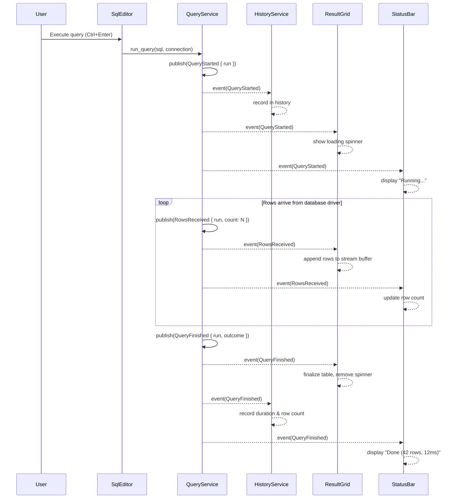

# Event System

> Tempr's internal decoupling backbone — an async, typed event bus that lets every module communicate without knowing about each other.

---

## Purpose

The event system is the **decoupling backbone** of Tempr's architecture. It exists so that no module ever holds a direct dependency on another module's internals. Every significant state change — a connection opening, a query finishing, a schema snapshot arriving — is published as a typed event on a central bus. Subscribers express interest through filters and react accordingly, without the publisher knowing who is listening or whether anyone is listening at all.

This design keeps the codebase modular, testable, and amenable to the plugin system. It also provides a single, auditable stream of everything happening inside the application, which is invaluable for debugging, telemetry, and future dev-tools.

---

## Responsibilities

The event system owns exactly three things:

1. **Event definition** — the canonical `AppEvent` enum that enumerates every core event the application can produce. This is the shared vocabulary that all internal modules speak.
2. **Publish and subscribe** — the `EventBus` that accepts publishes from any thread and delivers to all matching subscribers asynchronously. It guarantees per-publisher ordering, drops or coalesces when a subscriber falls behind, and never blocks the publisher.
3. **Lifecycle management** — RAII subscriptions that auto-unsubscribe on drop, channel cleanup, and backpressure policy enforcement.

The event system does **not** own:

- Business logic (it does not decide what a query outcome means).
- Persistence (events are ephemeral by default; replay is a future concern — see [Open Questions](#open-questions)).
- Cross-process IPC (events are in-process only; OS-level communication is out of scope).

---

## Design Rationale

### Why an event bus at all?

Without an event bus, modules communicate through direct function calls or shared mutable state. This creates tight coupling: the query service must know about the result grid, the history service must know about the status bar, and the schema inspector must know about everything. Every new consumer requires changing the producer. The event bus inverts this — producers publish once, consumers subscribe independently, and neither side knows about the other.

### Typed enum vs trait-object events

The core design tension is between two approaches:

| Approach | Advantage | Disadvantage |
|---|---|---|
| `enum AppEvent { ... }` | Compile-time exhaustiveness; pattern matching; zero-cost dispatch; easy to grep and audit | Adding a new variant requires modifying the enum (but only once) |
| `Box<dyn Event>` trait objects | Fully extensible; no central enum to modify | No exhaustiveness checking; runtime dispatch; harder to audit; serialization is opaque |

**Resolution**: Tempr uses a **hybrid approach**. Core application events live in the `AppEvent` enum, giving us compile-time safety for the ~20-30 events that the core system produces. Plugin-authored events are carried inside a single `PluginEvent` variant that wraps a namespaced `plugin_id` and an erased `Box<dyn Any + Send>` payload. This means:

- Core code gets exhaustive `match` arms and IDE tooling support.
- Plugins can define arbitrary events without touching the core enum.
- The `PluginEvent` variant is explicitly marked as "check the `plugin_id` at runtime," which keeps the ergonomic cost contained to one variant rather than the whole enum.

This design also means the enum stays manageable. If every plugin contributed variants, the enum would grow without bound and become a merge-conflict magnet. The namespaced approach avoids that while still giving plugins first-class bus access.

### Why async fan-out?

Synchronous fan-out would block the publisher until every subscriber has processed the event. In a database IDE where publishers include UI threads (GPUI main thread), network I/O callbacks, and query workers, blocking is unacceptable. The bus therefore fans out asynchronously: it pushes each event into per-subscriber bounded channels and returns immediately. Subscribers process events at their own pace, subject to backpressure policy (see [Data Flow](#data-flow)).

---

## Interfaces

### Event enum

```rust
pub enum AppEvent {
    // Workspace lifecycle
    WorkspaceOpened { id: WorkspaceId },
    WorkspaceClosed { id: WorkspaceId },

    // Connection lifecycle
    ConnectionRequested { id: ConnectionId },
    ConnectionStateChanged { id: ConnectionId, state: ConnectionState },
    ConnectionClosed { id: ConnectionId },

    // Query lifecycle
    QueryStarted { run: QueryRunId },
    RowsReceived { run: QueryRunId, count: usize },
    QueryFinished { run: QueryRunId, outcome: QueryOutcome },

    // Schema
    SchemaRefreshed { connection: ConnectionId, snapshot: SchemaSnapshotId },

    // Editor
    BufferChanged { file: SqlFileId },
    BufferSaved { file: SqlFileId },

    // Plugin system
    PluginEvent { plugin_id: PluginId, payload: Box<dyn Any + Send> },

    // ... catalog is representative, not exhaustive
}
```

All event payloads are **small, fixed-size, and ID-based**. No event carries row data, schema trees, or file contents — those travel through dedicated channels (e.g., `QueryStream` handles for row data). This ties directly into Tempr's minimal-allocations pillar: events are cheap to allocate, cheap to clone (where needed), and never hold large buffers hostage.

### EventBus

```rust
pub struct EventBus {
    // ... internal channel infrastructure
}

impl EventBus {
    /// Publish an event to all current subscribers.
    /// Returns immediately; delivery is async.
    pub fn publish(&self, event: AppEvent);

    /// Subscribe to events matching a filter.
    /// Returns a Subscription handle; dropping it unsubscribes (RAII).
    pub fn subscribe(
        &self,
        filter: EventFilter,
        handler: impl Fn(&AppEvent) + Send + 'static,
    ) -> Subscription;
}

/// RAII guard — unsubscribes when dropped.
pub struct Subscription { /* ... */ }
```

### EventFilter

```rust
pub enum EventFilter {
    All,
    AnyOf(Vec<AppEventDiscriminant>),
    Not(AppEventDiscriminant),
}
```

Filters are evaluated **before** the event is pushed into the subscriber's channel, so a subscriber that only cares about `QueryFinished` never sees `BufferChanged` events at all. This is a cheap pre-filter; full pattern matching still happens in the handler if needed.

---

## Data Flow

### Delivery semantics

| Property | Guarantee |
|---|---|
| **Threading** | Publishers call `publish()` from any thread. Delivery to handlers is async via bounded MPMC channels. |
| **Ordering** | Per-publisher ordering is guaranteed. If publisher A publishes E1 then E2, every subscriber sees E1 before E2. Cross-publisher ordering is **not** guaranteed. |
| **UI thread** | Subscribers registered with `DeliveryTarget::MainThread` have their handlers dispatched on the GPUI main thread during the event loop tick, ensuring safe access to UI state. |
| **Payload size** | Events must never carry large payloads. Row data flows through `QueryStream` handles; events carry only the `QueryRunId`. Schema data flows through `SchemaSnapshotId` references, not full trees. |

### Backpressure policy

Every subscriber has a **bounded channel**. When a subscriber falls behind (its handler is slow or blocked), the channel fills up. The policy is:

- **High-frequency events** (e.g., `RowsReceived`): **drop-or-coalesce**. If the channel is full, the oldest undelivered event is dropped, or — for coalescible events — multiple events are merged into one (e.g., three `RowsReceived { count: 10 }` become one `RowsReceived { count: 30 }`).
- **Low-frequency events** (e.g., `ConnectionStateChanged`): **drop with warning**. The event is dropped and a diagnostic is logged. These events should rarely backlog; if they do, the subscriber is likely broken.

This prevents a slow subscriber from blocking the publisher or consuming unbounded memory. It is an explicit, documented trade-off: a subscriber that cannot keep up will miss events, but the rest of the system remains healthy.

### Sequence diagram — query execution event flow



Note that **no event in this flow carries row data**. `RowsReceived` carries only a count; the actual rows are streamed through the `QueryStream` handle that `ResultGrid` already holds a reference to. This keeps the event bus lightweight and avoids serializing potentially millions of rows through the pub-sub infrastructure.

---

## Future Considerations

- **Event replay and persistence**: Recording the event stream to disk for session replay, undo/redo across sessions, and post-mortem debugging. This would require serialization support for `AppEvent` and a decision on where to persist (file, SQLite, ring buffer). See [Open Questions](#open-questions).
- **Dev-tools event inspector**: A UI panel (likely a GPUI view) that shows the live event stream with timestamps, publishers, and payloads. Useful during development and potentially exposed to plugin authors.
- **Cross-process events**: If Tempr ever spawns separate processes (e.g., a background query runner), the event system may need an IPC layer. This is out of scope for v1 but the ID-based payload design makes it feasible.
- **Event schemas and versioning**: As the enum grows, ensuring backward-compatible changes (adding variants is fine; removing or renaming is breaking) may warrant a lightweight versioning or compatibility annotation.
- **Metrics and telemetry**: Subscribing to specific events for performance monitoring (query latency, connection churn) without modifying any service code.

---

## Open Questions

1. **Should event replay be a first-class feature or a bolt-on?** First-class replay requires every event to be serializable from day one, which constrains the `PluginEvent` variant (currently `Box<dyn Any>`). A bolt-on approach could record only a subset of events or snapshot state at intervals. What is the right trade-off for v1?

2. **What is the default channel capacity for subscribers?** Too small and slow subscribers drop events constantly; too large and a misbehaving subscriber consumes memory. Should there be per-event-type defaults (e.g., 256 for `RowsReceived`, 64 for `ConnectionStateChanged`)?

3. **Should the dev-tools event inspector be opt-in or always-on?** Always-on means zero setup for debugging but adds a small constant overhead (building the event payload for the inspector channel). Opt-in means no overhead in production but requires a flag or feature gate.

4. **How should `PluginEvent` payloads be typed safely?** Currently `Box<dyn Any + Send>` requires runtime downcasting. A registry mapping `(PluginId, event_name) -> TypeId` could add a layer of safety. Is this worth the complexity?

5. **Should backpressure drop policy be configurable per-subscriber?** Some subscribers may prefer to block (and be marked as "slow") rather than miss events. A `BackpressurePolicy` parameter on `subscribe()` could support this, but adds API surface.

---

## Related Documents

- [02 — Architecture Overview](02-architecture.md) — high-level system decomposition; the event bus sits at the center.
- [05 — Services](05-services.md) — `QueryService` as a primary event publisher; `QueryStream` handles for row data.
- [08 — Plugin API](08-plugin-api.md) — `PluginEvent` variant; plugin subscription and lifecycle.
- [13 — Result Grid](13-result-grid.md) — GPUI main-thread delivery; `ResultGrid` and `StatusBar` as subscribers.
- [ADR-0007 — Internal Event Bus](adr/0007-internal-event-bus.md) — the architectural decision record for this design.
