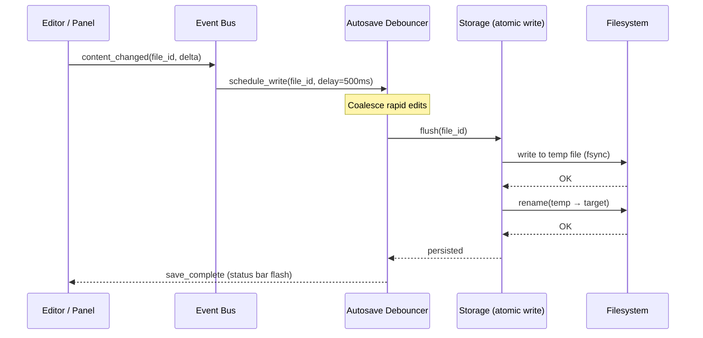
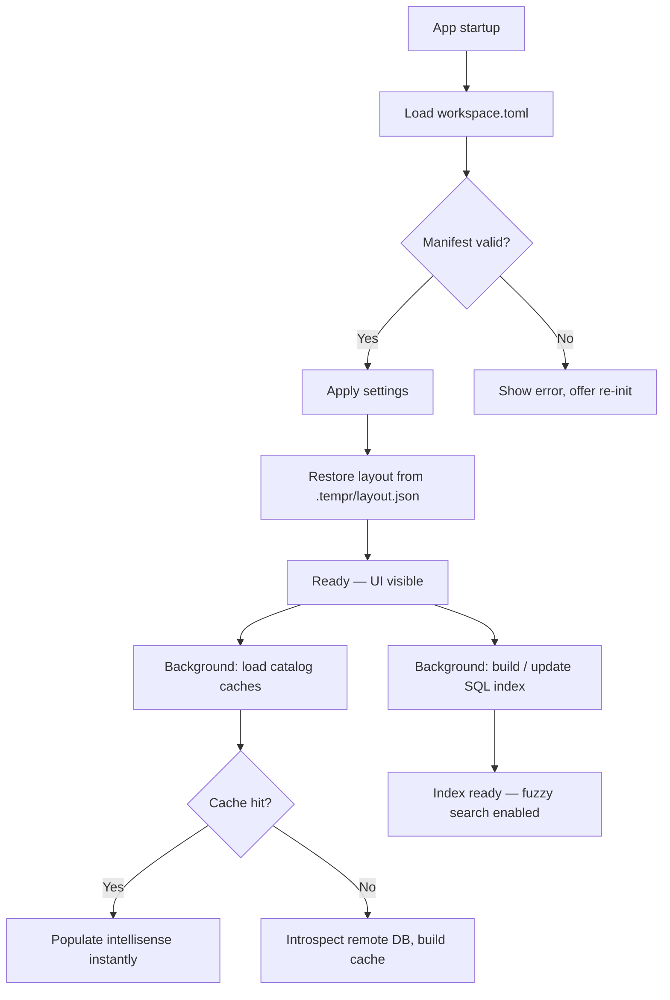

# 07 — Storage

> Every byte Tempr writes to disk, where, and in what format.

---

## Purpose

Tempr persists two categories of data:

1. **User-authored artifacts** — SQL files, workspace manifests, and layout state that the user expects to find, version-control, and share.
2. **Derived/internal state** — query history, schema catalog caches, and full-text indexes that Tempr generates to accelerate subsequent sessions.

This document defines the on-disk layout, the format chosen for each artifact, the invariants that govern how those bytes are written, and the traits through which the rest of the codebase accesses them.

---

## Responsibilities

| Concern | Owner in this doc |
|---|---|
| Defining the canonical directory tree | This section — see [On-disk layout](#on-disk-layout) |
| Choosing serialization formats and justifying each choice | [Design Rationale](#design-rationale) |
| Specifying the `Storage` trait boundary | [Interfaces](#interfaces) |
| Defining write/read paths including atomicity guarantees | [Data Flow](#data-flow) |
| Ensuring secrets never touch the workspace tree | [On-disk layout](#on-disk-layout) — security invariant |

Out of scope: network transport of query results, in-memory cache eviction policies, or UI rendering — those live in their respective documents.

---

## On-disk layout

```
<workspace>/
├── workspace.toml                 # manifest: name, format version, connection configs (no secrets)
├── *.sql                          # user SQL files — plain UTF-8 text
└── .tempr/
    ├── settings.toml              # workspace-level settings overrides
    ├── layout.json                # panel / dock layout state
    ├── history.db                 # query history — SQLite
    ├── cache/
    │   └── catalog/               # schema snapshots per connection (versioned, binary)
    └── index/                     # symbol & text indexes for SQL files
```

### Security invariant — secrets

> **Secrets (passwords, tokens, passphrases) are never stored on disk inside the workspace.**
> Connection credentials live exclusively in the OS keychain (macOS Keychain, Linux
> `secret-service` / KWallet, Windows Credential Manager). `workspace.toml` references a
> keychain entry by opaque ID only. Any code path that attempts to write a secret to the
> workspace tree is a bug and must be treated as a severity-1 issue.

### File-by-file specification

| Path | Format | Commit-able? | Description |
|---|---|---|---|
| `workspace.toml` | TOML | Yes | Project manifest — name, format version, connection definitions (ID + keychain ref, type, options). |
| `*.sql` | Plain UTF-8 text | Yes | User-authored SQL files, arbitrarily organized into subdirectories. |
| `.tempr/settings.toml` | TOML | No (gitignored) | Workspace-scoped setting overrides that should not leave the machine. |
| `.tempr/layout.json` | JSON | No | Serialized panel/dock layout. Ephemeral; regenerated if missing. |
| `.tempr/history.db` | SQLite | No | Append-only query execution history. |
| `.tempr/cache/catalog/` | Binary (see [Open Questions](#open-questions)) | No | One file per connection, versioned by schema hash. Fast-load format for instant startup. |
| `.tempr/index/` | Binary | No | Pre-built symbol and full-text indexes over all `*.sql` files. |

### Gitignore convention

The `.tempr/` directory is added to `.gitignore` by default when a workspace is initialized. `workspace.toml` and all `*.sql` files remain tracked. This clean split means collaborators get the same manifest and SQL files without dragging along local state.

---

## Design Rationale

### Why TOML for manifests

`workspace.toml` and `.tempr/settings.toml` are files users will edit by hand — renaming a project, toggling a setting, or adding a connection. TOML is:
- Human-readable and diffable with no extra tooling.
- Already the de facto Rust ecosystem standard (`Cargo.toml`, `rust-toolchain.toml`).
- Strictly typed enough to catch structural errors at parse time via `toml` + `serde`.

### Why SQLite for query history

Query history is **append-heavy and read-rare** (typically queried on startup for autocomplete or on demand for "recent queries"). SQLite gives us:
- ACID writes without a custom WAL.
- A queryable interface — "give me the last 50 queries against connection X" is a one-liner.
- Zero configuration; the entire database is a single file.
- Robustness against corruption via journaling.

### Why a binary format for catalog cache

Schema catalog snapshots can be large (hundreds of tables, thousands of columns). On startup Tempr must load these to power intellisense without blocking the UI. A zero-copy or near-zero-copy binary format (such as `rkyv`, or `bincode` with pre-allocated buffers) gives us:
- Sub-millisecond load times even for schemas with 500+ tables.
- No deserialization allocation overhead in the hot startup path.

> See [Open Questions](#open-questions) for the ongoing evaluation of `rkyv` vs `bincode` vs an embedded SQLite table.

### Why a separate `.tempr/` directory

Keeping all derived state under a single gitignore-able root means:
- A fresh clone of a workspace always starts clean — caches rebuild lazily.
- Users can `rm -rf .tempr/` to reset all local state without touching their SQL or manifest.
- The boundary between "what I wrote" and "what Tempr computed" is unambiguous.

---

## Interfaces

### `Storage` trait

The `Storage` trait is the sole gateway through which other modules access the file system. No module performs raw `std::fs` calls; all I/O flows through this trait to guarantee atomicity, debouncing, and observability.

```rust
/// Async trait — all methods are cancellable and return `Result`.
#[async_trait]
pub trait Storage: Send + Sync {
    /// Load and parse the workspace manifest. Fails if the file is missing or malformed.
    async fn load_manifest(&self) -> Result<WorkspaceManifest>;

    /// Serialize and persist the manifest. Uses atomic write (temp file + rename).
    async fn save_manifest(&self, manifest: &WorkspaceManifest) -> Result<()>;

    /// Open (or create) the SQLite history database for this workspace.
    async fn open_history(&self) -> Result<HistoryStore>;

    /// Return a handle to the catalog cache for a given connection.
    /// The cache is loaded lazily on first access.
    async fn catalog_cache(&self, connection_id: ConnectionId) -> Result<CatalogCache>;

    /// Persist the layout state (debounced, best-effort).
    async fn save_layout(&self, layout: &LayoutState) -> Result<()>;

    /// Rebuild the symbol/text index over all *.sql files.
    async fn rebuild_index(&self) -> Result<IndexHandle>;
}
```

### `HistoryStore`

Wraps a `sqlx::SqlitePool` opened against `.tempr/history.db`. Provides typed methods:

```rust
pub trait HistoryStore: Send + Sync {
    async fn record_query(&self, entry: QueryEntry) -> Result<()>;
    async fn recent_queries(&self, connection_id: ConnectionId, limit: u32) -> Result<Vec<QueryEntry>>;
    async fn search(&self, pattern: &str, limit: u32) -> Result<Vec<QueryEntry>>;
}
```

### `CatalogCache`

Provides access to a versioned schema snapshot. The cache key is a content hash of the schema introspection result, so unchanged schemas never trigger a re-write.

```rust
pub trait CatalogCache: Send + Sync {
    async fn load(&self) -> Result<Option<SchemaSnapshot>>;
    async fn save(&self, snapshot: &SchemaSnapshot) -> Result<()>;
    fn is_stale(&self, current_hash: SchemaHash) -> bool;
}
```

---

## Data Flow

### Write path — debounced autosave

All user-facing writes (SQL edits, layout changes, manifest updates) flow through a debounced autosave pipeline to avoid excessive disk I/O while guaranteeing durability.



Key properties:
- **Debounce window**: 500 ms (configurable). Rapid keystrokes are coalesced; only the final state is written.
- **Atomicity**: Every write creates a temporary file in the same directory, calls `fsync`, then performs a POSIX `rename`. A crash mid-write never corrupts the target file.
- **Ordering**: Layout and settings writes are best-effort (dropped under extreme load). Manifest and SQL writes are never dropped.

### Read path — startup vs lazy



- **Synchronous critical path** (blocking startup): `workspace.toml` parse + layout restore. Target: < 50 ms.
- **Asynchronous background path**: catalog cache hydration, SQL index rebuild. These run on Tokio background tasks and progressively enable features as they complete.

---

## Future Considerations

### Cache eviction policy

Catalog caches can grow large when a workspace has many connections to schemas with hundreds of tables. A future iteration should introduce:
- **LRU eviction** based on last-access timestamp stored alongside each cache file.
- A configurable `max_cache_size` (default: 50 MB).
- Manual eviction via a command palette action (`Tempr: Clear Cache`).

### Format migrations

`workspace.toml` carries a `format_version` field. When the on-disk format changes:
- Tempr reads old versions transparently and migrates on first write.
- Migrations are idempotent and versioned (similar to database migrations).
- A backup of the old file is written to `.tempr/backups/` before migration.

### Encryption at rest

For workspaces containing sensitive SQL (e.g., DDL for restricted tables), an optional encryption-at-rest mode would:
- Encrypt all files under `.tempr/` using a user-supplied passphrase or OS keychain-stored key.
- Use AES-256-GCM with a per-file nonce.
- Leave `workspace.toml` and `*.sql` unencrypted by default; encryption is opt-in per workspace.

---

## Open Questions

| # | Question | Status | Notes |
|---|---|---|---|
| 1 | **Catalog cache format: `rkyv` vs `bincode` vs embedded SQLite?** | Open | `rkyv` offers zero-copy deserialization but adds a `SAFETY` burden and pinned memory. `bincode` is simpler but requires allocation. An SQLite table within `history.db` avoids a second binary format but may be slower for snapshot loads. A prototype benchmark is needed. |
| 2 | **History retention defaults?** | Open | Should `history.db` auto-prune entries older than N days? What is a sane default — 30 days? 90? Should this be configurable in `settings.toml`? |
| 3 | **Should `.tempr/index/` be regenerable entirely from `*.sql` files?** | Open | If yes, it can always be deleted and rebuilt (no persistence guarantee needed). This simplifies the contract but adds startup cost for large workspaces. |
| 4 | **Cross-workspace history?** | Deferred | Some users may want a single global history across all workspaces. Architecture decision: per-workspace SQLite (current) vs a single `~/.tempr/history.db`. |

---

## Related Documents

- [04 — Workspace](./04-workspace.md) — workspace initialization, manifest structure, and connection lifecycle.
- [09 — Database Engine](09-database-engine.md) — how executed queries are recorded into history.
- [16 — Roadmap](16-roadmap.md) — startup budget, catalog cache load times, and the performance pillar.
- [02 — Architecture](02-architecture.md) — high-level system boundaries and where Storage sits in the component graph.
