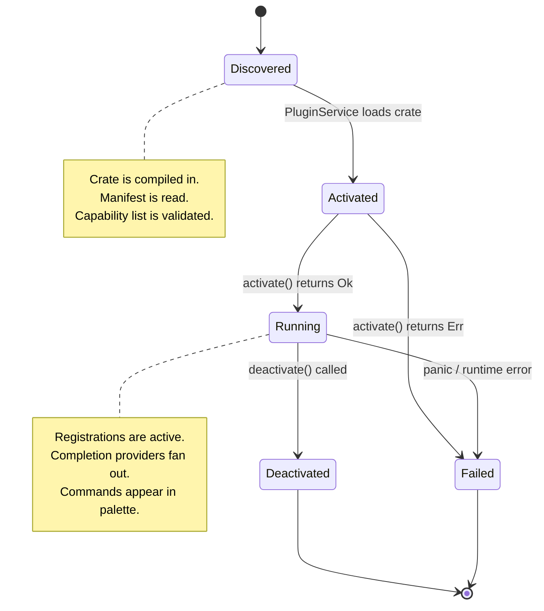
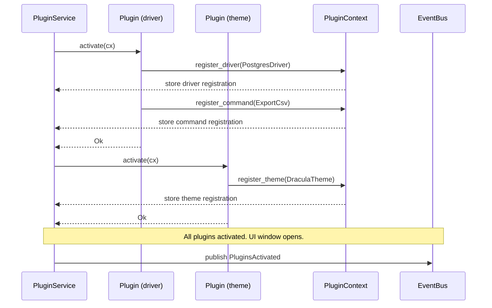

# Plugin API

> Extension points and plugin lifecycle — the contracts that make "everything is extensible" a concrete, testable API surface rather than a slogan.

---

## Purpose

The vision document ([01-vision.md](01-vision.md)) mandates that everything in Tempr is extensible. This document defines what "everything" means concretely by specifying the seven extension points that the plugin system exposes:

1. **Database drivers** — connect to new engines beyond the built-in PostgreSQL driver.
2. **Completion providers** — inject custom candidates into the SQL completion pipeline.
3. **Themes** — supply color schemes, typography, and spacing tokens to the UI layer.
4. **Commands** — register new actions in the command palette and bind keybindings.
5. **Panels** — contribute custom panels to the workspace dock layout.
6. **Result renderers** — provide specialized cell rendering for custom data types (e.g., GeoJSON, Protobuf).
7. **AI providers** — hook into the AI completion and generation surface with custom backends.

Every core feature in Tempr — including the PostgreSQL driver, the built-in themes, and the default result renderers — is implemented as a static plugin that registers through the same API third-party plugins use. This "eat your own plugin API" policy guarantees the API surface is battle-tested, ergonomic, and designed for real use from day one.

---

## Responsibilities

This document governs:

- The `Plugin` root trait that every plugin implements.
- The `PluginManifest` metadata structure (id, name, version, declared capabilities).
- The `PluginContext` that plugins receive during activation — the only surface through which plugins interact with the host.
- Each of the seven extension-point trait contracts: `DatabaseDriver`, `CompletionProvider`, `ResultRenderer`, `ThemeProvider`, `CommandContribution`, `PanelContribution`, `AiProvider`.
- Plugin lifecycle: discovery, activation, running, deactivation, and failure states.
- The v1 static-plugin delivery model and the rationale for deferring dynamic loading.
- The security boundary: plugins never receive access to the `ServiceRegistry`.

This document does **not** govern:

- The `EventBus` or `AppEvent` taxonomy (see [06-event-system.md](06-event-system.md)).
- The `ServiceRegistry` or service lifecycle (see [05-services.md](05-services.md)).
- Plugin UI rendering conventions (see [11-gpui.md](11-gpui.md)).
- Individual driver, completion, or rendering implementation details — those live in their respective domain documents.

---

## Design Rationale

### Registration-Based vs Hook-Based

Two fundamental plugin architectures exist:

| Model | How it works | Tradeoff |
|---|---|---|
| **Hook-based** | Host defines named hook points (`on_query_execute`, `on_render_cell`). Plugins register closures for each hook. | Simple to implement; creates implicit ordering problems; hard to audit which plugins touch which hooks; hook signature changes break every plugin. |
| **Registration-based** | Host defines typed extension-point traits. Plugins receive a `PluginContext` and call `register_*` methods to hand capabilities to the host. The host controls when and how those capabilities are invoked. | Clean ownership (host owns the capabilities); typed contracts enforced at compile time; easy to audit (grep for `register_` calls); signature changes produce compile errors, not runtime failures. |

Tempr uses the **registration-based** model. During activation, a plugin receives a mutable `PluginContext` and calls registration methods to hand its capabilities to the host. The host stores these capabilities and invokes them at the appropriate time — a completion request, a render call, a command execution. The plugin never calls into the host beyond registration and event access.

### Why Plugins Never Get `ServiceRegistry` Access

The `ServiceRegistry` (see [02-architecture.md](02-architecture.md)) provides access to every service in the system. Giving plugins this access would:

1. **Break API stability.** Every internal service method change would become a breaking change for every plugin. The `PluginContext` registration surface is intentionally narrow — changes to it are rare, well-reviewed, and versioned.
2. **Enable uncontrolled side effects.** A plugin with `ServiceRegistry` access could call any service method, subscribe to any event, and mutate shared state in ways the host cannot reason about. Registration-based APIs limit plugins to a well-defined interaction surface.
3. **Block the sandboxing path.** Future dynamic loading (WASM or process isolation) requires a capability boundary. If the v1 static API leaks `ServiceRegistry` access, migrating to dynamic plugins means breaking every plugin that uses it. The narrow `PluginContext` surface today preserves the option to sandbox tomorrow.

The one exception is `PluginContext::events()`, which returns a reference to the `EventBus`. Plugins may subscribe to and publish events (including their own namespaced `PluginEvent` variants) but cannot access services directly. This gives plugins the observability and communication channel they need without exposing internal service internals.

### Why Core Features Use the Plugin API

Implementing the PostgreSQL driver, the built-in themes, and the default result renderers as static plugins has three benefits:

1. **Dogfooding.** If the plugin API cannot express a first-class feature, it is insufficient for third-party plugins. Every pain point a core feature hits is a pain point a future plugin author would hit.
2. **Consistency.** Core and third-party plugins share the same activation path, the same `PluginContext`, and the same registration semantics. There are no "special" code paths for built-in features.
3. **Testability.** Each static plugin is a self-contained crate that can be tested independently against the plugin API contracts.

---

## Interfaces

### Plugin Manifest

Every plugin declares a manifest with stable identity and capability metadata:

```rust
pub struct PluginManifest {
    pub id: &'static str,           // unique, reverse-domain recommended: "dev.tempr.postgres"
    pub name: &'static str,         // human-readable: "PostgreSQL Driver"
    pub version: &'static str,      // semver: "0.1.0"
    pub capabilities: Vec<Capability>,
}

pub enum Capability {
    Driver { engine_name: &'static str },
    CompletionProvider,
    Theme,
    CommandContribution,
    PanelContribution,
    ResultRenderer { column_types: Vec<&'static str> },
    AiProvider { provider_name: &'static str },
}
```

The `capabilities` list is advisory — it enables early discovery (the host can check whether a plugin declares the capabilities the workspace needs) and UI display (listing installed plugins and what they provide). Actual registration still happens in `activate` via `PluginContext`.

### Root Plugin Trait

```rust
pub trait Plugin: Send + Sync {
    fn manifest(&self) -> &PluginManifest;

    /// Called once after construction. The plugin registers all its
    /// capabilities through the PluginContext. Returning Err marks the
    /// plugin as failed; its registrations are discarded.
    fn activate(&mut self, cx: &mut PluginContext) -> Result<(), PluginError>;

    /// Called before shutdown. The plugin should release any held resources.
    /// The host discards all registrations after this returns.
    fn deactivate(&mut self);
}
```

### PluginContext — The Registration Surface

```rust
pub struct PluginContext<'a> {
    // Registration APIs — the ONLY surface plugins touch.
    pub fn register_driver(&mut self, driver: Arc<dyn DatabaseDriver>);
    pub fn register_completion_provider(&mut self, p: Arc<dyn CompletionProvider>);
    pub fn register_result_renderer(&mut self, r: Arc<dyn ResultRenderer>);
    pub fn register_theme(&mut self, t: ThemeProvider);
    pub fn register_command(&mut self, c: CommandContribution);
    pub fn register_panel(&mut self, p: PanelContribution);
    pub fn register_ai_provider(&mut self, a: Arc<dyn AiProvider>);

    /// Read-only access to the event bus. Plugins may subscribe to
    /// AppEvent (including PluginEvent) and publish their own events.
    pub fn events(&self) -> &EventBus;
}
```

A plugin may register multiple capabilities of the same type (e.g., a plugin that provides drivers for both MySQL and SQLite calls `register_driver` twice). Calling a registration method with a duplicate identifier (e.g., the same engine name) is a `PluginError::DuplicateRegistration`.

### Extension-Point Traits

Each extension point is a trait that the host stores and invokes at the appropriate time. These are the contracts plugins implement.

#### DatabaseDriver

```rust
#[async_trait]
pub trait DatabaseDriver: Send + Sync {
    /// Engine identifier, e.g. "postgresql", "mysql", "sqlite".
    /// Must be unique across all registered drivers.
    fn engine_name(&self) -> &'static str;

    /// Establish a connection to the database using the provided config.
    async fn connect(&self, cfg: &ConnectionConfig) -> Result<Box<dyn DriverConnection>, DriverError>;
}
```

The `DriverConnection` trait (defined in [09-database-engine.md](09-database-engine.md)) provides `execute`, `cancel`, `snapshot_schema`, and `transaction` methods. This plugin-level trait is intentionally thin — it declares engine identity and connection creation. The full connection lifecycle is governed by the database engine layer.

#### CompletionProvider

```rust
pub trait CompletionProvider: Send + Sync {
    /// Provide completion candidates for the given request.
    /// Results are merged with the built-in completion pipeline
    /// and ranked together (ranking detail in 12-sql-intelligence.md).
    fn complete(&self, req: &CompletionRequest) -> Vec<CompletionItem>;
}
```

The `CompletionRequest` carries the buffer snapshot, cursor offset, and current connection ID. The `CompletionItem` carries label, kind, detail text, and a sort-priority hint. Plugins may return candidates from any source — built-in keyword lists, schema-derived suggestions, external catalogs. Merging and ranking of plugin-provided candidates with the built-in pipeline is deferred to [12-sql-intelligence.md](12-sql-intelligence.md).

#### ResultRenderer

```rust
pub trait ResultRenderer: Send + Sync {
    /// Determine whether this renderer can handle the given column type.
    /// Called once per column when a result set arrives.
    fn can_render(&self, col: &ColumnSpec) -> bool;

    /// Render a single cell value as a GPUI Element.
    /// Called only for columns where can_render returned true.
    fn render_cell(&self, value: &Value, col: &ColumnSpec) -> Box<dyn Element>;
}
```

The host evaluates `can_render` for each registered `ResultRenderer` in registration order and picks the first match. If no renderer matches, the default text renderer is used. This chain lets plugins provide specialized rendering for custom types (JSON pretty-printing, bytea hex display, geographic data visualization) without modifying the result grid.

#### ThemeProvider

```rust
pub trait ThemeProvider: Send + Sync {
    /// Theme identifier, e.g. "dracula", "monokai", "solarized-dark".
    fn name(&self) -> &'static str;

    /// Return the complete theme data — color palette, typography,
    /// spacing tokens — consumed by GPUI components (see 11-gpui.md).
    fn theme_data(&self) -> ThemeData;
}
```

Themes register as `ThemeProvider` instances (not wrapped in `Arc<dyn ...>`) because the host may need to clone theme data for concurrent rendering. `ThemeData` contains all color, font, and spacing tokens that the GPUI component library consumes.

#### CommandContribution

```rust
pub struct CommandContribution {
    pub id: &'static str,          // unique command ID
    pub title: &'static str,       // display title in the palette
    pub keybinding: Option<&'static str>,  // e.g. "cmd+k cmd+r"
    pub handler: Box<dyn Fn(&mut AppContext) + Send + Sync>,
}

impl CommandContribution {
    pub fn commands(&self) -> Vec<Command> {
        vec![Command {
            id: self.id,
            title: self.title,
            keybinding: self.keybinding,
        }]
    }
}
```

Commands contributed by plugins appear in the command palette alongside core commands. The handler receives a mutable `AppContext` reference — the same surface the command palette uses — but does not receive `ServiceRegistry` access. The handler must delegate to services through the event bus or through the scoped APIs available in `AppContext`.

#### PanelContribution

```rust
pub struct PanelContribution {
    pub panel_id: &'static str,    // unique panel identifier
    pub title: &'static str,       // tab title in the dock
    pub render: Box<dyn Fn() -> Box<dyn Element> + Send + Sync>,
}
```

Panels register a render function that the host calls to construct the panel's GPUI element tree. The panel appears as a dockable tab in the workspace layout. The render function is a closure because panels may capture configuration or state from the plugin's activation context.

#### AiProvider

```rust
pub trait AiProvider: Send + Sync {
    /// Provider identifier, e.g. "openai", "anthropic", "local-ollama".
    fn provider_name(&self) -> &'static str;

    /// Stream a completion response for the given prompt.
    /// Returns an async iterator of response chunks.
    /// The host handles buffering and UI integration.
    async fn complete(&self, prompt: &str) -> BoxStream<'static, Result<String, AiError>>;
}
```

AI providers return a `BoxStream` of response chunks, enabling streaming output in the UI (token-by-token rendering as the model generates). The host owns the stream and controls backpressure. The `AiError` type covers network failures, rate limiting, and authentication errors.

---

## Data Flow

### Plugin Lifecycle



### Registration Flow

At startup, after the `ServiceRegistry` is constructed but before the first GPUI window opens, `PluginService` iterates over all registered static plugins (Rust crates linked into the binary) and activates them in declared-dependency order:



After activation, the host stores all registered capabilities in typed vectors. The `PluginService` exposes accessor methods that core services use:

- `QueryService` calls `PluginService::drivers()` to resolve an `engine_name` to a `DatabaseDriver`.
- `IntelligenceService` calls `PluginService::completion_providers()` to fan out completion requests.
- `CommandService` calls `PluginService::commands()` to merge plugin-contributed commands into the palette.
- `ResultGrid` calls `PluginService::result_renderers()` to find a renderer for each column.
- `LayoutService` calls `PluginService::panels()` to instantiate dockable panel elements.
- The theme manager calls `PluginService::themes()` to list available themes.
- The AI surface calls `PluginService::ai_providers()` to list available backends.

### Completion Fan-Out

When a completion request arrives at the `IntelligenceService`, the flow is:

1. The built-in `SemanticEngine` generates its candidates (see [12-sql-intelligence.md](12-sql-intelligence.md)).
2. `IntelligenceService` iterates over all registered `CompletionProvider`s (from `PluginService`).
3. Each provider's `complete` method is called with the same `CompletionRequest`.
4. Results from all providers are collected into a single `Vec<CompletionItem>`.
5. The combined list is ranked and deduplicated by the ranking layer (detailed in [12-sql-intelligence.md](12-sql-intelligence.md)).
6. The top N candidates are returned to the editor for display.

This fan-out is synchronous within a single request — `CompletionProvider::complete` is not async because completion must resolve against the current buffer snapshot without awaiting I/O. The <5ms latency budget (per [12-sql-intelligence.md](12-sql-intelligence.md)) applies to the entire fan-out, including all plugin providers.

---

## Future Considerations

### Dynamic Plugin Loading

v1 uses static plugins (compiled-in Rust crates registered at startup). Dynamic loading is explicitly deferred to a future version. When it is pursued, two candidates exist:

| Dimension | WASM Component Model | Dynamic Library (dylib) |
|---|---|---|
| **Safety** | Memory-safe by construction; no buffer overflows, no use-after-free. Sandbox prevents filesystem/network access by default. | Unsafe Rust FFI; a misbehaving plugin can corrupt memory or crash the process. Requires `catch_unwind` and careful ABI design. |
| **Performance** | ~2-10x overhead on call boundaries (WASM→host transitions). Streaming data requires shared-memory copies. | Near-native performance; shared memory, no serialization boundary. |
| **API stability** | Component model enforces typed interfaces. Breaking changes require explicit version negotiation. | ABI is fragile; must pin `#[repr(C)]` structs and use careful versioning. |
| **Ecosystem** | Growing (wasmtime, wasm-component, WASI preview 2) but not yet stable for complex desktop use cases. | Mature; `libloading` crate handles dlopen/dlsym reliably. |
| **Portability** | Cross-platform by construction. Plugin compiled once runs everywhere with a WASM runtime. | Platform-specific binaries; plugin authors must build per-OS. |
| **Development experience** | Plugin authors compile to `wasm32-wasi` target. Debugging is harder (limited tooling). | Standard Rust toolchain; familiar debugging. |

**Recommendation:** When dynamic loading becomes a priority, evaluate the WASM component model first. Its safety guarantees align with the project's long-term sandboxing goals. The dylib path remains viable as a fallback if WASM maturity or performance does not meet requirements.

### Plugin Marketplace

A curated registry of vetted plugins — browsable from within Tempr, with installation, update, and removal workflows. This requires a trust model (signed plugins, reputation scoring), a hosting backend, and review processes. Not planned for v1.

### Plugin Settings Schema

Plugins that need user configuration (API keys for AI providers, custom color overrides for themes) need a settings schema mechanism. Options under consideration:

- A `settings.toml` section namespaced by plugin ID in the workspace settings.
- A declarative schema each plugin provides (similar to VS Code's `contributes.configuration`).
- Delegating settings entirely to the plugin's own `activate` method (the plugin reads its own files).

This is deferred until the settings system ([07-storage.md](07-storage.md)) is more mature.

### Plugin Capability Permissions

As the plugin ecosystem grows, a capability permissions model may be needed — declaring that a plugin requires filesystem access, network access, or a specific service, and having the host enforce those permissions at activation time. This aligns with the sandboxing path and would be required for dynamic loading.

---

## Open Questions

| # | Question | Status | Notes |
|---|---|---|---|
| 1 | **WASM component model timing.** When should the project invest in WASM plugin support? | Open | Depends on WASM component model stability and wasmtime/wasi maturity. Current leaning: defer until after v1 ships, when real third-party plugin demand materializes. The static-plugin API is designed to be a superset of what WASM plugins would need — no breaking changes required. |
| 2 | **Plugin settings schema.** How should plugins declare and receive user configuration? | Open | Options: namespace in workspace `settings.toml`, declarative JSON schema (VS Code style), or plugin-managed files. Needs input from the settings system design ([07-storage.md](07-storage.md)) and from potential plugin authors. The `PluginManifest` could carry a `settings_schema: Option<serde_json::Value>` field. |
| 3 | **Capability permissions model.** Should plugins declare required capabilities beyond their extension-point registrations? | Open | Example: an AI provider plugin needs network access; a theme plugin needs only theme registration. A permissions model would let the host prompt the user or enforce policies. Not needed for v1 static plugins (trust is implicit in compilation) but required for dynamic loading. |
| 4 | **Plugin conflict resolution.** What happens when two plugins register the same engine name, command ID, or panel ID? | Open | Current leaning: last-registration-wins for engines (error logged), first-registration-wins for commands (duplicates rejected with `PluginError::DuplicateRegistration`), and panels are namespaced by plugin ID. Needs formalization. |
| 5 | **Plugin hot-reload.** Should plugins support deactivation and re-activation without restarting the application? | Deferred | Useful during development, risky in production. Requires careful state migration for any state the plugin holds. Defer until after dynamic loading is implemented. |

---

## Related Documents

- [Services](05-services.md) — `PluginService` manages plugin lifecycle and exposes registered capabilities to other services; `CommandService` consumes `CommandContribution` registrations.
- [Event System](06-event-system.md) — plugins subscribe to and publish events through the `EventBus`; the `PluginEvent` variant carries namespaced plugin events.
- [Database Engine](09-database-engine.md) — `DatabaseDriver` and `DriverConnection` contracts; the PostgreSQL driver is the reference static plugin implementation.
- [SQL Intelligence](12-sql-intelligence.md) — `CompletionProvider` fan-out and ranking; the built-in `SemanticEngine` is the default completion source; plugin completions merge into the ranked list.
- [Result Grid](13-result-grid.md) — `ResultRenderer` chain evaluated per-column; default text renderer used when no plugin renderer matches.
- [ADR-0008](adr/0008-plugin-system.md) — locked decision: registration-based plugin model, static plugins in v1, seven extension points.
