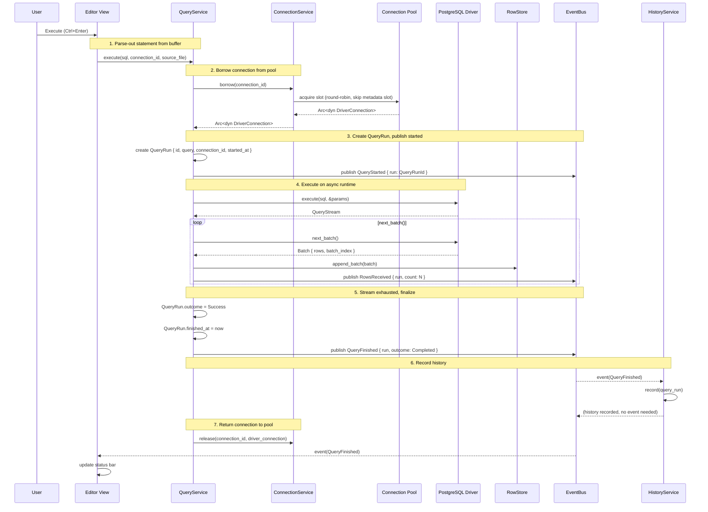
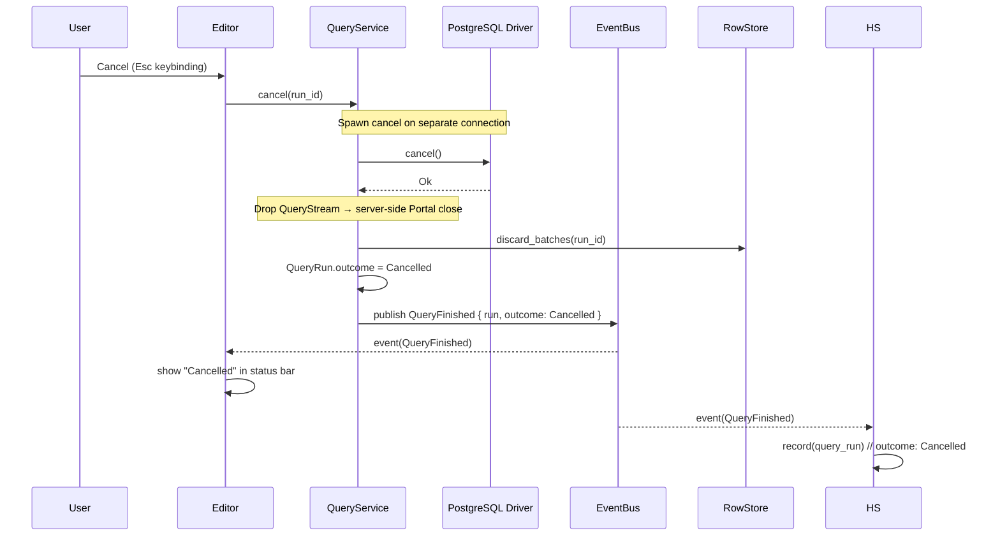
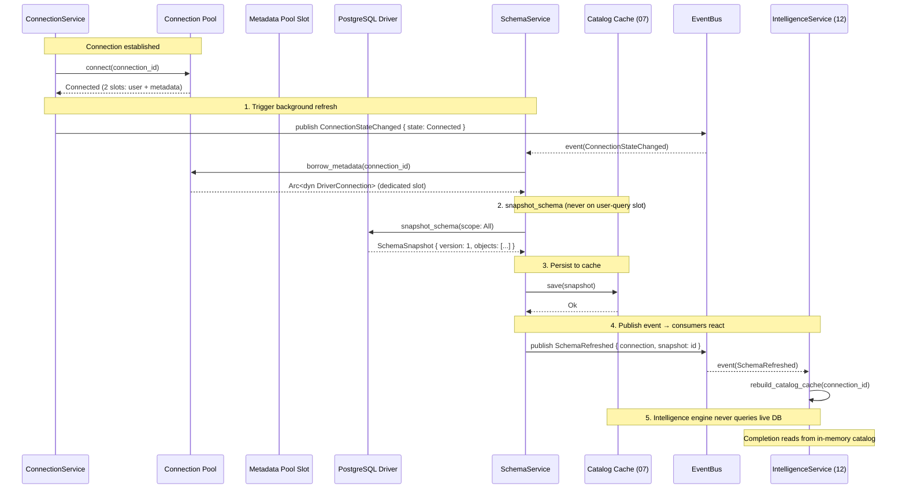

# 09 — Database Engine

> Everything between a Connection config and rows on screen — the driver abstraction, PostgreSQL implementation, query execution lifecycle, and metadata pipeline.

---

## Purpose

The database engine is the layer that translates a `ConnectionConfig` (host, port, credentials, engine type) into streaming, cancellable query execution and structured schema metadata. PostgreSQL is the only v1 target, but every interface is designed for N engines — MySQL, SQLite, and beyond — through a trait abstraction that plugins implement.

This document defines:

- The `DatabaseDriver` and `DriverConnection` traits that every engine must implement.
- The `QueryStream` streaming protocol: rows arrive in bounded batches, never row-at-a-time and never fully materialized in memory.
- The connection-pooling model: per-connection pools with a dedicated metadata slot so schema refresh never blocks user queries.
- The PostgreSQL-specific choices: wire protocol client, type mapping, and future LISTEN/NOTIFY support.
- The metadata pipeline: background schema snapshotting from connection to cache to `SchemaRefreshed` event.

---

## Responsibilities

| Concern | Owner in this doc |
|---|---|
| Defining the `DatabaseDriver` and `DriverConnection` traits | [Interfaces](#interfaces) |
| Specifying the `QueryStream` batch protocol | [Interfaces](#interfaces) — `QueryStream` |
| Connection pooling: pool sizing, health checks, dedicated metadata slot | [Design Rationale](#connection-pooling-model) |
| PostgreSQL driver choice and type mapping | [PostgreSQL specifics](#postgresql-specifics) |
| Query lifecycle from parse-out to history | [Query lifecycle](#query-lifecycle) |
| Metadata pipeline: schema snapshot → cache → event | [Metadata pipeline](#metadata-pipeline) |
| Type system: `Value`, `ColumnSpec`, `Batch`, `Row` | [Interfaces](#canonical-types) |

Out of scope: query editing (see [10-editor.md](10-editor.md)), completion and diagnostics (see [12-sql-intelligence.md](12-sql-intelligence.md)), result rendering (see [13-result-grid.md](13-result-grid.md)), and persistence of schema caches (see [07-storage.md](07-storage.md)).

---

## Design Rationale

### Why streaming batches, not row-at-a-time or full materialization

Three approaches exist for moving data from the database wire to the UI:

| Approach | Tradeoff |
|---|---|
| **Row-at-a-time** (one `next_row()` call per row) | Minimum memory at rest but maximum syscall and allocation overhead. Each row crossing the FFI or async boundary is an allocation. At 1M rows this is catastrophic. |
| **Full materialization** (buffer all rows before returning) | Simple API — the caller gets a `Vec<Row>`. But a 10M-row result set (common in analytical queries) consumes gigabytes before the user sees a single cell. Violates the memory footprint pillar. |
| **Batched streaming** (`next_batch()` returns `Vec<Row>` of bounded size) | Batches amortise the per-row overhead while bounding memory. The UI can start rendering the first batch before the last row has been received. The batch size is tuned so each batch is large enough to amortise overhead (~1000–5000 rows) and small enough that memory stay predictable. |

**Tempr uses batched streaming.** `QueryStream::next_batch` never returns a single row — it returns `Option<Batch>`, where `Batch` is `Vec<Row>` bounded to a configurable maximum (default: 4000 rows, tuned so a batch fits comfortably in a single allocation region). The UI receives batches through the row store (see [13-result-grid.md](13-result-grid.md)) and re-renders only its visible viewport.

### Why schema snapshot is pull-based + cached

The schema metadata pipeline is pull-based and cached rather than querying the database on every completion request:

- **Pull-based:** `SchemaService` calls `DriverConnection::snapshot_schema` explicitly, not on every keystroke. The snapshot is a point-in-time copy of the database's table/view/column structure.
- **Cached:** The snapshot is written to the catalog cache on disk (see [07-storage.md](07-storage.md)) and held in memory by `SchemaService`. The completion engine reads from the in-memory snapshot — never from the live database.

This eliminates two classes of problem:

1. **Latency on every keystroke.** Running `SELECT column_name, data_type FROM information_schema.columns` on every buffer change would add 10–100 ms of network latency to every completion request, making the editor feel sluggish. The cached snapshot is sub-microsecond to read.
2. **Database load during typing.** A user typing a query would generate hundreds of schema queries per minute, putting unnecessary load on the database server.

The tradeoff is staleness: if another client adds a column, the completion engine will not know about it until the next refresh. This is acceptable — the user can explicitly refresh schema, and a future version will trigger refresh on detected DDL.

### Connection pooling model

Every connection gets a pool of `DriverConnection` handles. Pool sizing follows these rules:

- **Minimum pool size:** 2 (one for user queries, one for metadata).
- **Maximum pool size:** configurable per connection (default: 8).
- **Dedicated metadata slot:** One pool slot is reserved exclusively for `SchemaService`. This slot is never borrowed by `QueryService`, so a long-running user query cannot starve a schema refresh. The metadata slot is created lazily on first `snapshot_schema` call and kept alive with periodic health checks.
- **Health checks:** Idle connections in the pool are pinged every 30 seconds. A failed ping triggers a reconnect attempt (up to 3 retries with exponential backoff). If all retries fail, the connection transitions to `Failed` state and a `ConnectionStateChanged` event is published.

### Why not sqlx for PostgreSQL

Three candidates for the PostgreSQL wire protocol client were evaluated:

| Client | Streaming control | Async runtime | Type mapping | Cursor support | Notes |
|---|---|---|---|---|---|
| **tokio-postgres** | Full — caller controls `RowStream` directly | tokio | Manual mapping required | Native `Portal` support | Lower-level; gives full control over batch sizes, cancellation, and portal lifecycle |
| **sqlx** (`postgres` feature) | Row-at-a-time via `fetch()` | tokio (with `runtime-tokio` feature) | Automatic via `FromRow` derive | Via `DECLARE CURSOR` (synthetic) | Convenient for CRUD; buffers rows internally; cancellation through `AbortHandle` |
| **Custom** over `openssl` + `byteorder` | Full | Any | Manual | Native | Unnecessary complexity for v1 |

**Recommendation: tokio-postgres.**

Rationale:

1. **Streaming control.** `tokio-postgres` exposes a `RowStream` that the caller polls for rows. Tempr wraps this in `QueryStream` and enforces batch boundaries. `sqlx` does not expose a raw stream — its `fetch()` returns a `Stream<Item = Result<PgRow, Error>>` but each item is decoded immediately, losing the ability to control batch sizes at the protocol level.
2. **Cancellation via Portal.** `tokio-postgres` supports PostgreSQL's extended query protocol natively. A `Portal` can be created, rows fetched in batches, and the portal closed (cancelling the query server-side) by dropping the connection or calling `cancel` on the underlying connection handle. `sqlx` cancellation requires wrapping the future in an `AbortHandle`, which terminates the client-side task but does not reliably cancel the server-side query.
3. **Connection lifecycle.** `tokio-postgres` gives raw `Connection` and `Client` handles that can be wrapped in Tempr's pool. `sqlx` owns its own pool, which would duplicate Tempr's pooling logic and make the dedicated metadata slot harder to implement.

The cost is manual type mapping (see [PostgreSQL type mapping](#postgresql-type-mapping)), but this is a one-time mapping table in the PostgreSQL driver implementation.

---

## Interfaces

### DatabaseDriver

The root trait that every engine plugin implements. It is intentionally thin — engine identity and connection creation. The connection lifecycle is handled by `DriverConnection`.

```rust
#[async_trait]
pub trait DatabaseDriver: Send + Sync {
    /// Engine identifier, e.g. "postgresql", "mysql", "sqlite".
    /// Must be unique across all registered drivers (enforced by PluginService).
    fn engine(&self) -> EngineId;

    /// Establish a new connection (or pool slot) to the database.
    /// The returned connection is not yet pooled — ConnectionService
    /// wraps it in pool management before exposing it to consumers.
    async fn connect(&self, cfg: &ConnectionConfig) -> Result<Box<dyn DriverConnection>, DriverError>;
}
```

### DriverConnection

The active connection handle returned by `DatabaseDriver::connect`. Every method is cancellable (the async task can be dropped to abort the operation).

```rust
#[async_trait]
pub trait DriverConnection: Send {
    /// Execute a SQL statement with bound parameters and return
    /// a streaming result handle. For DDL/DML that returns no rows,
    /// the stream yields zero batches and reports the affected row count
    /// via `QueryStream::rows_affected()`.
    async fn execute(&mut self, sql: &str, params: &[Value]) -> Result<QueryStream, DriverError>;

    /// Cancel the currently executing query on this connection.
    /// PostgreSQL: sends a CancelRequest on a separate connection.
    /// Called from the cancel path in QueryService (see [Query lifecycle](#query-lifecycle)).
    async fn cancel(&mut self) -> Result<(), DriverError>;

    /// Perform a full schema introspection within the given scope
    /// (database, schema, or all). Returns a structured snapshot that
    /// SchemaService persists to the catalog cache.
    /// This method is called on the dedicated metadata pool slot.
    async fn snapshot_schema(&mut self, scope: SchemaScope) -> Result<SchemaSnapshot, DriverError>;

    /// Open a transaction. The returned Transaction handle supports
    /// commit/rollback and wraps the same DriverConnection.
    async fn transaction(&mut self) -> Result<Transaction<'_>, DriverError>;
}
```

### QueryStream

The streaming result handle. Never buffers all rows in memory. The caller (typically `QueryService`) pulls batches and forwards them to the row store.

```rust
/// Streaming, never buffer-all: rows arrive in bounded batches.
/// Dropping the stream cancels the server-side query (via Portal close
/// for PostgreSQL).
pub struct QueryStream {
    inner: Box<dyn QueryStreamImpl + Send>,
    // batch_size is set by ConnectionService at pool-borrow time
    // and can be overridden per-query via QueryOptions.
    batch_size: usize,
    rows_affected: u64,
    finished: bool,
}

impl QueryStream {
    /// Column metadata — available immediately after execute() returns,
    /// before any rows are fetched. Returns empty slice for DDL/DML.
    pub fn columns(&self) -> &[ColumnSpec];

    /// Fetch the next batch of rows. Returns None when the result set
    /// is exhausted. Batch size is bounded to self.batch_size (default 4000).
    /// This is the ONLY way to read rows — there is no row-at-a-time API.
    pub async fn next_batch(&mut self) -> Result<Option<Batch>, DriverError>;

    /// Total number of rows affected (for DML) or inserted (for COPY).
    /// Valid only after the stream is exhausted (next_batch returned None).
    pub fn rows_affected(&self) -> u64;
}
```

### Canonical Types

Types that travel between the engine layer and the rest of the system. These are defined in a shared `tempr-types` crate or at the domain-model level.

```rust
/// Unique engine identifier, used as the key in driver registration.
#[derive(Debug, Clone, PartialEq, Eq, Hash)]
pub struct EngineId(pub String);

/// Connection configuration — everything except the secret.
#[derive(Debug, Clone)]
pub struct ConnectionConfig {
    pub engine: EngineId,
    pub host: String,
    pub port: u16,
    pub database: String,
    pub username: String,
    pub secret_ref: SecretRef,            // resolved by ConnectionService
    pub pool_min_size: usize,
    pub pool_max_size: usize,
    pub connect_timeout_ms: u64,
}

/// A single row: positionally-indexed cell values.
pub type Row = Vec<Value>;

/// A batch of rows with a bounded size.
pub struct Batch {
    pub rows: Vec<Row>,
    pub batch_index: usize,              // 0-based sequence number
}

/// The unified value type that every database engine maps into.
/// Canonical types used for all engines; engine-specific types
/// are mapped to the closest variant at the driver boundary.
#[derive(Debug, Clone)]
pub enum Value {
    Null,
    Bool(bool),
    Int64(i64),
    Float64(f64),
    String(String),
    Bytes(Vec<u8>),
    Uuid(uuid::Uuid),
    Json(serde_json::Value),
    Timestamp(chrono::DateTime<chrono::Utc>),
    Date(chrono::NaiveDate),
    Time(chrono::NaiveTime),
    Numeric(String),                     // avoid float precision loss
    Array(Box<[Value]>),
    // Engine-specific values are wrapped in this variant.
    // The driver provides a display hint for rendering.
    Custom(String, Vec<u8>),
}

/// Column metadata, available as soon as execute() returns.
#[derive(Debug, Clone)]
pub struct ColumnSpec {
    pub name: String,
    pub ordinal: usize,
    pub data_type: String,               // engine-specific type name, e.g. "int4"
    pub value_type: ValueType,           // the mapped Value variant
    pub nullable: bool,
    pub table_schema: Option<String>,    // for column completion context
    pub table_name: Option<String>,
}

#[derive(Debug, Clone, PartialEq, Eq)]
pub enum ValueType {
    Null,
    Bool,
    Int,
    Float,
    String,
    Bytes,
    Uuid,
    Json,
    Timestamp,
    Date,
    Time,
    Numeric,
    Array,
    Custom,
}

/// Scope for schema introspection.
#[derive(Debug, Clone)]
pub enum SchemaScope {
    All,
    Schema(String),
    Table { schema: String, table: String },
}

/// Error type for all driver operations.
#[derive(Debug, thiserror::Error)]
pub enum DriverError {
    #[error("connection refused: {0}")]
    ConnectionRefused(String),
    #[error("authentication failed: {0}")]
    AuthFailed(String),
    #[error("query error: {0}")]
    Query(String),
    #[error("cancelled")]
    Cancelled,
    #[error("timeout")]
    Timeout,
    #[error("engine not found: {0}")]
    EngineNotFound(String),
    #[error("internal: {0}")]
    Internal(String),
}

/// Transaction handle. Dropping without commit/rollback triggers
/// an automatic rollback.
pub struct Transaction<'a> {
    conn: &'a mut dyn DriverConnection,
    active: bool,
}

impl Transaction<'_> {
    pub async fn commit(&mut self) -> Result<(), DriverError>;
    pub async fn rollback(&mut self) -> Result<(), DriverError>;
}

impl Drop for Transaction<'_> {
    fn drop(&mut self) {
        if self.active {
            // spawn rollback on async runtime — best-effort
            // (transaction will be rolled back by the server on
            // connection close if this fails)
        }
    }
}
```

---

## PostgreSQL Specifics

### tokio-postgres integration

The PostgreSQL driver is a static plugin that wraps `tokio-postgres` behind the `DatabaseDriver` trait. Key integration points:

- **Connection:** `tokio-postgres::Client` is created from a `Config` and wrapped in `PostgresConnection` (implements `DriverConnection`).
- **Pooling:** Tempr's pool holds a `Vec<tokio_postgres::Client>`, not a single `tokio_postgres::Connection`. Each pool slot is a fully authenticated client. The dedicated metadata slot holds a separate client that uses `tokio_postgres::Client::copy_out` for schema introspection via `COPY (query) TO STDOUT` (fastest path for bulk metadata reads).
- **Cancellation:** `tokio_postgres::Client::cancel` is called via a separate cancellation connection (raw socket with `CancelRequest` message). The cancel future is spawned in a separate task so it cannot be blocked by a stalled query.
- **Batch control:** `tokio_postgres::Client::query_raw` returns a `RowStream`. Tempr's `PostgresStream` polls this stream until it has accumulated `batch_size` rows, then yields the batch. The portal is closed when the stream is dropped, cancelling the server-side query.

### PostgreSQL type mapping

The following table defines the mapping from PostgreSQL wire-protocol type OIDs to `Value` variants. Every v1 PostgreSQL type is mapped; types not listed are mapped to `Value::Custom(type_name, raw_bytes)`.

| PostgreSQL type | OID | Value variant | Notes |
|---|---|---|---|
| `bool` | 16 | `Bool` | |
| `int2` | 21 | `Int64` | |
| `int4` | 23 | `Int64` | |
| `int8` | 20 | `Int64` | |
| `float4` | 700 | `Float64` | |
| `float8` | 701 | `Float64` | |
| `numeric` | 1700 | `Numeric(String)` | `to_string()` on the `rust_decimal` to avoid precision loss |
| `text` | 25 | `String` | |
| `varchar` | 1043 | `String` | |
| `bpchar` | 1042 | `String` | |
| `bytea` | 17 | `Bytes` | |
| `json` | 114 | `Json` | Parsed via `serde_json::from_slice` |
| `jsonb` | 3802 | `Json` | |
| `uuid` | 2950 | `Uuid` | |
| `timestamptz` | 1184 | `Timestamp` | Always normalised to UTC |
| `timestamp` | 1114 | `Timestamp` | Treated as UTC-implied |
| `date` | 1082 | `Date` | |
| `time` | 1083 | `Time` | |
| `timetz` | 1266 | `String` | Time with TZ — no native variant; stored as ISO string |
| `interval` | 1186 | `String` | Display-formatted via `humantime` |
| `inet` | 869 | `String` | |
| `cidr` | 650 | `String` | |
| `macaddr` | 829 | `String` | |
| `point` | 600 | `String` | Display-formatted |
| `int4[]` | 1007 | `Array` | Element-wise recursive mapping |
| `text[]` | 1009 | `Array` | |
| `oid` | 26 | `Int64` | |
| `regclass` | 2205 | `String` | Display-formatted |
| `xid` | 28 | `Int64` | |

### LISTEN/NOTIFY (future)

PostgreSQL's `LISTEN`/`NOTIFY` is a first-class future consideration. When implemented, the metadata slot's connection will:

1. Issue `LISTEN "tempr_schema_changed"` after authentication.
2. Run a `SELECT pg_notify('tempr_schema_changed', ...)` in the `snapshot_schema` method to register interest.
3. Expose a `notification_stream()` method on `DriverConnection` that returns a `Stream<Item = PgNotification>` for `SchemaService` to poll.

This does not affect the v1 abstraction — `DriverConnection` already has a slot for it via the async cancellation mechanism.

---

## Data Flow

### Query lifecycle

The full lifecycle of a query from the moment the user presses the execute keybinding to the updated history record.



### Cancel path

When the user hits cancel mid-query:



Key invariant: the cancel path **never** waits for the original query task to complete. `cancel()` is a separate async operation that sends a PostgreSQL `CancelRequest` on a dedicated socket. The original task is abandoned (dropped), which drops the `QueryStream` and triggers the server-side portal close via `tokio-postgres`'s connection-drop behaviour.

### Metadata pipeline

Schema metadata flows from the database to the intelligence engine without ever being queried during a completion keystroke.



Two critical invariants of this pipeline:

1. **Metadata never blocks user queries.** The metadata pool slot is distinct from user-query slots. A schema refresh can execute alongside a long-running `SELECT`. If the metadata slot fails (connection lost), the refresh is retried with exponential backoff up to 3 times before `SchemaService` emits a `SchemaRefreshFailed` event. User queries continue unaffected.
2. **Completion never queries the database.** The intelligence engine (see [12-sql-intelligence.md](12-sql-intelligence.md)) reads exclusively from the in-memory `SchemaSnapshot` held by `SchemaService`. The database is never queried during a completion keystroke. This is a locked constraint — any code path that queries the database during a completion request is a bug.

---

## Future Considerations

### MySQL and SQLite drivers

Adding MySQL and SQLite drivers is the primary validation test for the `DatabaseDriver` / `DriverConnection` abstraction. Each exercises a different edge:

| Engine | Challenge |
|---|---|
| **MySQL** | Connection parameters differ (no `database` in the connection URL — `mysql://user@host/db` vs `postgres://user@host/db`). Type mapping: `TINYINT(1)` is semantically boolean, `DECIMAL` maps to `Numeric`. `EXPLAIN` returns result sets with different column shapes. Cancellation via `KILL QUERY` (requires a separate connection, same as PostgreSQL via `CancelRequest`). |
| **SQLite** | No network layer — connections are file-based. `ConnectionConfig` carries a `database_path` instead of `host`/`port`. Pooling is file-level (single writer). Cancellation via `sqlite3_interrupt`. Schema introspection queries differ completely (`sqlite_master` instead of `information_schema`). |

Both drivers are deferred to post-v1 but the trait contract is designed to accommodate them without modification. The `ConnectionConfig` carries engine-specific fields in an `engine_options: HashMap<String, Value>` bag for properties that do not fit the common fields.

### Read-only replicas

A future connection type that routes read queries (`SELECT`) to a replica and write queries (`INSERT`/`UPDATE`/`DELETE`/DDL) to the primary. This would be implemented as a `DriverConnection` wrapper that:

1. Holds two inner connections (primary and replica).
2. Inspects the SQL statement (via `pg_query` parser) to determine read vs write.
3. Routes to the appropriate connection transparently.

The wrapper would implement `DriverConnection` and delegate to the inner connections, so `QueryService` would be unaware of the split.

### SSH tunnels

A tunnel mode where the connection is established through an SSH bastion. The tunnel lifecycle (connect, keepalive, reconnect) would be managed by `ConnectionService` before handing the `DriverConnection` to the pool. The `ConnectionConfig` would carry optional `ssh_host`, `ssh_port`, `ssh_user`, and `ssh_key_ref` fields.

### Named prepared statements

For repeated execution of the same query (e.g., a user re-running a SELECT with different parameters), the driver could cache prepared statements. This is not exposed in the v1 interface — `execute` takes raw SQL and the driver chooses whether to prepare — but a future version may add:

```rust
pub async fn prepare(&mut self, sql: &str) -> Result<PreparedStatement, DriverError>;
pub async fn execute_prepared(&mut self, stmt: &PreparedStatement, params: &[Value]) -> Result<QueryStream, DriverError>;
```

### TLS configuration

v1 assumes TLS is configured via the connection string (`sslmode=require` in PostgreSQL). A future version should expose explicit TLS fields in `ConnectionConfig`: `tls_mode` (Disabled, Preferred, Required), `tls_ca_path`, `tls_client_cert_path`, `tls_client_key_path`.

---

## Open Questions

| # | Question | Status | Notes |
|---|---|---|---|
| 1 | **Async runtime: tokio vs smol.** The entire architecture (pool, cancellation, streaming) is designed around tokio. Zed uses smol, and aligning would reduce dependency surface. The current code assumes tokio (tokio-postgres dependency). Resolve this in ADR-0004 or here. | **Needs ADR** | The abstraction behind `#[async_trait]` makes the swap tractable — swap out the pool runtime and the PostgreSQL driver internals. But the cancellation model (`tokio::spawn` for cancel request) and the metadata slot health checks (`tokio::time::interval`) are tokio-specific in the current sketch. |
| 2 | **Multi-statement transaction UX.** How does the user enter and exit a transaction? Options: (a) a transaction panel with explicit Begin/Commit/Rollback buttons; (b) `BEGIN`/`COMMIT` statements treated as ordinary SQL; (c) a transaction-mode toggle in the editor that wraps all executed statements in a transaction. Each has different implications for the `Transaction` handle lifecycle. | Open | Option (b) is simplest but the `Transaction` handle creates a problem: `BEGIN` returns a `Transaction` that must be kept alive until `COMMIT`. If the user closes the tab mid-transaction, the driver auto-rollbacks on drop. This may confuse users. Option (c) with explicit mode toggling may be the best compromise. |
| 3 | **Should `schema_snapshot` run inside a transaction?** PostgreSQL introspection queries (`information_schema` reads) work correctly at any isolation level, but a repeatable-read snapshot ensures consistency across the hundreds of queries a full introspection issues. Cost: a long-running introspection could block DDL on the server. | Open | Current leaning: run outside a transaction, accepting that a schema change during introspection produces a logically-inconsistent snapshot (e.g., a table without its new column). The snapshot is versioned and the next refresh will fix it. If inconsistencies cause problems in practice, add a `BEGIN ISOLATION LEVEL REPEATABLE READ` wrap. |
| 4 | **Batch size: static or adaptive?** The default batch size is 4000 rows. Should the driver dynamically adjust batch size based on row width (fewer rows for wide tables, more for narrow ones)? An adaptive approach would reduce per-batch memory for JSON-heavy columns while keeping throughput high for narrow integer columns. | Open | An adaptive heuristic: target a batch byte budget (e.g., 1 MB). The driver estimates row width from column types and calculated batch size = budget ÷ estimated_row_width, clamped to [100, 10000]. This is implementation detail within `QueryStream` and does not change the interface. |
| 5 | **Connection-level vs query-level timeout.** Should the timeout be a connection config field (applied to every query) or settable per query via `QueryOptions`? Both have use cases. A data-analyst user may want a 5-minute timeout for exploratory queries but the connection's DDL queries should use the connection default. | Open | Current design: connection config sets the default; `QueryOptions` can override per-query. Not implemented in the interface above but the field slot exists in concept. |
| 6 | **Should `DriverConnection` be `Sync` or `Send + Sync`?** Currently `Send` only. Making it `Sync` would allow `Arc<dyn DriverConnection>` to be shared across tasks without `Mutex`. But `tokio_postgres::Client` is `Send + Sync`, so the PostgreSQL implementation would benefit. MySQL and SQLite drivers may not be `Sync` internally (e.g., rusqlite `Connection` is `Send` but not `Sync`). | Open | If any target driver is not `Sync`, the trait stays `Send`-only and callers use `Mutex`. This is the safer default. |

---

## Related Documents

- [03 — Domain Model](03-domain-model.md) — canonical types (`Connection`, `QueryRun`, `ResultSet`, `SchemaSnapshot`, `Value`) that this document's interfaces produce and consume.
- [07 — Storage](07-storage.md) — `CatalogCache` persistence layer; schema snapshots written to `.tempr/cache/catalog/` and loaded on startup.
- [08 — Plugin API](08-plugin-api.md) — `DatabaseDriver` as an extension point; the PostgreSQL driver is a static plugin registered via `PluginContext::register_driver`.
- [12 — SQL Intelligence](12-sql-intelligence.md) — `IntelligenceService` consumes `SchemaRefreshed` events; completion and diagnostics read from the in-memory catalog cache, never from the live database.
- [13 — Result Grid](13-result-grid.md) — `RowStore` and `ResultGrid` consume `RowsReceived` batches; virtualized rendering of streaming data.
- [ADR-0004](adr/0004-postgresql-first.md) — _Planned._ Resolves the tokio vs smol question that affects this document's PostgreSQL client choice and pool implementation.
