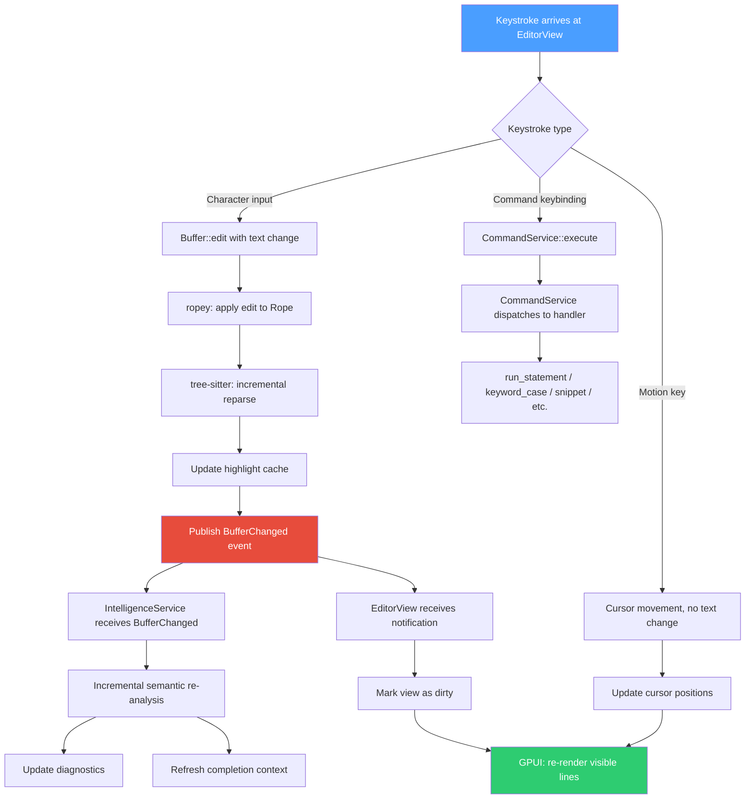

# Editor

> The custom SQL editor — rope-based text buffer, incremental tree-sitter parsing, and SQL-specific UX, purpose-built for Tempr.

---

## Purpose

Tempr includes a custom SQL editor built from scratch. This is a locked brief decision ([ADR-0003](adr/0003-custom-sql-editor.md)): no Monaco, no CodeMirror, no Scintilla, no web view. The editor follows Zed's architectural patterns — a model/view split where a `Buffer` owns text and history, and an `EditorView` owns cursors, scrolling, and rendering — but is purpose-built for SQL from the ground up.

Every feature in the editor is designed around the reality that users write SQL, not general-purpose code. Statement boundary detection, per-statement execution gutters, keyword casing controls, and snippet expansion for common SQL patterns are first-class concerns, not plugins layered onto a generic text widget. The same architecture enables the internal semantic engine ([12-sql-intelligence.md](12-sql-intelligence.md)) to consume the parse tree directly, without serialization or inter-process communication.

---

## Responsibilities

The editor module owns:

1. **Text storage and editing.** A `Rope`-backed `Buffer` that supports multi-range editing, undo/redo history, and transaction-level snapshots. The buffer is the single source of truth for file content; views never hold independent text copies.

2. **Incremental parsing.** A tree-sitter SQL grammar feeding a `SyntaxTree` on every edit. The tree-sitter incremental parser reparses only the changed regions, keeping per-keystroke latency negligible. The same tree is exposed to the semantic engine for completion, diagnostics, and hover information.

3. **Syntax highlighting.** Tree-sitter query files define highlight captures for SQL keywords, identifiers, strings, numbers, comments, and operators. The highlight map is recomputed incrementally on each edit and consumed by `EditorView` during rendering.

4. **Cursor and selection management.** Multiple cursors, rectangular selections, word/line/statement-level motions, and selection-aware editing commands (delete, transpose, indent/unindent).

5. **SQL-specific behaviors.** Statement boundary detection (`statement_at`) that identifies the statement surrounding a cursor position; per-statement gutter run buttons that execute individual statements via `CommandService`; keyword casing normalization (uppercase/lowercase toggle); snippet expansion for `SELECT * FROM`, `INSERT INTO`, `CREATE TABLE`, `WITH ... AS`, and other common patterns.

6. **View rendering.** `EditorView` (a GPUI view component) renders visible lines with syntax highlighting, line numbers, gutter icons, cursor indicators, and selection overlays. Only visible lines are rendered — the view virtualizes along the vertical axis, consistent with Tempr's performance pillar.

7. **Event publication.** After every edit, the buffer publishes a `BufferChanged { file: SqlFileId }` event to the `EventBus`, which the `IntelligenceService` consumes for incremental re-analysis and the `HistoryService` may consume for dirty-state tracking.

---

## Design Rationale

### Why build an editor at all

Three forces demand a custom editor:

1. **SQL-specific semantics.** General-purpose editors treat code as undifferentiated text with optional language hooks. Tempr needs statement-level execution, per-statement gutter run buttons, and SQL-aware cursor movement (jump to next statement boundary, select current statement). These behaviors require deep integration between the buffer model and the statement parser — something no embedded editor widget exposes through its API without hacks or forks.

2. **No web-view compromise.** Embedding Monaco or CodeMirror would mean running an entire browser runtime for the editing surface. This violates the native pillar ([ADR-0002](adr/0002-rust-only.md)): no Electron, no web views, no managed runtime. The editor must be a GPUI-native component rendered directly on the GPU, with zero FFI boundaries to JavaScript or DOM.

3. **Performance pillar.** The editor must respond to every keystroke without delay. A rope-based buffer with incremental tree-sitter parsing achieves O(log n) edit insertion and O(changed nodes) reparse — performance characteristics that no JavaScript-based editor can match. The startup budget (no synchronous I/O before the first frame) also requires the editor to initialize from a rope without parsing the entire file eagerly.

### What is deliberately descoped at v1

- **No LSP client.** Tempr's intelligence engine is internal ([ADR-0009](adr/0009-internal-semantic-engine-not-lsp.md)); the editor does not run an LSP subprocess. This is a feature, not a limitation — it eliminates process-boundary latency and enables direct access to the workspace's semantic context.

- **No non-SQL language support.** The editor uses a SQL-specific tree-sitter grammar. It does not support JavaScript, Python, or other languages. Users who need a general-purpose editor use Zed; Tempr is purpose-built for SQL.

- **No vim mode at v1.** Vim keybindings are a future consideration (see [Future Considerations](#future-considerations)) but are deliberately excluded from v1 to limit scope. The command system is designed to be extensible enough to support modal editing as a layer, not a fork.

### Rope crate choice: `ropey` vs Zed's `sum_tree`

The buffer needs a rope data structure for efficient text storage and editing. Two primary options exist:

| Criterion | `ropey` | Zed's `sum_tree` |
|---|---|---|
| **Maturity** | Battle-tested; used by Lapce, Helix, and other Rust editors | Proven in Zed; designed for Zed's specific multi-cursor and multi-buffer needs |
| **API surface** | Simple, well-documented; `Rope`, `RopeBuilder`, chunk iteration | More complex; purpose-built for ziplined cursor tracking and summary propagation |
| **Incremental parsing integration** | Direct: tree-sitter accepts `&str` slices from rope chunks | Requires adapter layer to convert `sum_tree` summaries to tree-sitter input |
| **Dependency weight** | Single crate, no internal dependencies | Part of Zed's `gpui` internals; extracting it couples Tempr to Zed's crate structure |
| **Undo/redo** | External implementation needed (the buffer must track edit operations separately) | External implementation needed (same) |

**Recommendation:** `ropey`. It is the de facto standard Rust rope crate, has a clean API that integrates directly with tree-sitter's `Input` trait, and avoids coupling Tempr to Zed's internal data structures. Zed's `sum_tree` is optimized for Zed's specific multi-buffer architecture (where a single logical buffer may span multiple files); Tempr's single-file-per-buffer model does not need that complexity. The undo/redo implementation is equivalent effort in either case — it lives in the `Buffer` as an edit-history stack, not in the rope itself.

---

## Interfaces

### Buffer

The `Buffer` is the model layer: it owns the text content, edit history, and syntax tree. It is a plain Rust struct with no GPUI dependency, making it testable in isolation.

```rust
pub struct Buffer {
    rope: Rope,
    history: EditHistory,
    syntax: SyntaxTree,
    file_id: SqlFileId,
}

/// A unique identifier for each edit operation, used for undo/redo
/// tracking and for correlating edits with events.
pub struct EditId(u64);

/// The byte range of a SQL statement within the buffer.
pub struct StatementRange {
    pub start: usize,
    pub end: usize,
}

impl Buffer {
    /// Apply a batch of edits (all within the same transaction).
    /// Returns an EditId for undo/redo tracking. Triggers an
    /// incremental reparse and publishes BufferChanged on the EventBus.
    pub fn edit(&mut self, edits: &[(Range<usize>, &str)]) -> EditId;

    /// Access the underlying rope for reading. Returns a snapshot
    /// that is valid for the lifetime of this call (not buffered).
    pub fn text(&self) -> Rope;

    /// The current incremental parse tree. Updated after every edit.
    /// Consumed by the semantic engine (12) for completion and diagnostics.
    pub fn syntax(&self) -> &SyntaxTree;

    /// Given a byte offset (e.g. cursor position), return the byte range
    /// of the SQL statement containing that offset. Returns None if the
    /// offset is outside any statement (e.g. in whitespace between statements).
    pub fn statement_at(&self, offset: usize) -> Option<StatementRange>;

    /// Undo the most recent edit (or redo, if the last operation was undo).
    pub fn undo(&mut self) -> Option<EditId>;
    pub fn redo(&mut self) -> Option<EditId>;

    /// Return a point (line, column) for a byte offset, for cursor positioning.
    pub fn point_for_offset(&self, offset: usize) -> Point;

    /// Return the byte offset for a Point (line, column), for cursor placement.
    pub fn offset_for_point(&self, point: Point) -> usize;

    /// Total byte length of the buffer content.
    pub fn len(&self) -> usize;
}
```

### SyntaxTree

`SyntaxTree` wraps tree-sitter's incremental parser output. It is produced by `Buffer` on every edit and consumed by both the editor's highlight layer and the semantic engine.

```rust
pub struct SyntaxTree {
    tree: tree_sitter::Tree,
    language: tree_sitter::Language,
}

impl SyntaxTree {
    /// Re-parse incrementally given a changed region. Called internally
    /// by Buffer::edit — not called directly by views.
    pub fn reparse(
        &mut self,
        old_text: &Rope,
        new_text: &Rope,
        changed_range: Range<usize>,
    );

    /// Return the root node of the current parse tree.
    pub fn root_node(&self) -> tree_sitter::Node;

    /// Run a tree-sitter query (e.g. highlights.scm) against the tree
    /// and return capture ranges for syntax highlighting.
    pub fn query(&self, query: &tree_sitter::Query) -> Vec<QueryCapture>;
}
```

### EditorView

`EditorView` is a GPUI view component. It owns cursor state, scroll position, and rendering logic. It holds a reference (or handle) to the `Buffer` and subscribes to `BufferChanged` events to trigger re-renders.

```rust
pub struct EditorView {
    buffer: BufferHandle,          // shared handle to the Buffer model
    cursors: CursorSet,           // one or more cursors with selections
    scroll_offset: Point,         // current scroll position (line, column)
    gutter_width: f32,            // width reserved for line numbers + run buttons
    highlight_cache: HighlightCache, // incremental highlight map from tree-sitter
}

impl EditorView {
    /// Render the visible portion of the buffer. Called by GPUI on every
    /// frame when the view is dirty. Only visible lines are computed.
    pub fn render(&mut self, cx: &mut Context<Self>) -> impl IntoElement;

    /// Handle a keystroke: translate to buffer edit, cursor motion,
    /// or command execution.
    pub fn on_keystroke(&mut self, keystroke: &Keystroke, cx: &mut Context<Self>);

    /// Execute the statement under the primary cursor. Extracts the
    /// statement range via Buffer::statement_at, then dispatches to
    /// CommandService for execution.
    pub fn run_statement(&mut self, cx: &mut Context<Self>);
}
```

### StatementRange

`StatementRange` is the bridge between the editor and the query execution pipeline. It identifies the boundaries of a single SQL statement, enabling the "run statement under cursor" pattern and the per-statement gutter run buttons.

```rust
pub struct StatementRange {
    pub start: usize,   // byte offset of first character
    pub end: usize,     // byte offset past last character (exclusive)
}
```

The gutter run button is a GPUI element rendered alongside each statement's first line. Clicking it (or pressing the bound keybinding) calls `EditorView::run_statement`, which extracts the text within `StatementRange` and passes it to `CommandService::execute("run_statement")`.

---

## Interfaces — Mermaid Diagram

### Edit Pipeline Flowchart

The following diagram shows what happens from the moment a keystroke arrives at `EditorView` to the point where the semantic engine receives the updated buffer state:



Key properties of this pipeline:

- **The Buffer never publishes events directly.** `Buffer::edit` updates the rope and syntax tree synchronously, then returns. The caller (typically the GPUI view's event handler) publishes `BufferChanged` through the `EventBus`. This keeps the `Buffer` free of event-bus dependencies and simplifies testing.
- **The IntelligenceService receives the event asynchronously.** It may run on the main thread (for trivial re-analysis) or be deferred to a background task (for large files). The latency budget for completion remains under 5 ms regardless, because the `CatalogCache` is in-memory and the tree-sitter reparse is incremental.
- **The view re-renders only if the highlight map changed.** For cursor-only movements (arrow keys), the view updates cursor positions without recomputing highlights — a fast path that avoids unnecessary work on the most frequent interaction.

---

## Data Flow

### Edit Lifecycle

1. **Keystroke arrives.** `EditorView::on_keystroke` receives the GPUI input event and determines whether it is a text edit, a cursor motion, or a command dispatch.

2. **Buffer::edit called.** For text edits, the view calls `Buffer::edit(&[(range, replacement)])`. The buffer applies the edit to the rope (O(log n) insertion), updates the undo history, and calls `SyntaxTree::reparse` with the changed byte range. Tree-sitter incrementally reparses only the affected subtree.

3. **Highlights recomputed.** The buffer runs the tree-sitter highlights query against the new tree and produces a `HighlightCache` — a list of `(byte_range, highlight_type)` tuples covering the visible viewport. Only visible lines are queried.

4. **BufferChanged published.** The view (or the buffer, depending on configuration) publishes `BufferChanged { file: SqlFileId }` to the `EventBus`. This event carries no payload beyond the file ID — per the event system's payload rule ([06-event-system.md](06-event-system.md)).

5. **IntelligenceService reacts.** The intelligence service receives `BufferChanged` and triggers incremental re-analysis of the buffer's semantic state: scope resolution, alias tracking, diagnostic generation. The parse tree is accessed through `Buffer::syntax()` without copying.

6. **View re-renders.** `EditorView` receives the notification that its buffer changed, marks itself dirty, and GPUI calls `render()` on the next frame. The render method iterates visible lines, applies highlight captures, draws cursors and selections, and returns the element tree.

### Statement Execution Flow

When a user triggers "run statement under cursor" (via gutter button click or keybinding):

1. `EditorView::run_statement` calls `Buffer::statement_at(cursor_offset)` to get the `StatementRange`.
2. The range's text is extracted from the rope via `Buffer::text().slice(range)`.
3. The extracted SQL string and the active `ConnectionId` are passed to `CommandService::execute("run_statement")`.
4. `CommandService` dispatches to `QueryService::execute(sql, connection_id, Some(file_id))`.
5. `QueryService` publishes `QueryStarted`, streams rows via `QueryStream`, and publishes `QueryFinished` — the standard query lifecycle ([09-database-engine.md](09-database-engine.md), [06-event-system.md](06-event-system.md)).

The editor does not participate in query execution beyond extracting the statement text. This boundary is absolute: no database code lives in the editor module.

### Multi-Range Editing

Multi-cursor editing operates on the same `Buffer` model. Each cursor has an independent position and selection, but all edits are applied as a single batch:

1. `EditorView` collects all active cursors.
2. For each cursor, compute the edit range and replacement (based on the keystroke — character insert, delete, backspace).
3. Call `Buffer::edit` with all edits in a single transaction. The buffer sorts edits by offset (descending) to avoid invalidating earlier offsets, applies them in order, and triggers a single incremental reparse.
4. A single `BufferChanged` event is published for the entire batch.

This ensures that multi-cursor edits are atomic (all cursors update together) and efficient (one reparse, one event, one re-render).

---

## Future Considerations

- **Vim mode.** Modal editing (normal/insert/visual modes, motions, text objects) is a natural fit for the keyboard-first pillar. The architecture supports this as an input-layer transformation: `EditorView::on_keystroke` routes through an optional `InputMode` trait that vim mode would implement. The buffer and syntax tree are mode-agnostic; only cursor behavior and keystroke interpretation change. This is excluded from v1 to limit scope but is a high-priority future feature.

- **Collaborative editing.** Zed's real-time collaboration model (CRDT-based multi-peer editing) could be adapted for shared SQL files. This would require replacing the single-writer `Buffer` model with a CRDT-backed rope (e.g., `diamond-types` or `automerge`) that merges concurrent edits. The `EditorView` would need to render remote cursors. This is explicitly future work — v1 is single-user only, per the product invariants ([01-vision.md](01-vision.md)).

- **Code folding.** Tree-sitter knows statement and block boundaries; folding regions could be computed from the parse tree and rendered as gutter fold icons. Low complexity once the tree-sitter integration is stable.

- **Find and replace with regex.** A search panel that operates on the buffer's rope, supports regex patterns, and highlights matches in the viewport. Tree-sitter syntax awareness could power "search within comments only" or "search within string literals" modes.

- **Bracket matching and auto-closing.** Tree-sitter node inspection at cursor position determines whether the cursor is inside a string literal, comment, or code — enabling context-aware bracket matching that does not activate inside strings. Auto-closing pairs (`'`, `"`, `(`, `[`) would be SQL-aware (e.g., no auto-close for `{` in most SQL dialects).

- **Snippet system expansion.** The v1 snippet system covers common SQL patterns. A future iteration could expose a snippet registry API to plugins, allowing database-specific snippets (e.g., Postgres-specific `CREATE EXTENSION` patterns) to be contributed via the plugin system ([08-plugin-api.md](08-plugin-api.md)).

---

## Open Questions

1. **Undo granularity.** Should undo operate at the single-character level (each keystroke is a separate undo step, like most editors), at the word level (grouping consecutive character insertions into a single undo step, like IntelliJ), or at the transaction level (the user controls undo boundaries via explicit grouping)? Word-level undo is the most ergonomic for typing but harder to implement correctly with multi-cursor edits. Character-level is simplest and most predictable. The current recommendation is character-level for v1, with word-level as a future enhancement controlled by a setting.

2. **Embedded SQL-in-string highlighting.** Many applications embed SQL inside string literals in other languages (e.g., Rust's `r#"SELECT ..."#`, Python's triple-quoted strings). Since Tempr is SQL-only, this is less relevant — but users may paste multi-language code into a SQL file. Should the editor detect and skip highlighting inside string literals that appear to contain SQL keywords, or should it highlight them as regular strings? The tree-sitter grammar handles this correctly (strings are leaf nodes), but the question is whether the semantic engine should "see through" strings for completion purposes.

3. **Gutter run button semantics.** When the cursor is between two statements (in whitespace), which statement does the gutter button execute? Options: (a) execute the statement above the cursor, (b) execute the statement below, (c) show a mini-picker listing both. The most common convention (DataGrip behavior) is to execute the statement containing the cursor, returning `None` from `statement_at` when the cursor is between statements — which means the gutter button in that region should be disabled or execute the nearest statement. This needs a clear UX decision before implementation.

4. **Buffer snapshot vs shared reference.** When `IntelligenceService` reads the buffer's syntax tree, does it receive an immutable snapshot (safe for concurrent access but requires cloning the tree on each edit) or a shared reference (no clone but requires synchronization)? Tree-sitter's `Tree` is `Send` but not `Sync`; sharing it across threads requires either a `Mutex` or an `Arc<RwLock<>>`. The recommendation is immutable snapshots for v1 (the tree is small after incremental reparse) with shared references as a future optimization if profiling shows snapshot cost matters.

---

## Related Documents

- [GPUI](11-gpui.md) — view-layer conventions; how `EditorView` follows GPUI component patterns for rendering and event subscription.
- [SQL Intelligence](12-sql-intelligence.md) — the semantic engine that consumes `Buffer::syntax()` for completion, diagnostics, and hover; the downstream consumer of the parse tree.
- [Services](05-services.md) — `CommandService` (statement execution commands, gutter button registration), `IntelligenceService` (BufferChanged consumer).
- [Event System](06-event-system.md) — `BufferChanged` event definition, delivery semantics, and the payload rule that keeps events small.
- [ADR-0003](adr/0003-custom-sql-editor.md) — the locked decision to build a custom editor from scratch, rejecting Monaco, CodeMirror, and Scintilla.
