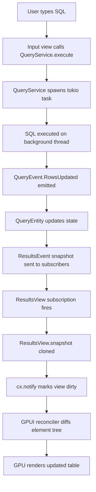

# 11 — GPUI Usage

> **Status:** Draft  
> **Applies to:** Tempr v0.1+  
> **Supersedes:** —  
> **See also:** [ADR-0001](adr/0001-gpui-for-ui.md), [02 — Architecture](02-architecture.md), [08 — Plugin API](08-plugin-api.md), [10 — Editor](10-editor.md), [13 — Result Grid](13-result-grid.md)

---

## Purpose

GPUI is Tempr's sole UI framework. It provides a GPU-accelerated, retained-mode element tree that Tempr composes through an immediate-mode-style `render()` method on each view. The framework's model — **App → Window → View → Entity** — is the foundation of every interactive surface in the product.

This document governs:

- How views are structured and composed.
- How views interact with the service layer and the event bus.
- How rendering, state updates, and re-renders flow through the application.
- Which custom components the Tempr component library will provide.
- Hard rules that every contributor must follow when working on UI code.

### GPUI Primer (Tempr Scope)

| Concept | What It Means in Tempr |
|---|---|
| **App** | Top-level singleton. Owns the main thread, the event loop, and all windows. Created once at startup. |
| **Window** | A native OS window. Tempr's main window is created through `App::open_window`. Each window holds a root view. |
| **View** | A lightweight UI unit that implements `render(&mut self, cx: &mut Context<Self>) -> impl IntoElement`. Views are composable: a parent view's `render` calls child view factories. Views are *not* ECS entities — they are closer to React components with retained state. |
| **Entity** | A long-lived, message-passing object. Entities are the bridge between views and services. A view holds an `EntityHandle<T>` and can dispatch actions to it or subscribe to its events. Entities are thread-safe and can be cloned across threads. |
| **render()** | An immediate-mode-style method. Every time it is called it produces a fresh element tree. GPUI diffs the tree against the previous frame and issues minimal GPU draw calls. |
| **Element Tree** | The output of `render()`. A hierarchy of GPUI elements (Div, Text, List, etc.) that describe layout, styling, and event handlers. GPU-accelerated; no intermediate retained layout objects. |
| **Context** | A borrowed reference to the view's state plus the window's event loop. Passed as `&mut Context<Self>` into `render()` and event handlers. Provides methods to subscribe to events, spawn tasks, and update state. |
| **Subscription** | A handle returned by `cx.subscribe(&entity, \|view, event, cx\| { ... })`. Subscriptions are cancelled automatically when the view is dropped, preventing use-after-free. |

### Rendering Strategy

Tempr uses a **retained + GPU hybrid** model. Views retain their state between frames; only the `render()` method re-executes on every frame. This avoids the full-tree re-creation cost of pure immediate-mode frameworks while still allowing the GPU to batch and optimize draw calls. GPUI's internal reconciler diffs the element tree and produces a minimal set of GPU operations.

---

## Responsibilities

### What Tempr Must Build

GPUI provides primitives. Tempr must build a custom component library on top of them. Each component encapsulates layout, styling, keyboard navigation, and accessibility metadata so that application code never deals with raw GPUI elements directly.

### Component Library Catalog

| Component | Behavior Summary |
|---|---|
| **Button** | Clickable/keyboard-activatable element. Supports `primary`, `secondary`, `ghost` variants. Renders tooltip on hover after delay. Dispatches a registered Command on activation. |
| **Input** | Single-line text field with selection, clipboard, undo. Auto-resizes to content when used in palettes. Emits `on_change` and `on_submit` callbacks. |
| **List** | Virtualized scrollable list. Only renders visible rows. Supports multi-select and keyboard navigation (↑/↓/Home/End/PageUp/PageDown). Used for palette results, sidebar items. |
| **Table** | Virtualized, columnar grid. Shared with the result grid (§6 data flow). Columns are resizable. Cells support copy-on-select. Keyboard navigable in a 2D grid pattern. |
| **Palette** | Modal overlay combining `Input` + `List`. Fuzzy-search over a command or file list. Activated via a global keybinding. Returns selection to the caller. |
| **Dock/Panel** | Resizable sidebar/bottom panel container. Panels can be collapsed, floated, or docked to any edge. State is persisted to workspace config (§8). |
| **Tabs** | Horizontal tab bar. Each tab has a label, optional dirty indicator, and close button. Tabs are reorderable via drag. Keyboard navigable (Ctrl+Tab, Ctrl+Shift+Tab). |
| **StatusBar** | Bottom bar rendered as a fixed-height `Div`. Displays connection status, active database, line/column, and mode indicator. Right-aligned actions are `Button` components. |
| **Tooltip** | Hover-triggered overlay. Attached to any component via a wrapper. Delay is configurable. Dismissed on mouse-leave or Escape. |
| **ContextMenu** | Right-click or Shift+F10 overlay menu. Positioned at cursor. Items can be nested (submenus). Each item maps to a Command. Dismissed on outside-click or Escape. |

### Theme Tokens

All components consume theme tokens from the `ThemeProvider` (see [08 — Plugin API](./08-plugin-api.md)). Tokens include:

- **Colors:** `background`, `surface`, `border`, `text`, `text_muted`, `accent`, `danger`, `success`, `warning` — each with normal/hover/pressed/disabled states.
- **Spacing:** `xs` (4px), `sm` (8px), `md` (12px), `lg` (16px), `xl` (24px).
- **Typography:** `body`, `body_emphasis`, `caption`, `code`, `heading` — each with font family, size, weight, and line height.
- **Radii:** `sm` (4px), `md` (8px), `lg` (12px).
- **Shadows:** `sm`, `md`, `lg` — used for overlays and elevated surfaces.

Components **never** hard-code colors, sizes, or fonts. All visual properties are read from the current theme at render time.

### Hard Rules

These rules apply to **every** view and component in the codebase:

1. **No business logic in views.** Views call services and subscribe to events. If a view needs data, it reads from an immutable snapshot provided by a service or entity. If a view needs to trigger an action, it dispatches a Command. View methods (`render`, event handlers) must not contain database queries, SQL parsing, connection management, or any I/O.

2. **Long work never on the main thread.** Every I/O-bound or CPU-intensive operation (query execution, schema introspection, file parsing) runs on a background thread or `tokio` task. The main thread is reserved for rendering and event dispatch. When a background task completes, it emits an `AppEvent` which the view consumes on the next frame.

3. **Keyboard-first: every interactive element is keyboard-reachable.** Every `Button`, `Input`, `ContextMenu` item, and tab must be activatable via keyboard. All interactive actions are expressed as Commands (see [10 — Editor](./10-editor.md)). Mouse interaction is a convenience, not a requirement.

4. **No shared mutable state across views.** Views own their state. Cross-view communication happens exclusively through the event bus (`AppEvent` variants) or through entities that own the shared data. No `Rc<RefCell<...>>` escapes a single view.

5. **Accessibility metadata on every interactive element.** Every `Button`, `Input`, `List`, and `Table` must carry `aria_label` or equivalent metadata. Tempr's accessibility story begins at the component level, not retrofitted.

---

## Design Rationale

### Why GPUI Over Alternatives

| Alternative | Why Not |
|---|---|
| **egui** | Immediate-mode only. No GPU acceleration. No retained state model. Good for debug UIs, not production IDEs. Accessibility is nascent. |
| **iced** | Elm-architecture. Elegant but rigid. Message-passing model makes complex stateful UIs (dock panels, tab trees, resizable grids) verbose. No GPU-accelerated list virtualization. |
| **Qt (via bindings)** | Native look, but C++ dependency. License complexity (LGPL/commercial). Rust bindings (`cxx-qt`) are immature. No GPU-accelerated rendering. |
| **Electron** | Cross-platform, but ships Chromium. 150+ MB binary. 200+ MB RAM at idle. Not a native IDE. Tempr's value proposition is native performance. |

GPUI was chosen because:

1. **Native performance.** GPU-accelerated rendering, no runtime overhead. Binary size < 20 MB. Idle memory < 50 MB.
2. **Zed lineage.** GPUI is battle-tested in Zed, a production IDE with 100k+ users. Its rendering model, input handling, and text layout are proven at scale.
3. **Retained + GPU hybrid.** Avoids the re-creation cost of immediate-mode while keeping GPU draw-call batching. Ideal for complex, stateful UIs like database IDEs.
4. **Rust-native.** No FFI, no C++ dependency. Type-safe view composition. Compile-time guarantees on event handler signatures.

**See [ADR-0001](adr/0001-gpui-for-ui.md) for the full decision record.**

### Risk: GPUI API Instability

GPUI evolves inside the Zed repository. Its API surface is not versioned independently. Breaking changes are frequent.

**Mitigation:**

- **Pin a specific Zed revision** in `Cargo.toml` (not a branch or tag). Update intentionally after reviewing the diff.
- **Thin wrapper components.** Every Tempr component wraps GPUI primitives behind a stable internal API. When GPUI changes, only the wrapper implementations need updating — application code is insulated.
- **GPUI compatibility shim.** A single `src/gpui_compat.rs` module abstracts GPUI calls. If GPUI renames a method or changes a trait signature, the fix is isolated to this module.

---

## Interfaces

### View ↔ Service Pattern

Views never hold raw database connections, query parsers, or business-state structs. Instead, a view holds:

1. A **service reference** (typically `Arc<QueryService>`) for dispatching commands.
2. A **snapshot** of the data it needs to render (immutable, cloned from the service or entity).
3. A **subscription** to the entity's events so it can refresh its snapshot when data changes.

#### Code Sketch

```rust
use gpui::{App, Context, Entity, Subscription, Window};

struct ResultsView {
    query_service: Arc<QueryService>,
    entity: Entity<ResultsEntity>,
    snapshot: ResultsSnapshot,  // immutable, cloned each frame
    _subscription: Subscription,
}

impl ResultsView {
    fn new(
        query_service: Arc<QueryService>,
        entity: Entity<ResultsEntity>,
        cx: &mut Context<Self>,
    ) -> Self {
        let snapshot = entity.read(cx).snapshot();
        let _subscription = cx.subscribe(
            &entity,
            |this, event: ResultsEvent, cx| {
                match event {
                    ResultsEvent::RowsUpdated(snap) => {
                        this.snapshot = snap;
                        cx.notify();
                    }
                }
            },
        );
        Self {
            query_service,
            entity,
            snapshot,
            _subscription,
        }
    }
}

impl gpui::View for ResultsView {
    fn render(&mut self, cx: &mut Context<Self>) -> impl IntoElement {
        // render from self.snapshot — never queries the service here
        div()
            .child(
                Table::new(self.snapshot.columns.clone(), self.snapshot.rows.clone())
                    .on_copy(|rows, cx| { /* ... */ })
            )
            .child(
                Button::new("export")
                    .label("Export CSV")
                    .on_click(cx.listener(|this, _, cx| {
                        // dispatch to service, not execute here
                        this.query_service.export_csv(/* ... */);
                    }))
            )
    }
}
```

Key points:

- `snapshot` is cloned from the entity on subscription event. `render()` reads only from `snapshot`.
- `cx.listener(|this, _, cx| { ... })` captures `this` — the view — and can call `this.query_service.export_csv(...)`, which enqueues work on a background thread.
- The subscription is cancelled automatically when `ResultsView` is dropped — no manual cleanup.

### Entity ↔ Event Bus

Entities own mutable state and expose it via snapshots. They receive commands from views and emit events that views subscribe to. The event bus (`AppEvent`) is used for cross-cutting concerns (connection status changed, theme changed, settings updated).

```rust
// Entity owns the authoritative state
struct ResultsEntity {
    rows: Vec<Row>,
    columns: Vec<Column>,
}

impl ResultsEntity {
    fn snapshot(&self) -> ResultsSnapshot {
        ResultsSnapshot {
            rows: self.rows.clone(),
            columns: self.columns.clone(),
        }
    }
}

// Event emitted by the entity
enum ResultsEvent {
    RowsUpdated(ResultsSnapshot),
}
```

---

## Data Flow

### Frame Lifecycle

```
User Input / Timer / Background Task
        │
        ▼
┌─────────────────────┐
│  App Event Loop     │  ← GPUI main loop, runs on main thread
│  (dispatch event)   │
└────────┬────────────┘
         │
         ▼
┌─────────────────────┐
│  View Event Handler │  ← fn on_event(&mut self, event, cx)
│  (update snapshot)  │     - reads from entity or service snapshot
│                     │     - updates self.state
└────────┬────────────┘
         │
         ▼
┌─────────────────────┐
│  cx.notify()        │  ← marks this view as dirty
└────────┬────────────┘
         │
         ▼
┌─────────────────────┐
│  GPUI Reconciler    │  ← diffs old vs new element tree
│  (minimize GPU ops) │     issues minimal draw calls
└────────┬────────────┘
         │
         ▼
┌─────────────────────┐
│  GPU Render         │  ← composites the frame to screen
└─────────────────────┘
```

### How an `AppEvent` Becomes a Re-Render

1. **Background task completes.** A `tokio` task finishes executing a SQL query. It sends the result through a channel.
2. **Event arrives on the main thread.** The GPUI event loop picks up the `AppEvent::QueryResult(rows)` from the channel.
3. **Entity processes the event.** The `QueryEntity` updates its internal state and emits a `QueryEvent::RowsUpdated(snapshot)`.
4. **View receives the subscription callback.** `ResultsView`'s subscription handler fires. It clones the new snapshot into `self.snapshot`.
5. **View calls `cx.notify()`.** This marks the view as dirty in GPUI's reconciler.
6. **GPUI calls `render()`.** On the next frame, `ResultsView::render()` runs. It reads from `self.snapshot` (immutable) and produces a new element tree.
7. **GPUI diffs and renders.** The reconciler diffs the old and new element trees. Only changed elements are re-rendered. GPU issues minimal draw calls.

Total latency from background task completion to pixels on screen: one frame (~16 ms at 60 fps).

### Data Flow Diagram



---

## Future Considerations

### Multi-Window Support

GPUI supports multiple windows. Tempr will leverage this for:

- **Detached result sets.** Right-click a result tab → "Open in New Window". The new window gets its own `ResultsView` backed by the same `ResultsEntity` (shared via `Entity::clone`).
- **Schema diff viewer.** A dedicated window for comparing two schema snapshots side by side.
- **Query editor as separate window.** Power users may want to pop the query editor out into a second monitor.

Implementation requires:

- Each window has its own root view and its own `Context`.
- Shared entities are cloned across windows via `Entity::clone`. GPUI handles cross-window event dispatch internally.
- Workspace layout persistence (§8) must track per-window state.

### Accessibility APIs

GPUI has basic accessibility support (tree exposure, focus management). Tempr will:

- Use GPUI's built-in `accessible` modifier on all interactive elements.
- Implement a custom `Aria` attribute set on elements that need screen-reader metadata.
- Ensure all keyboard navigation patterns (list, table, palette) expose correct `role` and `state` attributes.
- Test with `orca` on Linux and `VoiceOver` on macOS.

This is a **v0.2+** target. v0.1 will have keyboard navigation but not full screen-reader support.

### Theming System Integration

When [08 — Plugin API](./08-plugin-api.md) ships dark/light/high-contrast themes, each view's `render()` will read tokens from `ThemeProvider`. The component library must never hard-code colors. This is enforced by code review and, in the future, by a custom `clippy` lint that flags hardcoded hex colors in `src/ui/`.

### Virtualized List/Table Performance

GPUI's `List` element supports virtualization natively. Tempr's `Table` component wraps it for 2D grids. Performance targets:

- 100k rows: < 200 ms initial render, < 16 ms scroll.
- 1k columns: column virtualization (only visible columns rendered).
- Cell-level memoization: unchanged cells are not re-rendered on scroll.

---

## Open Questions

### GPUI Versioning Strategy

GPUI is developed inside the Zed repository (`zed-industries/zed`). It is not published as a standalone crate on crates.io. Tempr pins a specific Git revision:

```toml
[dependencies]
gpui = { git = "https://github.com/zed-industries/zed", rev = "abc1234" }
```

**Open questions:**

- How frequently should Tempr update the pinned revision? Every Zed release? Monthly?
- What is the blast radius of a typical GPUI breaking change? Can the shim module absorb it without touching application code?
- Should Tempr fork GPUI into its own repository for stability, or track upstream?
- Who maintains the `gpui_compat` shim? Is this a shared crate or per-project?

**Recommendation:** Track upstream monthly. If a breaking change touches >5 files outside `gpui_compat.rs`, evaluate forking. Document every update in a changelog entry.

### Linux and Windows Platform Maturity

GPUI was built for Zed, which ships primarily on macOS and Linux. Windows support is newer and less tested.

**Known gaps (as of mid-2026):**

- **Windows:**IME support is incomplete. Some keybindings may conflict with Windows conventions (e.g., Ctrl+C is copy, not signal). Font fallback for non-Latin scripts may be limited.
- **Linux:**Wayland is the primary target. X11 is supported but not actively tested by Zed. NVIDIA GPU driver compatibility should be validated. HiDPI scaling on mixed-DPI monitor setups needs testing.

**Mitigation:**

- Tempr's CI must run on all three platforms (macOS, Linux, Windows) from day one.
- Platform-specific quirks are documented in a `PLATFORM_NOTES.md` file maintained alongside the codebase.
- GPUI compatibility shim can absorb platform-specific workarounds.

---

## Related Documents

| Document | Relationship |
|---|---|
| [02 — Architecture](./02-architecture.md) | GPUI is the UI layer in the overall architecture. This document specifies *how* it is used. |
| [08 — Plugin API](./08-plugin-api.md) | Provides the theme tokens consumed by all components in §2. |
| [10 — Editor](./10-editor.md) | Defines the Command system that every interactive element must use (§2 hard rules). |
| [13 — Result Grid](./13-result-grid.md) | Defines the snapshot types (`ResultsSnapshot`, etc.) that views render from (§4). |
| [ADR-0001](adr/0001-gpui-for-ui.md) | The decision record for choosing GPUI. Referenced in §3. |

---

*This document is part of the Tempr documentation set. See the [docs index](./README.md) for the full list.*
