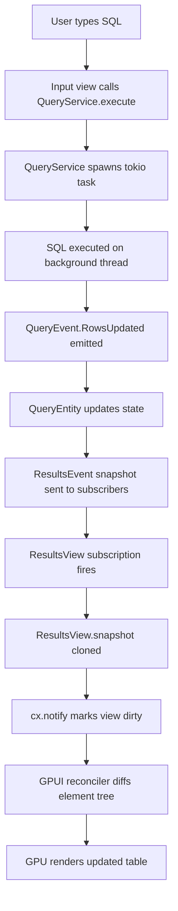

# 11 — GPUI Usage

> **Status:** Draft — API sections verified against a local `zed-industries/zed` clone (gpui `0.2.2`, 2026-08-17)  
> **Applies to:** Tempr v0.1+  
> **Supersedes:** —  
> **See also:** [ADR-0001](adr/0001-gpui-for-ui.md), [02 — Architecture](02-architecture.md), [08 — Plugin API](08-plugin-api.md), [10 — Editor](10-editor.md), [13 — Result Grid](13-result-grid.md), [D16](DECISIONS.md)

---

## Purpose

GPUI is Tempr's sole UI framework. It provides a GPU-accelerated, retained-mode element tree that Tempr composes through an immediate-mode-style `render()` method on each view. The framework's model — **App → Window → View → Entity** — is the foundation of every interactive surface in the product.

This document governs:

- How views are structured and composed.
- How views interact with the service layer and the event bus.
- How rendering, state updates, and re-renders flow through the application.
- Which custom components the Tempr component library will provide.
- Hard rules that every contributor must follow when working on UI code.

### GPUI Primer (Tempr Scope)

| Concept | What It Means in Tempr |
|---|---|
| **`Application`** | `pub struct Application(Rc<AppCell>)` in `crates/gpui/src/app.rs`. Owns the main thread, the event loop, and all windows. Constructed **not** directly but via `gpui_platform::application()` (see §Interfaces). `.run(\|cx: &mut App\| { … })` starts the loop; `.run_embedded(…) -> ApplicationHandle` exists for host-driven loops. |
| **`App`** | The root context handed to the `run` closure (`&mut App`). Opens windows, creates entities, holds globals. |
| **`Window`** | A native OS window, opened with `cx.open_window(WindowOptions { … }, \|window, cx\| cx.new(\|cx\| RootView { … }))`. Each window holds a root entity that implements `Render`. |
| **`Entity<T>`** | The single state primitive. Created with `cx.new(\|cx\| T { … })`; read with `entity.read(cx)`, mutated with `entity.update(cx, …)`. There is no separate "view type" — a view *is* an `Entity<T>` whose `T` implements `Render`. Entities can be cloned, shared between windows, and subscribed to. |
| **`Render`** | `impl Render for T { fn render(&mut self, window: &mut Window, cx: &mut Context<Self>) -> impl IntoElement }`. **Both** `&mut Window` and `&mut Context<Self>` are passed — a 2-argument signature. Produces a fresh element tree per frame. |
| **Element Tree** | The output of `render()`: `div()`, `svg()`, `list()`, `uniform_list()`, `Empty`, etc. Built with the builder traits from `gpui::prelude::*` — `Styled`, `ParentElement`, `InteractiveElement`, `StatefulInteractiveElement`, `IntoElement`, `Render`. |
| **`Context<T>`** | Borrowed handle to the entity's state plus the app. Provides `cx.notify()`, `cx.subscribe(…)`, `cx.listener(…)`, `cx.processor(…)`, `cx.spawn(…)`, `cx.background_spawn(…)`, `cx.new(…)`. |
| **`Subscription`** | Handle returned by `cx.subscribe(&entity, \|this, event, cx\| { … })`. Dropped with the subscriber — no manual cleanup. Store it in a `_subscription` field to keep it alive. |
| **`Task<R>`** | Join handle for async work. **Dropping a `Task` cancels it** — store it if the work must survive. |

### Rendering Strategy

Tempr uses a **retained + GPU hybrid** model. Entity state persists between frames; only `render()` re-executes, and only for entities marked dirty by `cx.notify()`. This avoids the full-tree re-creation cost of pure immediate-mode frameworks while still allowing the GPU to batch and optimize draw calls. GPUI's internal reconciler diffs the element tree and produces a minimal set of GPU operations.

---

## Responsibilities

### What Tempr Must Build

GPUI provides primitives. Tempr must build a custom component library on top of them. Each component encapsulates layout, styling, keyboard navigation, and accessibility metadata so that application code never deals with raw GPUI elements directly.

**This is not optional, and licensing is the reason.** Zed's own component library (`crates/ui`), theme system (`crates/theme`), markdown renderer (`crates/markdown`), and editor (`crates/editor`) are **GPL-3.0**. `gpui`, `gpui_platform`, and the platform backends are **Apache-2.0**. Tempr is MIT ([D12](DECISIONS.md)), so it depends on the Apache-2.0 crates only and reimplements everything else — see [D16](DECISIONS.md).

### What GPUI Actually Ships

Verified against the local zed clone (gpui `0.2.2`):

| Need | GPUI provides | Tempr's job |
|---|---|---|
| Window + styled boxes | `div()`, `Styled` trait (`crates/gpui/src/styled.rs:22`): `.flex()`, `.flex_col()`, `.bg()`, `.p_2()`, `.gap_3()`, `.size(px(..))`, `.rounded_md()`, `.border_1()`, `.text_color()`, `.shadow_lg()`, `.overflow_y_scroll()`. Units `px()`, `rems()`, `relative()`, `percentage()`; colors `rgb()`, `rgba()`, `hsla()` | Wrap in themed components |
| Fixed-height virtualized list | `uniform_list(id, count, cx.processor(…))` — renders only the visible `Range<usize>` | Sidebar, palette results |
| Variable-height virtualized list | `list(state, render)` + `ListState` (`crates/gpui/src/elements/list.rs`) — heights in a `sum_tree`, O(log n) offset ↔ index | Not needed for the grid; useful for log/history panes |
| 2D data grid | **Nothing.** `examples/data_table.rs` is a demo, not a component | Build `Table` on top of `uniform_list` (rows) + column virtualization — see [13 — Result Grid](./13-result-grid.md) |
| Text input | **Nothing.** `examples/input.rs` (778 lines) is the reference hand-rolled `TextInput`: `EntityInputHandler`/`ElementInputHandler` (IME + marked range), `FocusHandle`/`Focusable`, `selected_range`/`selection_reversed`, custom `Element` shaping via `ShapedLine`, `actions!` for Backspace/Delete/arrows/Home/End/SelectAll/Copy/Cut/Paste | Tempr's SQL editor is custom anyway ([ADR-0003](adr/0003-custom-sql-editor.md)); `examples/input.rs` is the starting point for single-line `Input` |
| Animation | `Animation`, `AnimationExt` (`use gpui::AnimationExt as _`), `Transformation`, easings `ease_in_out`, `bounce(..)`, `percentage(delta)` — `element.with_animation(id, Animation::new(dur).repeat().with_easing(..), \|el, delta\| …)` | Spinners for long-running queries |
| Theme | **Nothing usable** — `ActiveTheme`/`cx.theme()` lives in GPL `crates/theme` | Tempr's own `ThemeProvider` ([08 — Plugin API](./08-plugin-api.md)) |
| Accessibility | `accesskit` is a core dep; `examples/a11y.rs`, `tab_stop.rs`, `focus_visible.rs` show focus/tab-stop APIs | Wire `aria`-equivalent metadata per component |

Useful examples to read before writing a component: `hello_world.rs`, `input.rs`, `uniform_list.rs`, `list_example.rs` (chat-style `ListAlignment::Bottom` + manual scrollbar math), `data_table.rs`, `grid_layout.rs`, `tree.rs`, `popover.rs`, `drag_drop.rs`, `scrollable.rs`, `text*.rs`, `animation.rs`, `view_example/`, `move_entity_between_windows.rs`.

A community alternative exists — **`gpui-component`** (longbridge/gpui-component: `Input`, `TextInput`, buttons, lists). Not adopted: it conflicts with the custom-component mandate in [D1](DECISIONS.md) and adds an unpinned third-party surface. Reconsider only via RFC.

### Component Library Catalog

| Component | Behavior Summary |
|---|---|
| **Button** | Clickable/keyboard-activatable element. Supports `primary`, `secondary`, `ghost` variants. Renders tooltip on hover after delay. Dispatches a registered Command on activation. |
| **Input** | Single-line text field with selection, clipboard, undo. Auto-resizes to content when used in palettes. Emits `on_change` and `on_submit` callbacks. **Status (2026-09-03):** `tempr_ui::components::Input` — selection, clipboard, IME/marked text, grapheme-aware cursor; emits `InputEvent::{Changed, Submit}`; keybindings via `input::bind_keys` (context `Input`). Undo and auto-resize are TODO. |
| **List** | Virtualized scrollable list, wrapping `uniform_list` (fixed row height) or `list` + `ListState` when rows vary. Only renders visible rows. Supports multi-select and keyboard navigation (↑/↓/Home/End/PageUp/PageDown). Used for palette results, sidebar items. |
| **Table** | Virtualized, columnar grid built on `uniform_list` for rows plus Tempr's own column virtualization. Shared with the result grid (§6 data flow). Columns are resizable. Cells support copy-on-select. Keyboard navigable in a 2D grid pattern. **Status (2026-09-03):** Phase 1 `tempr_ui::components::ResultGrid` — `uniform_list` row virtualization, fixed 180 px columns, horizontal scroll, `∅` for NULL, rows appended per `Batch`. Column virtualization/resize, copy, 2D keyboard nav, and the columnar `RowStore` are TODO. |
| **Palette** | Modal overlay combining `Input` + `List`. Fuzzy-search over a command or file list. Activated via a global keybinding. Returns selection to the caller. |
| **Dock/Panel** | Resizable sidebar/bottom panel container. Panels can be collapsed, floated, or docked to any edge. State is persisted to workspace config (§8). |
| **Tabs** | Horizontal tab bar. Each tab has a label, optional dirty indicator, and close button. Tabs are reorderable via drag. Keyboard navigable (Ctrl+Tab, Ctrl+Shift+Tab). |
| **StatusBar** | Bottom bar rendered as a fixed-height `Div`. Displays connection status, active database, line/column, and mode indicator. Right-aligned actions are `Button` components. |
| **Tooltip** | Hover-triggered overlay. Attached to any component via a wrapper. Delay is configurable. Dismissed on mouse-leave or Escape. |
| **ContextMenu** | Right-click or Shift+F10 overlay menu. Positioned at cursor. Items can be nested (submenus). Each item maps to a Command. Dismissed on outside-click or Escape. |

### Theme Tokens

All components consume theme tokens from the `ThemeProvider` (see [08 — Plugin API](./08-plugin-api.md)). Tokens include:

- **Colors:** `background`, `surface`, `border`, `text`, `text_muted`, `accent`, `danger`, `success`, `warning` — each with normal/hover/pressed/disabled states.
- **Spacing:** `xs` (4px), `sm` (8px), `md` (12px), `lg` (16px), `xl` (24px).
- **Typography:** `body`, `body_emphasis`, `caption`, `code`, `heading` — each with font family, size, weight, and line height.
- **Radii:** `sm` (4px), `md` (8px), `lg` (12px).
- **Shadows:** `sm`, `md`, `lg` — used for overlays and elevated surfaces.

Components **never** hard-code colors, sizes, or fonts. All visual properties are read from the current theme at render time.

### Hard Rules

These rules apply to **every** view and component in the codebase:

1. **No business logic in views.** Views call services and subscribe to events. If a view needs data, it reads from an immutable snapshot provided by a service or entity. If a view needs to trigger an action, it dispatches a Command. View methods (`render`, event handlers) must not contain database queries, SQL parsing, connection management, or any I/O.

2. **Long work never on the main thread.** Every I/O-bound or CPU-intensive operation (query execution, schema introspection, file parsing) runs via `cx.background_spawn` or, for tokio-based DB work, the `Tokio::spawn` bridge (§Interfaces). The main thread is reserved for rendering and event dispatch. When a background task completes, it emits an `AppEvent` which the view consumes on the next frame. Never `block_on` inside `render()` or an event handler.

3. **Keyboard-first: every interactive element is keyboard-reachable.** Every `Button`, `Input`, `ContextMenu` item, and tab must be activatable via keyboard. All interactive actions are expressed as Commands (see [10 — Editor](./10-editor.md)). Mouse interaction is a convenience, not a requirement.

4. **No shared mutable state across views.** Views own their state. Cross-view communication happens exclusively through the event bus (`AppEvent` variants) or through entities that own the shared data. No `Rc<RefCell<...>>` escapes a single view.

5. **Accessibility metadata on every interactive element.** Every `Button`, `Input`, `List`, and `Table` must carry `aria_label` or equivalent metadata. Tempr's accessibility story begins at the component level, not retrofitted.

---

## Design Rationale

### Why GPUI Over Alternatives

| Alternative | Why Not |
|---|---|
| **egui** | Immediate-mode only. No GPU acceleration. No retained state model. Good for debug UIs, not production IDEs. Accessibility is nascent. |
| **iced** | Elm-architecture. Elegant but rigid. Message-passing model makes complex stateful UIs (dock panels, tab trees, resizable grids) verbose. No GPU-accelerated list virtualization. |
| **Qt (via bindings)** | Native look, but C++ dependency. License complexity (LGPL/commercial). Rust bindings (`cxx-qt`) are immature. No GPU-accelerated rendering. |
| **Electron** | Cross-platform, but ships Chromium. 150+ MB binary. 200+ MB RAM at idle. Not a native IDE. Tempr's value proposition is native performance. |

GPUI was chosen because:

1. **Native performance.** GPU-accelerated rendering, no runtime overhead. Binary size < 20 MB. Idle memory < 50 MB.
2. **Zed lineage.** GPUI is battle-tested in Zed, a production IDE with 100k+ users. Its rendering model, input handling, and text layout are proven at scale.
3. **Retained + GPU hybrid.** Avoids the re-creation cost of immediate-mode while keeping GPU draw-call batching. Ideal for complex, stateful UIs like database IDEs.
4. **Rust-native.** No FFI, no C++ dependency. Type-safe view composition. Compile-time guarantees on event handler signatures.

**See [ADR-0001](adr/0001-gpui-for-ui.md) for the full decision record.**

### Risk: GPUI API Instability

GPUI evolves inside the Zed repository. Its API surface is not versioned independently. Breaking changes are frequent.

Evidence: the crate was recently split into `gpui` + `gpui_platform` + per-OS backends, moving the application entry point from `gpui::Application::new()` to `gpui_platform::application()`. Any doc or tutorial predating that split is wrong.

**Mitigation:**

- **Pin a specific Zed revision** in `Cargo.toml` (not a branch or tag), and pin `gpui` and `gpui_platform` to the *same* rev. Update intentionally after reviewing the diff.
- **Thin wrapper components.** Every Tempr component wraps GPUI primitives behind a stable internal API. When GPUI changes, only the wrapper implementations need updating — application code is insulated.
- **GPUI compatibility shim.** A single `gpui_compat` module abstracts GPUI *and* `gpui_platform` calls (application bootstrap, window opening, executor spawn helpers). If GPUI renames a method, changes a trait signature, or moves a type between crates, the fix is isolated to this module.

---

## Interfaces

### Dependency Wiring

Recent Zed **split GPUI into a core crate plus per-platform backend crates**. `gpui` holds the framework (elements, `App`/`Entity`/`Window`, executor, styling); the OS windowing backends live in `gpui_macos`, `gpui_linux`, `gpui_windows`, `gpui_web`, `gpui_wgpu` and are wired together by **`gpui_platform`**. Every `crates/gpui/examples/*.rs` now starts through `gpui_platform::application()`, not a bare `gpui::Application::new()`.

Tempr therefore depends on **both** crates, pinned to the **same** rev ([D14](DECISIONS.md), [D16](DECISIONS.md)):

```toml
[workspace.dependencies]
# Current pin: Zed main @ 2026-09-03 (ed8d600). Must be ≥ ac5af8b9 (2026-09-01) — earlier revs, including every release tag up to v1.18.0, declare `zlog`/`ztracing`/`ztracing_macro` (transitive deps of gpui via `sum_tree`) as GPL-3.0-or-later. Bump all three together.
gpui          = { git = "https://github.com/zed-industries/zed", rev = "ed8d6004648e4e38a6879d9c80ac4406ad3d7266" }
gpui_platform = { git = "https://github.com/zed-industries/zed", rev = "ed8d6004648e4e38a6879d9c80ac4406ad3d7266" }
gpui_tokio    = { git = "https://github.com/zed-industries/zed", rev = "ed8d6004648e4e38a6879d9c80ac4406ad3d7266" }
```

- `gpui` features: `default = ["font-kit", "wayland", "x11", "windows-manifest"]`; also `screen-capture`, `inspector`, `test-support`, `bench`, `leak-detection`, `input-latency-histogram`. `gpui_platform` forwards `wayland`, `x11`, `font-kit`, `screen-capture` to the backends.
- Core transitive deps: `taffy` (flexbox layout, exact-pinned upstream), `resvg`/`usvg`, `lyon`, cosmic-text/`ttf-parser`, `sum_tree`, `smallvec`, `futures`, `async-task`, `parking_lot`, `scheduler`, `refineable`, `accesskit`.
- macOS pulls the Zed `font-kit` fork (`zed-font-kit`) as a transitive git dependency — `cargo deny` and `cargo vendor` must tolerate nested git sources.
- Zed pins its toolchain per release (`1.95.0` at v1.9.0, `1.97.1` on `main`) with `edition = "2024"`. Tempr's `rust-toolchain.toml` pins `1.97.1`; bump it alongside the gpui rev.
- Linux build hosts need the gpui system libraries (dev packages, not just runtime `.so.N`): `sudo apt install libxkbcommon-dev libxkbcommon-x11-dev libwayland-dev libfontconfig-dev libfreetype-dev libx11-xcb-dev libvulkan-dev`. Missing `libxkbcommon-x11-dev` surfaces as `rust-lld: error: unable to find library -lxkbcommon-x11` at the final link. CI installs the same list.
- `gpui_platform` must be built with `features = ["wayland", "x11"]` on Linux — without them the binary compiles but panics at startup (`At least one of the "wayland" or "x11" features must be enabled`).
- `.cargo/config.toml` sets `net.git-fetch-with-cli = true` — the Zed repo is large and libgit2 fetches it an order of magnitude slower than the git CLI.

### Entry Point

```rust
use gpui::{App, Bounds, Context, Window, WindowBounds, WindowOptions, div, prelude::*, px, size};
use gpui_platform::application;

struct MainWindow { /* service handles + snapshots */ }

impl Render for MainWindow {
    fn render(&mut self, _window: &mut Window, _cx: &mut Context<Self>) -> impl IntoElement {
        div().flex().flex_col().size_full()
    }
}

fn main() {
    application().run(|cx: &mut App| {
        let bounds = Bounds::centered(None, size(px(1200.), px(800.)), cx);
        cx.open_window(
            WindowOptions { window_bounds: Some(WindowBounds::Windowed(bounds)), ..Default::default() },
            |_window, cx| cx.new(|_cx| MainWindow { /* … */ }),
        )
        .expect("open main window");
        cx.activate(true);
    });
}
```

Service construction and registration happen **before** `application().run(…)` or inside the `run` closure before the window opens; the root entity receives `Arc<…Service>` handles. No service work happens in `render()`.

### Async: GPUI Executor vs Tokio

GPUI does **not** run on tokio. `crates/gpui/src/executor.rs` provides its own `BackgroundExecutor` (thread pool) and `ForegroundExecutor` (main thread) over Zed's `scheduler` crate (`async-task` + `waker-fn` + `parking`):

- `cx.background_spawn(future) -> Task<R>` — off the main thread, future must be `Send`.
- `cx.spawn(async move |this, cx| { … })` — foreground, entity-aware; use it to hop back and `entity.update(cx, …)`.
- `Task<R>` is the join handle; **dropping it cancels the work**.

Tempr's database layer is tokio-based (`tokio-postgres`, `deadpool-postgres`). The bridge is **`gpui_tokio`**: `Tokio::init(cx)` installs a multi-thread tokio runtime as a GPUI global, and `Tokio::spawn(cx, future) -> Task<Result<R, JoinError>>` runs a tokio future as a GPUI `Task`. Canonical shape for a query:

1. `Tokio::spawn(cx, async move { query_service.execute(…).await })` — DB work on the tokio runtime.
2. `cx.spawn(async move |this, cx| { … })` awaits it, then `entity.update(cx, |state, cx| { state.apply(batch); cx.notify(); })`.
3. Streaming results push one `entity.update` + `cx.notify()` per batch, so the grid fills incrementally.

`gpui_tokio` is Apache-2.0 (verified at the pinned rev, 2026-09-03) and is a direct dependency of `tempr_ui`. Tempr code calls it only through `tempr_ui::gpui_compat::spawn_tokio`.

### View ↔ Service Pattern

Views never hold raw database connections, query parsers, or business-state structs. Instead, a view holds:

1. A **service reference** (typically `Arc<QueryService>`) for dispatching commands.
2. A **snapshot** of the data it needs to render (immutable, cloned from the service or entity).
3. A **subscription** to the entity's events so it can refresh its snapshot when data changes.

#### Code Sketch

```rust
use gpui::{Context, Entity, Subscription, Window, div, prelude::*, uniform_list};

struct ResultsView {
    query_service: Arc<QueryService>,
    entity: Entity<ResultsEntity>,
    snapshot: ResultsSnapshot,  // immutable, refreshed on event
    _subscription: Subscription,
}

impl ResultsView {
    fn new(
        query_service: Arc<QueryService>,
        entity: Entity<ResultsEntity>,
        cx: &mut Context<Self>,
    ) -> Self {
        let snapshot = entity.read(cx).snapshot();
        let _subscription = cx.subscribe(&entity, |this, _entity, event: &ResultsEvent, cx| {
            match event {
                ResultsEvent::RowsUpdated(snap) => {
                    this.snapshot = snap.clone();
                    cx.notify();
                }
            }
        });
        Self { query_service, entity, snapshot, _subscription }
    }
}

impl Render for ResultsView {
    fn render(&mut self, _window: &mut Window, cx: &mut Context<Self>) -> impl IntoElement {
        // render from self.snapshot — never queries the service here
        div()
            .flex()
            .flex_col()
            .size_full()
            .child(
                // virtualized rows: the closure only sees the visible range
                uniform_list("result-rows", self.snapshot.row_count, cx.processor(
                    |this, range: Range<usize>, _window, _cx| {
                        range.map(|ix| this.render_row(ix)).collect::<Vec<_>>()
                    },
                ))
                .h_full(),
            )
            .child(
                Button::new("export")
                    .label("Export CSV")
                    .on_click(cx.listener(|this, _event, _window, _cx| {
                        // dispatch to service, not execute here
                        this.query_service.export_csv(/* … */);
                    })),
            )
    }
}
```

Key points:

- `snapshot` is refreshed from the entity on the subscription event. `render()` reads only from `snapshot`.
- `cx.subscribe` handlers take `(this, emitter_entity, &Event, cx)`; `cx.listener` handlers take `(this, event, window, cx)`. Both keep `&mut Self` available without any interior mutability.
- `cx.processor(…)` is the virtualization entry point: it hands the render closure `&mut Self` plus the visible index range, so only on-screen rows are built.
- The subscription is cancelled automatically when `ResultsView` is dropped — no manual cleanup.

### Entity ↔ Event Bus

Entities own mutable state and expose it via snapshots. They receive commands from views and emit events that views subscribe to. The event bus (`AppEvent`) is used for cross-cutting concerns (connection status changed, theme changed, settings updated).

```rust
// Entity owns the authoritative state
struct ResultsEntity {
    rows: Vec<Row>,
    columns: Vec<Column>,
}

impl ResultsEntity {
    fn snapshot(&self) -> ResultsSnapshot {
        ResultsSnapshot {
            rows: self.rows.clone(),
            columns: self.columns.clone(),
        }
    }
}

// Event emitted by the entity
enum ResultsEvent {
    RowsUpdated(ResultsSnapshot),
}
```

---

## Data Flow

### Frame Lifecycle

```
User Input / Timer / Background Task
        │
        ▼
┌─────────────────────┐
│  App Event Loop     │  ← GPUI main loop, runs on main thread
│  (dispatch event)   │
└────────┬────────────┘
         │
         ▼
┌─────────────────────┐
│  View Event Handler │  ← fn on_event(&mut self, event, cx)
│  (update snapshot)  │     - reads from entity or service snapshot
│                     │     - updates self.state
└────────┬────────────┘
         │
         ▼
┌─────────────────────┐
│  cx.notify()        │  ← marks this view as dirty
└────────┬────────────┘
         │
         ▼
┌─────────────────────┐
│  GPUI Reconciler    │  ← diffs old vs new element tree
│  (minimize GPU ops) │     issues minimal draw calls
└────────┬────────────┘
         │
         ▼
┌─────────────────────┐
│  GPU Render         │  ← composites the frame to screen
└─────────────────────┘
```

### How an `AppEvent` Becomes a Re-Render

1. **Background task completes.** A `Tokio::spawn`ed task finishes executing a SQL query (tokio runtime, off the main thread). It sends the result through a channel.
2. **Event arrives on the main thread.** The `cx.spawn` foreground task awaiting it resumes, or the GPUI event loop picks up the `AppEvent::QueryResult(rows)` from the channel.
3. **Entity processes the event.** The `QueryEntity` updates its internal state and emits a `QueryEvent::RowsUpdated(snapshot)`.
4. **View receives the subscription callback.** `ResultsView`'s subscription handler fires. It clones the new snapshot into `self.snapshot`.
5. **View calls `cx.notify()`.** This marks the view as dirty in GPUI's reconciler.
6. **GPUI calls `render()`.** On the next frame, `ResultsView::render()` runs. It reads from `self.snapshot` (immutable) and produces a new element tree.
7. **GPUI diffs and renders.** The reconciler diffs the old and new element trees. Only changed elements are re-rendered. GPU issues minimal draw calls.

Total latency from background task completion to pixels on screen: one frame (~16 ms at 60 fps).

### Data Flow Diagram


```mermaid
flowchart TD
    A[User types SQL] --> B[Input view calls QueryService.execute]
    B --> C[QueryService spawns tokio task]
    C --> D[SQL executed on background thread]
    D --> E[QueryEvent.RowsUpdated emitted]
    E --> F[QueryEntity updates state]
    F --> G[ResultsEvent snapshot sent to subscribers]
    G --> H[ResultsView subscription fires]
    H --> I[ResultsView.snapshot cloned]
    I --> J[cx.notify marks view dirty]
    J --> K[GPUI reconciler diffs element tree]
    K --> L[GPU renders updated table]
```

---

## Future Considerations

### Multi-Window Support

GPUI supports multiple windows. Tempr will leverage this for:

- **Detached result sets.** Right-click a result tab → "Open in New Window". The new window gets its own `ResultsView` backed by the same `ResultsEntity` (shared via `Entity::clone`).
- **Schema diff viewer.** A dedicated window for comparing two schema snapshots side by side.
- **Query editor as separate window.** Power users may want to pop the query editor out into a second monitor.

Implementation requires:

- Each window has its own root view and its own `Context`.
- Shared entities are cloned across windows via `Entity::clone`. GPUI handles cross-window event dispatch internally.
- Workspace layout persistence (§8) must track per-window state.

### Accessibility APIs

GPUI has basic accessibility support (tree exposure, focus management). Tempr will:

- Use GPUI's built-in `accessible` modifier on all interactive elements.
- Implement a custom `Aria` attribute set on elements that need screen-reader metadata.
- Ensure all keyboard navigation patterns (list, table, palette) expose correct `role` and `state` attributes.
- Test with `orca` on Linux and `VoiceOver` on macOS.

This is a **v0.2+** target. v0.1 will have keyboard navigation but not full screen-reader support.

### Theming System Integration

When [08 — Plugin API](./08-plugin-api.md) ships dark/light/high-contrast themes, each view's `render()` will read tokens from `ThemeProvider`. The component library must never hard-code colors. This is enforced by code review and, in the future, by a custom `clippy` lint that flags hardcoded hex colors in `src/ui/`.

### Virtualized List/Table Performance

GPUI virtualizes rows natively — `uniform_list` for fixed row heights (the result-grid case) and `list` + `ListState` for variable heights, which stores measured heights in a `sum_tree` so scroll-offset ↔ item-index conversion is O(log n). `ListState` also exposes `scroll_to_end()`, `scroll_to_reveal_item(ix)`, `logical_scroll_top() -> ListOffset`, `is_scrolled_to_end()`, `splice(range, count)` / `reset(count)` / `remeasure()` for mutation, and scrollbar helpers (`max_offset_for_scrollbar()`, `viewport_bounds()`). Column virtualization has no GPUI equivalent — Tempr's `Table` implements it. Performance targets:

- 100k rows: < 200 ms initial render, < 16 ms scroll.
- 1k columns: column virtualization (only visible columns rendered).
- Cell-level memoization: unchanged cells are not re-rendered on scroll.

---

## Open Questions

### GPUI Versioning Strategy

**Settled:** GPUI is developed inside the Zed repository (`zed-industries/zed`). A `gpui` crate exists on crates.io (version `0.2.2`, homepage gpui.rs), but the split-out `gpui_platform` and backend crates make the git pin the only coherent option. Tempr pins `gpui` + `gpui_platform` to the same rev, no fork — [D14](DECISIONS.md), [D16](DECISIONS.md).

**Still open:**

- How frequently should Tempr update the pinned revision? Every Zed release? Monthly?
- What is the blast radius of a typical GPUI breaking change? Can the shim module absorb it without touching application code?
- Whether the crates.io `gpui` release cadence eventually becomes usable, dropping the git pin entirely.

**Recommendation:** Track upstream monthly. If a breaking change touches >5 files outside `gpui_compat`, re-evaluate (fork, or freeze the rev for a release cycle). Document every update in a changelog entry.

### Zed Crate Licensing

**Settled:** `gpui`, `gpui_platform`, and the platform backends are Apache-2.0 and usable. `crates/ui`, `crates/theme`, `crates/markdown`, and `crates/editor` are **GPL-3.0** and are out of bounds for MIT-licensed Tempr — [D16](DECISIONS.md).

**Settled (2026-09-03):** `gpui_tokio` is Apache-2.0 and is the adopted bridge.

### Linux and Windows Platform Maturity

GPUI was built for Zed, which ships primarily on macOS and Linux. Windows support is newer and less tested.

Each OS is a separate backend crate selected by `#[cfg]` inside `gpui_platform::current_platform()`: `gpui_macos::MacPlatform`, `gpui_linux`, `gpui_windows`, `gpui_web` (plus `gpui_wgpu`). A platform gap is therefore a gap in one crate, not in the framework.

**Known gaps (as of mid-2026):**

- **Windows:** IME support is incomplete. Some keybindings may conflict with Windows conventions (e.g., Ctrl+C is copy, not signal). Font fallback for non-Latin scripts may be limited.
- **Linux:** Wayland and X11 are both in `gpui`'s default features and both compile; Wayland is Zed's primary target and X11 is less actively tested. NVIDIA GPU driver compatibility should be validated. HiDPI scaling on mixed-DPI monitor setups needs testing.

**Mitigation:**

- Tempr's CI must run on all three platforms (macOS, Linux, Windows) from day one.
- Platform-specific quirks are documented in a `PLATFORM_NOTES.md` file maintained alongside the codebase.
- GPUI compatibility shim can absorb platform-specific workarounds.

---

## Related Documents

| Document | Relationship |
|---|---|
| [02 — Architecture](./02-architecture.md) | GPUI is the UI layer in the overall architecture. This document specifies *how* it is used. |
| [08 — Plugin API](./08-plugin-api.md) | Provides the theme tokens consumed by all components in §2. |
| [10 — Editor](./10-editor.md) | Defines the Command system that every interactive element must use (§2 hard rules). |
| [13 — Result Grid](./13-result-grid.md) | Defines the snapshot types (`ResultsSnapshot`, etc.) that views render from (§4). |
| [ADR-0001](adr/0001-gpui-for-ui.md) | The decision record for choosing GPUI. Referenced in §3. |

---

*This document is part of the Tempr documentation set. See the [docs index](./README.md) for the full list.*
