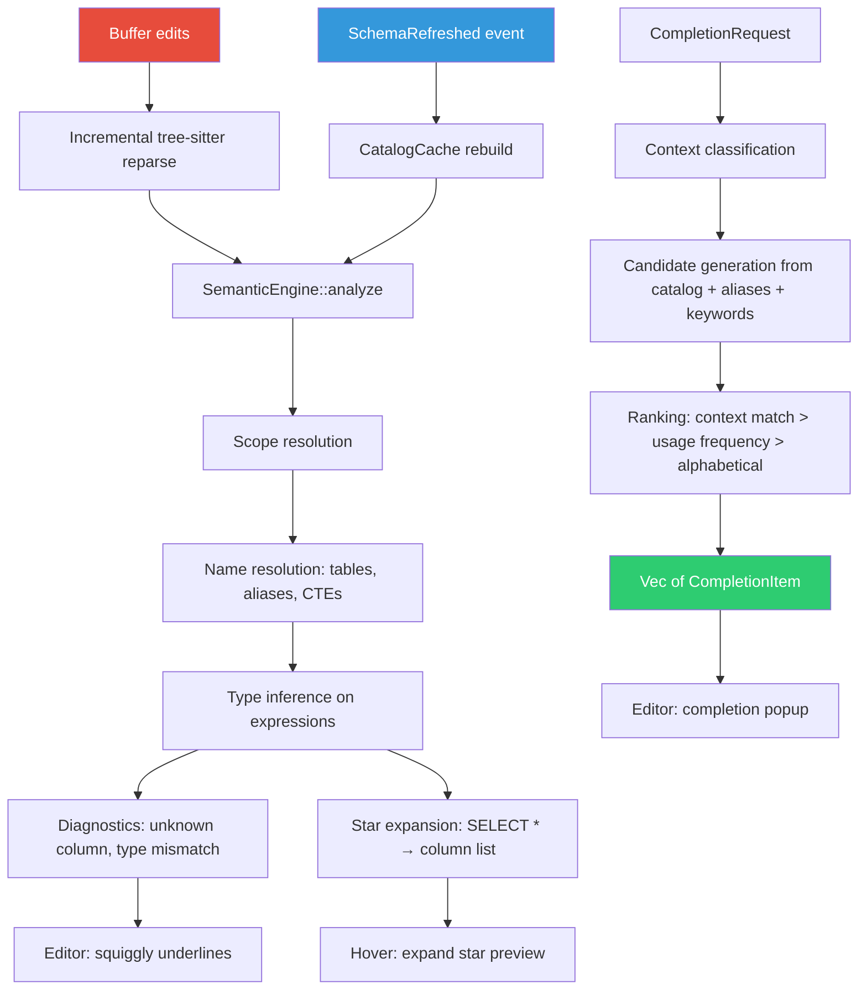
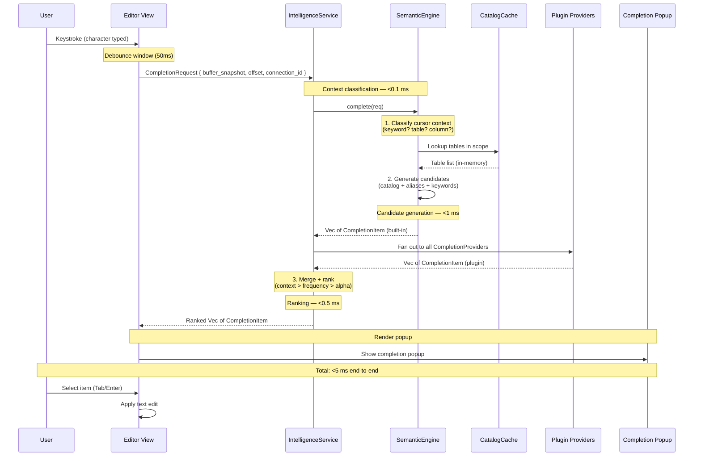
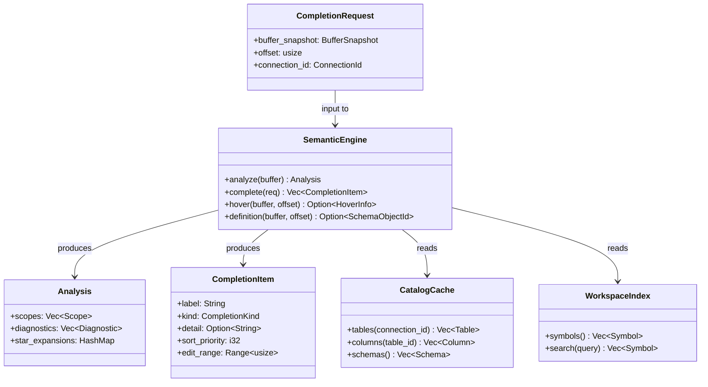

# SQL Intelligence

> The DataGrip half of Tempr — an internal semantic engine that resolves names, infers types, completes intelligently, and catches errors, all with zero I/O on the request path.

---

## Purpose

SQL intelligence is the core differentiator that elevates Tempr from "a fast SQL editor" to a true database IDE. It provides the semantic understanding of SQL that DataGrip pioneered — schema-aware completion, alias resolution, CTE scoping, type inference on comparisons, and diagnostic reporting — but implemented as an **internal semantic engine** running in-process, not as an external language server.

This is a locked architectural decision ([ADR-0009](adr/0009-internal-semantic-engine-not-lsp.md)): Tempr does **not** use an LSP subprocess for SQL intelligence. There is no separate process, no JSON-RPC hop, no serialized message exchange. The `SemanticEngine` has direct, in-memory access to the buffer's tree-sitter parse tree and to the workspace's `CatalogCache`. This eliminates two categories of latency that plague LSP-based tools — process startup and IPC serialization — and enables the <5 ms completion budget that makes typing in Tempr feel instantaneous.

The four inputs to the semantic engine are:

1. **Incremental parsing** — the tree-sitter SQL tree produced by the editor's `Buffer` ([10-editor.md](10-editor.md)). The tree is updated on every edit via incremental reparse, and the semantic engine consumes it directly without copying or serialization.

2. **Workspace cache** — symbol and index data maintained by the storage layer ([07-storage.md](07-storage.md)). Cross-file symbol resolution (e.g., completing a table defined in a different `.sql` file) reads from the pre-built workspace index, not by re-parsing every file.

3. **Semantic analysis** — name resolution, scope tracking, and type inference performed over the AST. This is the engine's own work: walking the tree-sitter nodes, resolving tables and aliases in scope at the cursor, handling CTEs and subqueries, and building the diagnostic model.

4. **Database metadata** — the `CatalogCache` built from `SchemaSnapshot` data provided by the database engine layer ([09-database-engine.md](09-database-engine.md)). The catalog is refreshed asynchronously via `SchemaRefreshed` events and held entirely in memory. The intelligence engine **never** queries the live database during completion or analysis — all metadata reads are sub-microsecond in-memory lookups.

---

## Responsibilities

This document governs:

- The `SemanticEngine` struct and its core API: `analyze`, `complete`, `hover`, `definition`.
- The semantic analysis pipeline: incremental scope resolution, alias tracking, CTE handling, subquery scoping, and star-expansion knowledge.
- The completion pipeline: context classification, candidate generation, ranking, and the <5 ms latency budget.
- Diagnostic generation: unknown column, ambiguous reference, type mismatch on comparison.
- The integration contract between the engine and plugin `CompletionProvider`s ([08-plugin-api.md](08-plugin-api.md)).
- The canonical types: `SemanticEngine`, `CatalogCache`, `CompletionRequest`, `CompletionItem`.

Out of scope:

- The editor buffer, tree-sitter grammar, and incremental parsing mechanics ([10-editor.md](10-editor.md)).
- The database driver, query execution, and schema snapshotting ([09-database-engine.md](09-database-engine.md)).
- The catalog cache persistence format and on-disk layout ([07-storage.md](07-storage.md)).
- Plugin lifecycle and registration mechanics ([08-plugin-api.md](08-plugin-api.md)).
- GPUI view-layer integration for displaying completions and diagnostics ([11-gpui.md](11-gpui.md)).

---

## Design Rationale

### Internal Engine vs External LSP

The decision to build an internal semantic engine rather than integrating an external LSP server was one of the earliest locked architectural choices. The tradeoffs are significant:

| Dimension | Internal Engine (Tempr) | External LSP (DataGrip, VS Code) |
|---|---|---|
| **Latency** | Sub-millisecond for in-memory operations. No process spawn, no IPC round-trip. Completion candidates resolve in <5 ms. | 50–200 ms typical (process startup + JSON-RPC serialization + response deserialization). First completion after idle can exceed 500 ms. |
| **DB-metadata access** | Direct in-memory read from `CatalogCache`. No serialization boundary. Schema snapshot is shared memory. | Requires IPC or a shared-memory protocol. Most LSP implementations re-query the database or cache metadata separately, introducing duplication. |
| **Multi-buffer context** | Full access to all open buffers, workspace symbols, and connection state. Cross-buffer completion (referencing a CTE defined in another file) is trivial. | LSP protocol is per-file. Cross-file context requires workspace-level extensions (`workspace/symbol`), which are inconsistently implemented and add latency. |
| **Protocol constraints** | No protocol. The engine's API is a Rust trait — types are checked at compile time, new methods are added without versioning. | LSP protocol is JSON-RPC over stdio. Every feature addition requires protocol version negotiation, `capabilities` advertisement, and serde round-tripping. |
| **Extensibility** | Plugin `CompletionProvider`s merge directly into the same ranked list. No separate registration protocol. | Plugins must implement the LSP client protocol or use a language-server-specific extension mechanism. |
| **Maintainability** | Single codebase, single language, single build. No separate language-server binary to ship, version, and debug. | Requires shipping a separate binary. Version mismatches between client and server cause hard-to-debug failures. |

The LSP approach has one advantage: it enables language-agnostic tooling (the same server powers multiple editors). Tempr is SQL-only — there is no second editor to serve — so this advantage does not apply.

### Why LSP Concepts Are Preserved as Internal API Shape

Despite rejecting the LSP protocol, the `SemanticEngine` API intentionally mirrors LSP concepts:

- `complete` returns `Vec<CompletionItem>` — the same type name LSP uses.
- `hover` returns `Option<HoverInfo>` — the same pattern as `textDocument/hover`.
- `definition` returns `Option<SchemaObjectId>` — analogous to `textDocument/definition`.

This is deliberate. Developers building plugins or contributing to Tempr already understand LSP vocabulary. Keeping familiar names reduces the learning curve without inheriting LSP's latency and protocol costs. The API shape is for human familiarity; the implementation is entirely internal.

---

## Interfaces

### SemanticEngine

The central type. Owned by `IntelligenceService`, constructed once per workspace, and fed buffer snapshots and catalog updates via the event system.

```rust
pub struct SemanticEngine {
    catalog: Arc<CatalogCache>,
    workspace_index: Arc<WorkspaceIndex>,
    analysis_cache: RwLock<HashMap<SqlFileId, Analysis>>,
}

impl SemanticEngine {
    /// Perform full semantic analysis of a buffer: resolve all scopes,
    /// build the diagnostic set, and return the analysis result.
    /// Incremental: only re-analyzes changed regions based on the
    /// incremental tree-sitter tree.
    pub fn analyze(&self, buffer: &BufferSnapshot) -> Analysis;

    /// Generate completion candidates for the given request.
    /// <5 ms budget on a 10k-object catalog (see Latency Budget below).
    pub fn complete(&self, req: &CompletionRequest) -> Vec<CompletionItem>;

    /// Return hover information (type, definition text, column metadata)
    /// at the given byte offset. Returns None if the offset is not
    /// on a resolvable name.
    pub fn hover(&self, buffer: &BufferSnapshot, offset: usize) -> Option<HoverInfo>;

    /// Navigate to the definition of the symbol at the given offset.
    /// For tables/columns, returns a SchemaObjectId pointing into the
    /// catalog. For aliases, returns the offset of the alias definition.
    pub fn definition(&self, buffer: &BufferSnapshot, offset: usize) -> Option<SchemaObjectId>;
}
```

### CompletionRequest

The input to the completion pipeline. Constructed by `IntelligenceService` on every completion trigger (keystroke debounce or explicit request).

```rust
pub struct CompletionRequest {
    /// Immutable snapshot of the buffer at the time of the request.
    pub buffer_snapshot: BufferSnapshot,

    /// Byte offset of the cursor within the buffer.
    pub offset: usize,

    /// The active database connection. Used to select the correct
    /// catalog partition (multi-connection workspaces may have
    /// different schemas).
    pub connection_id: ConnectionId,
}
```

### CompletionItem

A single completion candidate. Merged with plugin-provided items before ranking.

```rust
pub struct CompletionItem {
    /// The text to insert.
    pub label: String,

    /// Category for icon and grouping in the popup.
    pub kind: CompletionKind,

    /// Optional detail text shown alongside the label (e.g., column type,
    /// table comment, keyword syntax hint).
    pub detail: Option<String>,

    /// Sort priority hint. Lower = higher priority. The ranking layer
    /// may override this based on context match and usage frequency.
    pub sort_priority: i32,

    /// Text edit range — the byte range in the buffer that this
    /// completion replaces (handles partial-word replacement).
    pub edit_range: Range<usize>,
}

pub enum CompletionKind {
    Keyword,
    Table,
    Column,
    Schema,
    Alias,
    Cte,
    Function,
    Snippet,
    Plugin, // contributed by a CompletionProvider
}
```

### Analysis

The result of a full semantic analysis pass over a buffer.

```rust
pub struct Analysis {
    /// All resolved scopes in the buffer, keyed by byte range.
    /// Each scope knows its parent scope, its visible tables/aliases,
    /// and its CTE definitions.
    pub scopes: Vec<Scope>,

    /// Diagnostics produced by the analysis.
    pub diagnostics: Vec<Diagnostic>,

    /// Star-expansion knowledge: for each `SELECT *` or `t.*`,
    /// the resolved list of columns that star would expand to.
    pub star_expansions: HashMap<ByteRange, Vec<ColumnId>>,
}

pub struct Diagnostic {
    pub range: ByteRange,
    pub severity: DiagnosticSeverity,
    pub message: String,
    pub code: DiagnosticCode,
}

pub enum DiagnosticSeverity {
    Error,
    Warning,
    Information,
}

pub enum DiagnosticCode {
    UnknownColumn,
    AmbiguousReference,
    TypeMismatch,
    UnknownTable,
    UnusedAlias,
}
```

### HoverInfo

```rust
pub struct HoverInfo {
    /// Markdown-formatted hover content.
    pub contents: String,

    /// The byte range of the symbol under the cursor.
    pub range: ByteRange,
}
```

---

## Data Flow

### Semantic Analysis Dataflow

The following diagram shows how buffer edits and schema refresh events flow through the semantic engine to produce diagnostics, completions, and hover information:



### Completion Request Sequence

The following sequence diagram shows the completion pipeline from keystroke to popup, with the <5 ms latency budget annotated at each stage:



### Scope Resolution Walk

The semantic analyzer walks the tree-sitter AST to build a scope chain. Each scope tracks visible tables, aliases, and CTEs. The resolution algorithm:

1. **Start at the root node.** The root scope has no parent and contains only the database-level objects from the `CatalogCache` (schemas, tables, views, functions).

2. **Enter a FROM clause.** When the walker enters `SELECT ... FROM table_name AS alias`, it resolves `table_name` against the catalog, creates an alias binding, and pushes a new scope. All column references in the SELECT list that are unqualified resolve against this scope.

3. **Enter a CTE (WITH clause).** When the walker encounters `WITH cte_name AS (SELECT ...)`, it records the CTE name in the current scope. The CTE's column list is inferred from its body's SELECT list. Columns from the CTE are available in the outer query via the CTE name or its optional alias.

4. **Enter a subquery.** Subqueries create a new child scope. The subquery can see its parent scope's tables (unless the subquery is in a FROM clause, in which case it creates a new scope chain). Lateral joins are recognized and handled specially — the right side of a LATERAL join can reference columns from the left side.

5. **Star expansion.** When `SELECT *` or `SELECT t.*` is encountered, the analyzer resolves the star against the current scope's visible tables. The result is a list of `(column_name, table_alias, type)` tuples that the editor can display on hover or use for type inference.

---

## Semantic Analysis Detail

### Name Resolution

The engine resolves names in three steps:

1. **Unqualified name** (e.g., `column_name`): Walk up the scope chain looking for a table or alias that contains a column with this name. If exactly one match is found, the reference is resolved. If zero matches are found, emit `DiagnosticCode::UnknownColumn`. If multiple matches are found, emit `DiagnosticCode::AmbiguousReference`.

2. **Qualified name** (e.g., `t.column_name`): Look up the qualifier `t` in the current scope. If `t` is an alias, resolve it to the underlying table and look up `column_name` in that table's column list. If `t` is a schema-qualified name (e.g., `public.users`), resolve via the catalog's schema → table → column hierarchy.

3. **Star expression** (`*` or `t.*`): Expand against all visible tables in scope (for `*`) or against the specific table (for `t.*`). Record the expansion for hover display and type inference.

### CTE Scope Handling

Common Table Expressions (CTEs) are treated as named subqueries that inject into the enclosing scope:

- A CTE defined in a `WITH` clause is visible to all subsequent CTEs in the same `WITH` and to the main query.
- The column list of a CTE is inferred from its body's SELECT list (including aliases applied within the CTE).
- Recursive CTEs (`WITH RECURSIVE`) are recognized — the recursive reference is available within the CTE body itself.
- CTEs can shadow table names (a CTE named `users` takes precedence over the `users` table in the catalog).

### Subquery Scoping

Subqueries in WHERE, HAVING, and FROM clauses each create a distinct scope:

- **WHERE subquery**: `WHERE x IN (SELECT ...)`. The inner query can reference tables from the outer query (correlated subquery). The engine tracks correlation by recording which outer-scope names the inner query references.
- **FROM subquery**: `FROM (SELECT ...) AS sub`. The inner query's result columns become the subquery's visible columns. The alias (`sub`) is bound in the parent scope.
- **LATERAL subquery**: `FROM t, LATERAL (SELECT ... FROM t2 WHERE t2.id = t.fk)`. Lateral subqueries can reference columns from preceding FROM items. The engine handles this by keeping preceding FROM items in scope during lateral subquery analysis.

### Star-Expansion Knowledge

The engine maintains a mapping of star expressions to their expanded column lists. This enables:

- **Hover on `*`**: Show a tooltip listing all columns that `*` would produce, with types.
- **Hover on `t.*`**: Show the columns of table `t` specifically.
- **Type inference**: When `SELECT *` is expanded, each column's type is known, enabling downstream type checking on comparisons and aggregations.

### Diagnostics

The semantic analysis produces three categories of diagnostics:

| Diagnostic | Trigger | Example |
|---|---|---|
| **Unknown column** | A column name is used that does not match any table in scope. | `SELECT nonexistent FROM users` — `nonexistent` is flagged. |
| **Ambiguous reference** | An unqualified column name matches columns in multiple tables in scope. | `SELECT id FROM users JOIN orders ON ...` — `id` exists in both `users` and `orders`. |
| **Type mismatch** | A comparison or assignment uses incompatible types. | `WHERE name > 42` — `name` is `text`, `42` is `integer`. |

The type-mismatch diagnostic is intentionally conservative for v1. It catches obvious mismatches (string vs integer, boolean vs timestamp) but does not attempt full type-system soundness. The depth of type inference is an open question (see [Open Questions](#open-questions)).

---

## Interfaces — Mermaid Diagram

### SemanticEngine Type Relationships



---

## Completion Pipeline

The completion pipeline is the most latency-sensitive path in the entire system. It runs on every keystroke (after debounce) and must return results before the user perceives a delay.

### Stage 1: Context Classification

The engine inspects the tree-sitter node at the cursor offset to determine what kind of completion the user expects:

| Context | Tree-sitter pattern | Candidates |
|---|---|---|
| **Keyword position** | Cursor after `SELECT`, `WHERE`, `FROM`, `JOIN`, etc. — a keyword-token node. | SQL keywords (`SELECT`, `FROM`, `WHERE`, `JOIN`, `GROUP BY`, etc.). |
| **Table position** | Cursor after `FROM` or `JOIN` — an identifier node in a table-reference position. | Tables, views, and subqueries from the catalog. Schema-qualified suggestions if cursor is after a dot. |
| **Column position** | Cursor in a SELECT list or WHERE clause — an identifier node that should resolve as a column. | Columns from all tables in scope, prefixed with alias when ambiguous. Qualified `alias.column` suggestions. |
| **Alias position** | Cursor after `AS` in a table or column alias context. | No auto-suggestions (alias names are user-chosen). |
| **Expression position** | Cursor in a general expression context. | Columns, functions, and literals from scope. |

### Stage 2: Candidate Generation

Once context is classified, the engine generates candidates from multiple sources:

1. **Catalog lookup** — for table and column positions, the engine reads from the in-memory `CatalogCache`. For a 10k-object catalog (500 tables × 20 columns average), this is a linear scan of the relevant partition — sub-microsecond on modern hardware.

2. **Scope resolution** — for column positions, the engine resolves which tables are in scope at the cursor's position and generates column candidates from those tables. Qualified suggestions (prefixing with `alias.`) are generated when multiple tables are in scope.

3. **Keyword list** — a static, hardcoded list of SQL keywords and their frequency ranks. No I/O required.

4. **Workspace index** — for table positions in cross-file contexts, the engine may query the workspace symbol index to suggest tables defined in other `.sql` files.

### Stage 3: Ranking

Candidates from all sources are merged and ranked by a three-tier comparator:

1. **Context match** (highest priority) — candidates that match the classified context are ranked above all others. A column candidate in a column position beats a keyword candidate.

2. **Usage frequency** — candidates that the user has selected before (tracked in query history) are boosted. This is a persistent signal: frequently-used tables and columns rise to the top over time.

3. **Alphabetical** — when context match and usage frequency are equal, candidates are sorted alphabetically.

Plugin-provided `CompletionItem`s are merged into the same list before ranking, with `CompletionKind::Plugin` items competing on equal footing with built-in items.

---

## Latency Budget

The <5 ms completion budget is a **hard requirement**, not a soft target. It is achieved through three architectural constraints:

| Constraint | How it helps |
|---|---|
| **In-memory interned catalog** | `CatalogCache` is held entirely in memory as interned string tables. Column and table name lookups are pointer comparisons, not heap allocations or string comparisons. A 10k-object catalog occupies ~2 MB of contiguous memory. |
| **No I/O on the request path** | The completion pipeline never performs disk reads, network calls, or subprocess invocations. All data sources (catalog, workspace index, keyword list) are pre-loaded and held in memory. Schema refresh happens asynchronously in the background; completion reads a consistent snapshot. |
| **Incremental analysis** | The semantic analyzer only re-analyzes regions of the buffer that changed since the last analysis. For a single-keystroke edit, this typically means one tree-sitter node and its immediate parent — not the entire file. |

Measured budget breakdown for a typical completion request:

| Stage | Budget | Notes |
|---|---|---|
| Context classification | <0.1 ms | Single tree-sitter node inspection. |
| Candidate generation | <1.0 ms | Catalog scan + scope resolution + keyword list. |
| Ranking | <0.5 ms | Sort ~200 candidates by three-tier comparator. |
| Plugin fan-out | <2.0 ms | All registered `CompletionProvider`s called synchronously. |
| Item construction | <0.5 ms | `CompletionItem` allocation and edit-range computation. |
| **Total** | **<5.0 ms** | Measured on a 10k-object catalog, single-cursor, on the GPUI main thread. |

If profiling reveals that any stage consistently exceeds its budget, the engine must be optimized — the budget is not negotiable.

---

## Data Flow

### Incremental Analysis on Buffer Edit

When the user types a character, the following sequence occurs:

1. **Buffer::edit** applies the change to the rope and triggers tree-sitter incremental reparse. The reparse produces a new `SyntaxTree` that differs from the previous tree only in the nodes affected by the edit.

2. **BufferChanged** is published to the `EventBus`.

3. **IntelligenceService** receives the event and calls `SemanticEngine::analyze` with the new `BufferSnapshot`.

4. **SemanticEngine** compares the new tree against the cached previous tree (stored in `analysis_cache`). It identifies which scope nodes were added, removed, or modified, and re-analyzes only those scopes. Unchanged scopes are reused from the cache.

5. **Diagnostics** for the changed regions are recomputed. Diagnostics for unchanged regions remain valid (they were computed in a previous pass and cached).

6. **The updated `Analysis`** is stored in the cache and made available to `complete`, `hover`, and `definition` calls.

### Schema Refresh Integration

When a `SchemaRefreshed` event arrives:

1. **CatalogCache** is rebuilt from the new `SchemaSnapshot`. This is a background operation — completion requests during the rebuild continue using the old catalog (stale but consistent).

2. **SemanticEngine** receives notification that the catalog changed. It invalidates any cached catalog-dependent analysis (specifically, type inference results that depend on column types from the catalog).

3. **Next completion request** uses the new catalog. The transition is seamless — the user sees no flicker or interruption.

---

## Future Considerations

### Quick-Fixes and Refactoring

The semantic engine's analysis output enables IDE-quality refactoring operations:

- **Rename alias** — when the user invokes rename on an alias (`FROM users AS u`), the engine can find all references to `u.` in the query and replace them atomically. The scope analysis already tracks alias bindings and their usage sites.

- **Expand star** — when the user invokes "expand star" on `SELECT *`, the engine replaces `*` with the explicit column list derived from star-expansion knowledge. This is the inverse of what the hover already shows.

- **Add table to FROM** — when the user types a column name that does not exist in the current scope, a quick-fix could suggest adding the table that owns that column to the FROM clause.

- **Inline CTE** — a refactoring that replaces a CTE reference with its definition body, useful for simplifying queries during debugging.

These are deferred to post-v1 but the analysis infrastructure (scope resolution, star expansion, alias tracking) is built to support them.

### Cross-Dialect Analysis

When MySQL and SQLite drivers land ([09-database-engine.md](09-database-engine.md)), the semantic engine will need to handle dialect-specific syntax:

- **Reserved words differ** — `INTERVAL` is a keyword in PostgreSQL but a regular identifier in MySQL. The keyword completion list must be filtered by the active connection's dialect.
- **Type system differences** — PostgreSQL's `jsonb` vs MySQL's `JSON` vs SQLite's type affinity. The type-mismatch diagnostic must understand per-dialect type compatibility.
- **Function signatures differ** — `GROUP_CONCAT` (MySQL) vs `STRING_AGG` (PostgreSQL) vs `GROUP_CONCAT` (SQLite). Function completion must be dialect-aware.

The current architecture supports this by parameterizing the `SemanticEngine` on a `Dialect` trait that provides reserved words, type compatibility rules, and function catalogs.

### AI Provider Integration Point

The semantic engine's analysis output is a natural input for AI-powered SQL assistance. A future `AiProvider` ([08-plugin-api.md](08-plugin-api.md)) could receive:

- The current `Analysis` (scopes, diagnostics, star expansions).
- The `CatalogCache` snapshot (table/column metadata).
- The user's natural-language prompt (e.g., "write a query to find active users").

The engine would serialize the relevant context into a prompt and pass it to the AI provider. The AI's response would be streamed back as a `CompletionItem` with `CompletionKind::Snippet`, blending AI-generated SQL with the existing completion pipeline.

---

## Open Questions

| # | Question | Status | Notes |
|---|---|---|---|
| 1 | **Type inference depth for v1.** How deep should the type inference go? Full type inference (tracking `INT + INT → INT`, `STRING \|\| STRING → STRING`, `INT + STRING → error`) is complex and may not justify its implementation cost for v1. Current leaning: infer types only for column references (from catalog metadata) and for literal expressions. Comparison type-mismatch detection uses column types only — it does not infer types of complex expressions. | Open | Full expression-level type inference is valuable for aggregate functions (`COUNT` always returns `BIGINT`, `SUM` of `INT` returns `BIGINT`) but the implementation cost is non-trivial. The v1 diagnostic for type mismatch on simple comparisons (`WHERE name > 42`) already delivers significant value. Expression-level inference is a post-v1 enhancement. |
| 2 | **Dialect abstraction for the analyzer.** How should dialect-specific behavior (reserved words, function signatures, type compatibility) be abstracted? Options: (a) a `Dialect` trait with Postgres/MySQL/SQLite implementations, selected by the active connection; (b) a single dialect-aware data structure loaded from a configuration file; (c) per-dialect crates. | Open | Option (a) is cleanest — the `SemanticEngine` holds a `dyn Dialect` reference injected at construction. The dialect provides `is_reserved(word)`, `type_compatible(from, to)`, and `functions()`. The Postgres dialect is the v1 implementation; MySQL and SQLite dialects are stubs. Option (b) is simpler but less extensible. Option (c) adds build complexity without clear benefit. |
| 3 | **Completion caching.** Should completed results be cached per (buffer_version, offset) to avoid recomputation when the user navigates away and back to the same position? The current implementation recomputes on every request. | Open | For most queries (under 500 lines), recomputation is under 1 ms and caching adds complexity (cache invalidation on every edit). For very large files (thousands of lines), caching could help. Recommend measuring on real-world large queries before deciding. |
| 4 | **Multi-cursor completion.** When the user has multiple cursors and triggers completion, should each cursor get independent candidates (based on its own scope context), or should all cursors share the same candidate list? | Open | Independent candidates are correct but require running the completion pipeline N times. For 2–3 cursors this is fine. For many cursors, the combined latency could exceed the 5 ms budget. Recommend independent for ≤3 cursors, shared for more. |

---

## Related Documents

- [Editor](10-editor.md) — the buffer, tree-sitter incremental parsing, and `BufferChanged` events that feed the semantic engine.
- [Database Engine](09-database-engine.md) — `SchemaSnapshot`, `CatalogCache`, and the metadata pipeline that provides schema data to the intelligence engine.
- [Storage](07-storage.md) — `CatalogCache` persistence, workspace index, and the on-disk cache format.
- [Plugin API](08-plugin-api.md) — `CompletionProvider` trait, plugin fan-out, and the registration model for third-party completion sources.
- [ADR-0009](adr/0009-internal-semantic-engine-not-lsp.md) — the locked decision to build an internal semantic engine rather than using an external LSP server.
