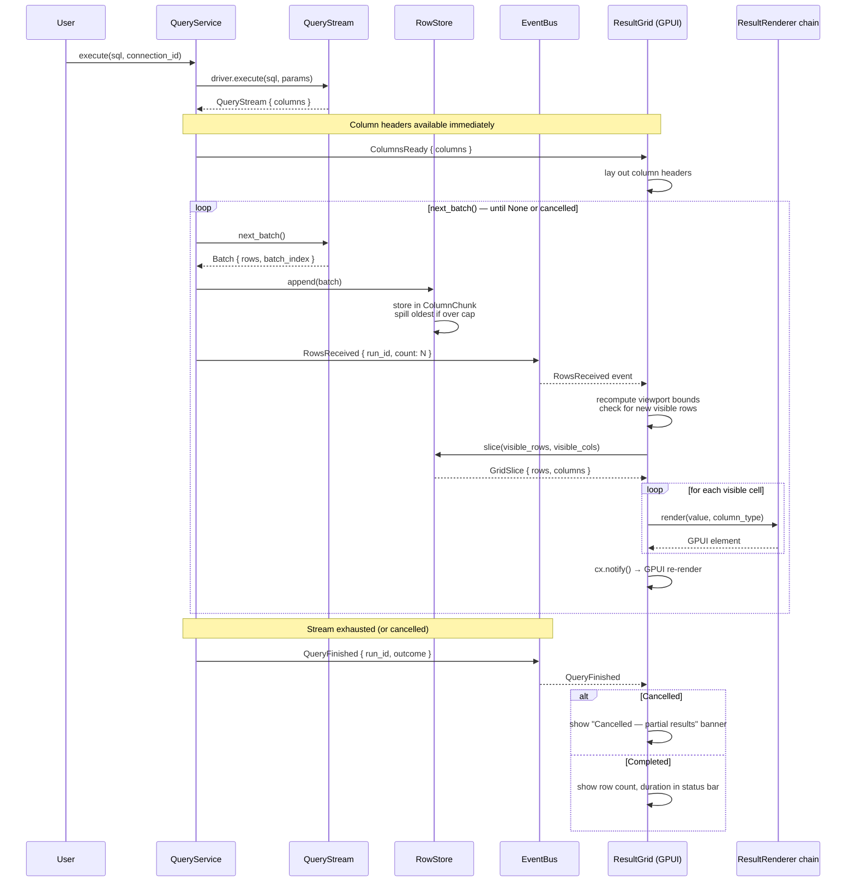

# 13 — Result Grid

> Displaying arbitrarily large result sets within a bounded memory footprint — streaming batches into a columnar row store and rendering only the visible viewport.

---

## Purpose

The result grid is the screen where query results meet the user's eyes. Every `SELECT` executed through [09 — Database Engine](09-database-engine.md) ultimately produces rows that must be displayed, scrolled, sorted, copied, and inspected — without consuming unbounded memory and without stalling the render thread.

This document governs:

- **RowStore** — a columnar, chunked storage engine that receives `Batch`es from `QueryStream`, holds them in memory up to a configurable threshold, and spills to disk beyond that threshold. It is the single source of truth for all rows fetched so far.
- **ResultGrid** — a GPUI view that renders only the rows and columns currently visible in the viewport. It performs virtualization on both axes: scrolling vertically does not materialize off-screen rows; scrolling horizontally does not render off-screen columns.
- **ColumnSpec** metadata — the column headers (name, type, ordinal) delivered by `QueryStream::columns()` before any rows arrive, enabling the grid to lay out headers immediately.
- **ResultRenderer chain** — the extensible rendering pipeline ([08 — Plugin API](08-plugin-api.md)) that maps `Value` variants to cell-level visual output (text, JSON tree, bytea hex preview, etc.).

The streaming contract is simple: rows arrive in batches, the row store appends them, the grid is notified with `RowsReceived`, and the grid re-renders only its visible viewport. The user sees the first rows appear as soon as the first batch is received, while the query may still be running on the server.

### Guiding pillars

| Pillar | How the result grid enforces it |
|---|---|
| **Memory footprint** | `RowStore` caps its in-memory footprint. Beyond the cap, chunks are evicted to a temporary spill file on disk. The grid never holds more than one viewport-worth of rendered cell elements at a time. |
| **Virtualized rendering** | `ResultGrid` only allocates GPUI elements for visible rows and columns. A 10 million row result set renders the same number of elements as a 100 row result set. |
| **Streaming responsiveness** | The first batch of results appears on screen within one frame (~16 ms) of arrival. The user is never blocked waiting for the full result set. |

---

## Responsibilities

| Concern | Owner | Notes |
|---|---|---|
| Chunked columnar storage of received `Batch`es | `RowStore` | Memory-capped; spills to disk when threshold exceeded |
| Cell-level rendering (text, JSON, bytea, NULL indicator) | `ResultRenderer` chain | Delegated through [08 — Plugin API](08-plugin-api.md) |
| Viewport virtualization (rows × columns) | `ResultGrid` (GPUI view) | Renders only visible cells; re-renders on scroll |
| Column header rendering and column resize/hide | `ResultGrid` | Column metadata from `QueryStream::columns()` |
| Cell selection and copy (CSV / TSV / JSON) | `ResultGrid` + `ClipboardService` | Keyboard-driven selection; command-registered copy actions |
| Column sort (client-side, within fetched rows) | `ResultGrid` | Sorts only rows currently in `RowStore`; partial-fetch semantics apply |
| Cell inspector (large values, expand) | `ResultGrid` | Opens a detail pane for oversized cell content |
| NULL vs empty-string visual distinction | `ResultRenderer` | NULL renders as a dimmed `∅`; empty string renders as blank |
| Cancel handling | `ResultGrid` / `QueryService` | On `QueryFinished { outcome: Cancelled }`, grid shows partial results with a banner |
| Export (CSV/JSON/TSV of visible or full fetched rows) | `ResultGrid` | Commands: `ExportCsv`, `ExportJson`, `ExportTsv` |

Out of scope:

- Query execution and connection management ([09 — Database Engine](09-database-engine.md)).
- Event bus mechanics and `RowsReceived` event structure ([06 — Event System](06-event-system.md)).
- Cell-level rendering plugin mechanics ([08 — Plugin API](08-plugin-api.md)).
- In-grid editing (UPDATE generation) — explicitly a v1 non-goal ([Future Considerations](#future-considerations)).

---

## Design Rationale

### Columnar chunk store over `Vec<Vec<Value>>`

A naive grid stores rows as `Vec<Vec<Value>>` — an array of row vectors. This is simple but has three costs:

| Dimension | `Vec<Vec<Value>>` (row-major) | Columnar chunk store (column-major) |
|---|---|---|
| **Cache locality on column operations** | Scanning a column (e.g., for sort) jumps between row vectors — pointer-chasing, cache-unfriendly. | Contiguous per-column arrays. A column scan is a sequential memory walk. |
| **Per-column type dispatch** | Every cell access requires matching on the `Value` enum. Sort, filter, and render must re-dispatch per cell. | Column knows its `ValueType` at the `ColumnSpec` level. Sort dispatches once per column, not once per cell. |
| **Memory management** | Evicting old rows requires shifting or compacting the `Vec<Vec<Value>>` structure. | Chunks are independent. Evicting the oldest chunk is a pointer swap. Spill-to-disk is chunk-granular. |

The columnar store is organized as `Vec<ColumnChunk>`, where each `ColumnChunk` holds a fixed number of rows (e.g., 4096) for all columns. This gives cache-friendly sequential access within a chunk, efficient eviction at chunk boundaries, and natural alignment with the batch sizes produced by `QueryStream`.

### Render-on-demand over render-all

Two models exist for grid rendering:

1. **Render-all:** Materialize GPUI elements for every cell, then let GPUI's virtualization hide off-screen elements. Simple but defeats the purpose — GPUI must still diff the full element tree.

2. **Render-on-demand:** Only create GPUI elements for cells within the current viewport. Scroll events update the viewport offset and trigger a targeted re-render of only the newly-visible cells. This is the approach Tempr uses.

The viewport is defined by `(first_visible_row, last_visible_row, first_visible_col, last_visible_col)`. On scroll, the grid computes which cells entered or left the viewport and only issues GPUI element creation/destruction for the delta. This keeps the per-frame cost proportional to the viewport size (typically ~50 rows × ~10 columns = ~500 cells), not the result set size.

---

## Interfaces

### RowStore

The columnar row store. Owned by `QueryService` (one per active `QueryRun`), exposed to the `ResultGrid` view via a read-only snapshot interface.

```rust
pub struct RowStore {
    columns: Vec<ColumnSpec>,
    chunks: VecDeque<ColumnChunk>,
    total_rows: usize,
    memory_usage_bytes: usize,
    memory_cap_bytes: usize,
    spill_file: Option<PathBuf>,
    spilled_chunk_count: usize,
}

impl RowStore {
    pub fn new(columns: Vec<ColumnSpec>, memory_cap_bytes: usize) -> Self;

    /// Append a batch of rows to the store. If appending this batch
    /// would exceed memory_cap_bytes, the oldest chunks are spilled
    /// to disk before appending.
    pub fn append(&mut self, batch: Batch);

    /// Total number of rows received so far (including spilled chunks).
    pub fn row_count(&self) -> usize;

    /// Column metadata. Available immediately after construction,
    /// before any rows are appended.
    pub fn columns(&self) -> &[ColumnSpec];

    /// Slice the store for the visible viewport only. Returns a
    /// GridSlice containing the requested row range and column range.
    /// Rows on disk are read back from the spill file on demand.
    /// Returns an error if the spill file is unreadable.
    pub fn slice(&self, rows: Range<usize>, cols: Range<usize>) -> Result<GridSlice, StoreError>;

    /// Discard all chunks for a cancelled query. Called from the
    /// cancel path in QueryService.
    pub fn discard(&mut self);

    /// Current memory usage in bytes (in-memory chunks only).
    pub fn memory_usage(&self) -> usize;
}

/// A view into a rectangular region of the RowStore.
/// Contains owned data — not borrowed from the store.
pub struct GridSlice {
    pub columns: Vec<ColumnSpec>,
    pub rows: Vec<Vec<Value>>,
    pub row_offset: usize, // global row index of first row in slice
}

pub enum StoreError {
    SpillReadFailed(PathBuf, std::io::Error),
    OutOfBounds { row: usize, col: usize },
}
```

### ResultGrid

The GPUI view. Constructed once per result tab, subscribed to `RowsReceived` events, and responsible for rendering only the visible viewport.

```rust
pub struct ResultGrid {
    store: RowStore,
    viewport: ViewportState,
    selection: CellSelection,
    sort_state: Option<SortState>,
    column_widths: Vec<f32>,
    column_hidden: Vec<bool>,
    inspector_open: Option<CellAddress>,
}

impl ResultGrid {
    /// Current viewport bounds, recomputed on scroll.
    pub fn viewport(&self) -> &ViewportState;

    /// Get the cell value at a specific address. Used by the
    /// inspector and copy operations.
    pub fn cell(&self, addr: CellAddress) -> Option<&Value>;

    /// Sort rows by the given column. Client-side only — operates
    /// on rows already in RowStore. If the query is still streaming,
    /// the sort applies only to fetched rows and a banner warns
    /// the user.
    pub fn sort_by(&mut self, column: usize, direction: SortDirection);

    /// Resize a column. Triggers a viewport re-layout.
    pub fn resize_column(&mut self, column: usize, width: f32);

    /// Hide a column. Hidden columns are excluded from viewport
    /// calculations and rendering.
    pub fn hide_column(&mut self, column: usize);

    /// Show a previously hidden column.
    pub fn show_column(&mut self, column: usize);

    /// Copy the current selection to the clipboard in the given format.
    pub fn copy_selection(&self, format: CopyFormat);
}

pub struct ViewportState {
    pub first_row: usize,
    pub last_row: usize,
    pub first_col: usize,
    pub last_col: usize,
    pub total_rows: usize,
    pub total_cols: usize,
}

pub struct CellSelection {
    pub anchor: Option<CellAddress>,
    pub head: Option<CellAddress>,
}

pub struct CellAddress {
    pub row: usize,
    pub col: usize,
}

pub struct SortState {
    pub column: usize,
    pub direction: SortDirection,
}

pub enum SortDirection {
    Ascending,
    Descending,
}

pub enum CopyFormat {
    Csv,
    Tsv,
    Json,
}
```

### ColumnSpec (canonical type, shared with 09)

`ColumnSpec` is defined in [09 — Database Engine](09-database-engine.md) and reused by `RowStore` without duplication. The grid consumes it directly for header rendering and type-dispatched cell rendering.

### ResultRenderer chain

Cell rendering is delegated to a chain of renderers registered through the plugin system ([08 — Plugin API](08-plugin-api.md)). Each renderer declares which `ValueType` it handles and produces a GPUI element for a cell value.

| Renderer | Handles | Output |
|---|---|---|
| `TextRenderer` | `String`, `Int64`, `Float64`, `Bool`, `Numeric`, `Uuid`, `Date`, `Time`, `Timestamp` | Plain text, truncated with ellipsis if wider than column |
| `NullRenderer` | `Null` | Dimmed `∅` symbol |
| `JsonRenderer` | `Json` | Syntax-highlighted JSON with collapsible tree |
| `ByteaRenderer` | `Bytes` | Hex dump with byte-offset header |
| `ArrayRenderer` | `Array` | Comma-separated preview with expand-to-inspector |
| `CustomRenderer` | `Custom` | Raw display string from the driver's display hint |

The renderer chain is evaluated in order: the first renderer that claims a `ValueType` wins. Plugins can prepend renderers to override defaults (e.g., a "map preview" renderer for PostGIS geometry types).

---

## Data Flow

### Streaming pipeline

The core data flow from query execution to pixels on screen:



### Cancel + partial-results behavior

When the user cancels a running query:

1. **QueryService** sends a cancel request to the driver and drops the `QueryStream` ([09 — Database Engine](09-database-engine.md) cancel path).
2. **RowStore** retains all chunks received up to the cancel point. The partial result set is valid — every row in the store is a correct row from the query.
3. **ResultGrid** receives `QueryFinished { outcome: Cancelled }`. It renders a banner at the top of the grid: `"Query cancelled — showing N of ? rows"`. The user can still scroll, sort, copy, and inspect the partial results.
4. If the user runs a new query on the same connection, the previous `RowStore` is discarded and a new one is created.

Key invariant: **cancel never corrupts the RowStore.** The store either has a chunk or it does not. There is no "half-written" chunk state because `append()` is atomic at the batch level — the entire batch is either in memory (or on disk) or not.

### Sort semantics during streaming

When the user sorts a column while the query is still streaming:

- `ResultGrid::sort_by` sorts only the rows currently in `RowStore`.
- A banner appears: `"Sorted by column — only N fetched rows sorted. More rows may arrive."`
- When the next `RowsReceived` event arrives, the newly-fetched rows are inserted into the sorted order (merge-insert, not full re-sort).
- When `QueryFinished` arrives, the sort is applied to the full result set and the banner disappears.

This avoids the false impression of a complete sort on a partial result while still giving the user useful early sorting feedback.

---

### v1 grid capabilities

All capabilities are keyboard-driven and command-registered through the command system ([10 — Editor](10-editor.md)).

| Capability | Interaction | Notes |
|---|---|---|
| **Cell selection** | Click to select a cell. Shift+Click to extend selection. Shift+Arrow keys to extend selection range. Ctrl+A to select all. | Selection is a rectangular range of cells. |
| **Copy (CSV)** | `Ctrl+Shift+C` → copy selection as CSV to clipboard. | Respects column hidden state. |
| **Copy (TSV)** | `Ctrl+C` (default) → copy selection as TSV. | Most common format for paste into spreadsheets. |
| **Copy (JSON)** | Command-registered: `CopyAsJson`. | Array of objects, one per row. |
| **Column sort** | Click column header to sort ascending. Click again for descending. Third click removes sort. | Client-side within fetched rows (see [Data Flow](#sort-semantics-during-streaming)). |
| **Column resize** | Drag column header border. Double-click border to auto-fit width. | Auto-fit samples up to 100 visible rows. |
| **Column hide** | Right-click column header → "Hide Column". Ctrl+Z to undo last hide. | Hidden columns excluded from viewport and export. |
| **Cell inspector** | Double-click a cell or press Enter on a selected cell. | Opens a detail pane below the grid showing the full value (JSON tree, large text, bytea hex). |
| **NULL display** | Rendered as dimmed `∅` by `NullRenderer`. | Distinct from empty string (blank cell). |
| **Export** | `Ctrl+Shift+E` → export menu (CSV, JSON, TSV). Exports fetched rows only. | Full-result export is a future consideration. |

### Value rendering delegation

Cell rendering is never hard-coded in `ResultGrid`. Every cell is rendered through the `ResultRenderer` chain. The grid calls `renderer.render(value, column_spec)` for each visible cell. The chain is:

1. **Plugin renderers** (checked first) — plugins can register custom renderers for any `ValueType` or for specific column name patterns.
2. **Built-in renderers** — `TextRenderer`, `NullRenderer`, `JsonRenderer`, `ByteaRenderer`, `ArrayRenderer`, `CustomRenderer`.

This means a future plugin can add a map renderer for PostGIS geometry columns without modifying the result grid code.

---

## Future Considerations

### In-grid editing with generated DML

Editing cells directly in the grid and generating `UPDATE` statements is a post-v1 feature. The design considerations are:

- **Confirmation dialog** — every edit generates a preview `UPDATE ... SET col = ? WHERE pk = ?` statement that the user must confirm before execution.
- **Row identity** — the grid must know the primary key (or a unique key) of each row to generate a correct `WHERE` clause. This requires the query result to carry key metadata, which PostgreSQL provides via `oid` or explicit `SELECT ... RETURNING`.
- **Optimistic locking** — the generated `UPDATE` should include a `WHERE` clause on the fetched value to detect concurrent modification.
- **Transaction wrapping** — edits should optionally be batched in a transaction for atomicity.

This feature is deferred because it significantly increases the complexity of the `RowStore` (mutation support, undo stack) and introduces DML generation logic that must be dialect-aware.

### Charts and visualization

Rendering result sets as charts (bar, line, scatter, etc.) is explicitly a v1 non-goal. The result grid's contract is tabular display. Charts would require:

- A different rendering pipeline (canvas-based, not GPUI element tree).
- Data transformation (aggregation, binning) that belongs in a separate module.
- A plugin API extension for chart types.

Charts are a natural post-v1 feature when a charting plugin can register a `ResultRenderer` that consumes tabular data and outputs a canvas element.

### Export of full unfetched results

The v1 export command exports only the rows currently in `RowStore` (fetched rows). For result sets that are still streaming or were cancelled, the export is partial. Full-result export is a future consideration:

- **Server-side re-run to file** — the export command re-executes the original query with a `COPY ... TO STDOUT` (PostgreSQL) or equivalent, streaming directly to a file on disk. This bypasses `RowStore` entirely and gives the user the complete result set without loading it into memory.
- **Format options** — CSV, TSV, JSON lines, Parquet.
- **Export dialog** — lets the user choose format, destination path, and whether to export fetched rows only or re-run for full results.

### Frozen column support

Pinning one or more columns to the left edge of the grid so they remain visible during horizontal scroll. Useful for tables with many columns where the primary key should always be visible.

---

## Open Questions

| # | Question | Status | Notes |
|---|---|---|---|
| 1 | **Default fetch cap.** Should `RowStore` have a hard cap on total rows fetched (e.g., 100k rows), even if memory is available? A hard cap prevents runaway queries from consuming all system memory via spill files. A soft cap (memory-based only) is simpler but risks disk thrashing on large result sets. | Open | Current leaning: hard cap of 1M rows by default, configurable per connection. Rows beyond the cap are discarded with a banner: `"Result truncated — 1M row limit reached. Re-run with LIMIT or export to file."` The cap is enforced in `RowStore::append`, not in `QueryStream`. |
| 2 | **Spill format.** What format should `RowStore` use when spilling chunks to disk? Options: (a) a custom binary format with per-column layout matching the in-memory `ColumnChunk`; (b) a temporary SQLite database; (c) newline-delimited JSON. | Open | Option (a) is fastest for read-back (zero deserialization — just `mmap` or `memcpy`), but creates a format that must be versioned and maintained. Option (b) adds a dependency but gives ACID guarantees for free. Option (c) is simplest but slowest. Recommend (a) for v1 with a versioned header; the format is internal and never exposed to the user. |
| 3 | **Sort algorithm for streaming inserts.** When new batches arrive during an active sort, the grid must merge newly-fetched rows into the sorted order. Options: (a) binary-search insertion for each new row (O(N log N) per batch); (b) buffer unsorted rows and re-sort on viewport access (amortized O(N log N) but deferred cost); (c) maintain a `BTreeMap` index alongside the chunk store. | Open | Option (c) is most efficient for repeated access but adds memory overhead and complexity. Recommend option (b) for v1: append new batches to an unsorted tail, merge on sort access. The sorted + unsorted split is invisible to the viewport — `slice()` returns a fully sorted view regardless. |
| 4 | **Column auto-fit algorithm.** When the user double-clicks a column border, the grid should auto-size the column to fit its content. How many rows should be sampled? Should truncated values (JSON, large text) be measured at full length or at a display-width cap? | Open | Sample up to 100 visible rows. Truncated values measured at a display-width cap of 200 characters. This gives a reasonable default without scanning the entire result set. The user can always manually resize after auto-fit. |
| 5 | **Cell inspector depth for nested types.** How deeply should the cell inspector render nested structures (JSON arrays/objects, PostgreSQL arrays of arrays)? Unbounded nesting risks infinite render loops on pathological data. | Open | Cap inspector nesting depth at 8 levels. Values beyond this depth show a `"... (truncated)"` indicator. This prevents render-time blowup on deeply nested JSON while covering the vast majority of real-world data. |

---

## Related Documents

- [09 — Database Engine](09-database-engine.md) — `QueryStream`, `Batch`, `ColumnSpec`, `Value`, and the streaming contract that feeds `RowStore`.
- [11 — GPUI Usage](11-gpui.md) — The UI framework; `ResultGrid` is a GPUI view following the view ↔ service pattern defined there.
- [06 — Event System](06-event-system.md) — `RowsReceived` and `QueryFinished` events that drive grid updates.
- [08 — Plugin API](08-plugin-api.md) — `ResultRenderer` registration point; the renderer chain that maps `Value` variants to cell-level GPUI elements.
