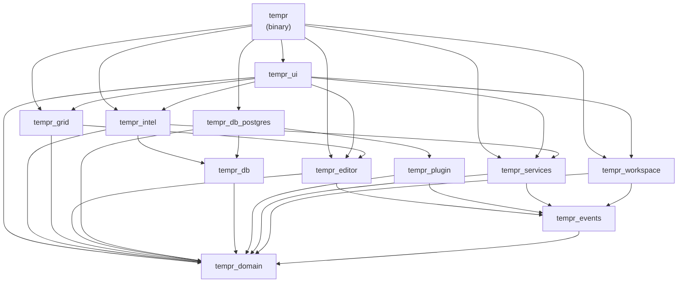

# Project Layout

## Purpose

Tempr is a native Rust Database IDE — "Zed meets DataGrip." This document defines the future Cargo workspace layout so that the mapping between documentation and code is fixed *before* implementation begins.

Every crate listed below maps to exactly one bounded context and one component document. Writing the layout down now means we can review dependencies, enforce layer boundaries, and plan parallel workstreams without waiting for code to exist.

## Responsibilities

### Crate Map

```
tempr/                    # Cargo workspace root
├── crates/
│   ├── tempr/            # binary: app entry, service wiring
│   ├── tempr_domain/     # domain model types
│   ├── tempr_workspace/  # WorkspaceService, storage
│   ├── tempr_events/     # EventBus, AppEvent
│   ├── tempr_services/   # remaining core services
│   ├── tempr_plugin/     # Plugin API traits, PluginContext
│   ├── tempr_db/         # driver abstraction, QueryStream
│   ├── tempr_db_postgres/# PostgreSQL driver (static plugin)
│   ├── tempr_editor/     # Buffer, rope, syntax
│   ├── tempr_ui/         # GPUI components, views
│   ├── tempr_intel/      # SemanticEngine, CatalogCache
│   └── tempr_grid/       # RowStore, ResultGrid
└── docs/
```

| Crate | Responsibility | Component Doc |
|---|---|---|
| `tempr` | Binary entry point — app bootstrap, service wiring, plugin registration | [02 — Architecture](02-architecture.md) |
| `tempr_domain` | Domain model types shared across all layers (Connection, Query, Column, DataType) | [03 — Domain](03-domain-model.md) |
| `tempr_workspace` | WorkspaceService, project storage, state persistence | [04 — Workspace](04-workspace.md), [07 — State](07-storage.md) |
| `tempr_events` | EventBus, AppEvent enum, publish/subscribe plumbing | [06 — Events](06-event-system.md) |
| `tempr_services` | Remaining core services (connection management, session lifecycle) | [05 — Services](05-services.md) |
| `tempr_plugin` | Plugin API traits, PluginContext, plugin lifecycle hooks | [08 — Plugin System](08-plugin-api.md) |
| `tempr_db` | Driver abstraction trait, QueryStream, result decoding | [09 — Database](09-database-engine.md) |
| `tempr_db_postgres` | PostgreSQL driver — ships as a static plugin, depends only on `tempr_db` + `tempr_plugin` | [09 — Database](09-database-engine.md) |
| `tempr_editor` | Buffer, rope data structures, syntax highlighting | [10 — Editor](10-editor.md) |
| `tempr_ui` | GPUI components, views, layout | [11 — UI](11-gpui.md) |
| `tempr_intel` | SemanticEngine, CatalogCache, code intelligence | [12 — Intelligence](12-sql-intelligence.md) |
| `tempr_grid` | RowStore, ResultGrid, data grid rendering | [13 — Grid](13-result-grid.md) |

## Design Rationale

**One crate per bounded context.** Each crate owns a single cohesive concept. This is not a style preference — it is enforced at build time:

- **Compile-time layer enforcement.** Rust's dependency system means a crate cannot import symbols from a crate it does not list as a dependency. If `tempr_domain` is not in your `Cargo.toml`, you cannot accidentally couple to it. Violations of layering (e.g. `tempr_db` importing `tempr_ui`) fail at `cargo check`, not in code review.

- **Incremental build times.** Touching `tempr_grid` recompiles only `tempr_grid` and its dependents (`tempr_ui`, the binary). `tempr_intel`, `tempr_editor`, and `tempr_db_postgres` are untouched. On a cold build this matters less; during iterative development it compounds into hours saved per week.

- **Plugin-crate pattern.** The `tempr_db_postgres` crate demonstrates how a database driver plugs into the system: it depends on `tempr_db` (for the `Driver` trait) and `tempr_plugin` (for `PluginContext`), and nothing else. New drivers (`tempr_mysql`, `tempr_sqlite`) will follow the same pattern — add one crate, register it at startup, done. The pattern generalises to any extension point.

## Interfaces

### Workspace Cargo Conventions

The workspace root `Cargo.toml` is the single source of truth for dependency versions and shared configuration.

```toml
[workspace]
members = ["crates/*"]
resolver = "2"

[workspace.dependencies]
tokio = { version = "1", features = ["full"] }
serde = { version = "1", features = ["derive"] }
gpui = { path = "../gpui" }

[workspace.lints.rust]
unsafe_code = "forbid"
unused_must_use = "warn"

[workspace.lints.clippy]
unwrap_used = "warn"
expect_used = "warn"
```

Each member crate's `Cargo.toml` inherits from the workspace:

```toml
[package]
name = "tempr_grid"
version.workspace = true
edition.workspace = true

[dependencies]
tokio.workspace = true
tempr_domain.workspace = true

[lints]
workspace = true
```

This means:

- **Dependency versions are pinned once** at workspace level. Upgrading `tokio` changes it for every crate in one commit.
- **Shared lints are enforced everywhere.** `unsafe_code = "forbid"` applies to every crate without duplication. Adding a lint to the workspace table cascades immediately.
- **Path dependencies replace registry crates** for internal crates. No versioning ceremony for intra-workspace changes.

## Data Flow

### Build and Test Pipeline

Every developer machine and CI runner runs the same pipeline, in the same order:


1. **Format check** — fast, catches whitespace and structural style. Runs in seconds.
2. **Clippy** — static analysis with workspace-level lints. Catches `unwrap()`, `unsafe`, dead code, and performance antipatterns.
3. **Test** — unit tests within each crate, integration tests in `crates/*/tests/`, and workspace-level property tests where applicable.
4. **Doc build** — ensures all `///` doc-comments and cross-references compile. Broken links in `//!` module docs fail here.
5. **Release build** — full optimised binary. Catches linker errors and feature-flag issues that debug builds may miss.

CI mirrors this pipeline exactly. There are no CI-only steps. If `cargo fmt --check` passes locally, it passes in CI. Reproducibility is non-negotiable.

### Dependency Graph

The following graph shows which crates depend on which. Arrows point from dependent to dependency (i.e. "A → B" means A imports B). The layering enforced is:

- **Domain** (`tempr_domain`, `tempr_events`) — depended on by almost everything, depend on nothing internal.
- **Services** (`tempr_workspace`, `tempr_services`, `tempr_plugin`, `tempr_db`) — depend on domain, not on each other (sibling layer).
- **Drivers** (`tempr_db_postgres`) — depend only on `tempr_db` + `tempr_plugin` + `tempr_domain`.
- **Intelligence** (`tempr_intel`, `tempr_editor`, `tempr_grid`) — depend on domain + services.
- **UI** (`tempr_ui`) — depends on everything below it; nothing depends on `tempr_ui`.
- **Binary** (`tempr`) — the root; depends on all crates, wires them together.



### Layer Rules (enforced by Cargo)

| Rule | Violation |
|---|---|
| `tempr_domain` depends on no internal crate | Compile error if any internal import added |
| `tempr_ui` is never imported by another crate | Checked via dependency graph review |
| `tempr_db_postgres` imports only `tempr_db`, `tempr_plugin`, `tempr_domain` | `cargo clippy` + workspace lint on dependency declarations |
| Binary crate is the only crate with `main()` | `[[bin]]` vs `[[lib]]` distinction in Cargo |

## Future Considerations

- **Separate plugin SDK repository.** If third-party plugin authors build drivers or extensions, the plugin traits (`tempr_plugin`, `tempr_db`) should ship as a standalone crate (`tempr-plugin-sdk`) published to crates.io. This may warrant its own repository with independent versioning and stability guarantees. The current monorepo layout supports extracting these crates without restructuring — the dependency edges are already clean.

- **MSRV policy.** Rust's minimum supported Rust version has not been pinned yet. Candidates: current stable (tracks forward, always latest), N-1 (one version behind stable, balances freshness with ecosystem readiness), or a pinned version with time-based updates. The choice affects CI matrix size and contributor friction. This should be decided before the first release tag.

- **Workspace-level feature flags.** Some crates (notably `tempr_ui`) may offer optional feature gates for experimental views or debug panels. Workspace dependency feature unification should be audited to avoid pulling unwanted transitive features.

- **Monorepo tooling.** As the crate count grows, consider `cargo-workspaces`, `cargo-deny` for licence/advisory auditing, and `cargo-cache` for CI speed. These are not blocking but should be evaluated at the 10-crate threshold (which we will hit immediately).

## Open Questions

1. **Separate repo for plugin SDK?** — The current plan keeps everything in one monorepo. If the plugin ecosystem grows or external contributors need stable API surfaces, splitting `tempr_plugin` + `tempr_db` into their own repo may be warranted. What is the trigger condition for that split?

2. **MSRV policy** — Which Rust version do we commit to supporting? Should it be the current stable at release time, or N-1? How do we communicate and enforce this (CI matrix, README badge, clippy lint)?

3. **Binary crate naming** — The `tempr` crate contains the binary. If a library re-export is needed later (for integration testing or scripting), do we split into `tempr-bin` and `tempr-lib`, or keep a single crate with both `[[bin]]` and `[lib]` sections?

4. **Feature flag granularity** — At what point do we introduce Cargo feature flags for optional functionality (e.g. `tempr_intel` with/without LSP support)? Too early adds complexity; too late requires refactoring.

5. **Plugin crate signing** — If plugins ship as separate crates, do we need a trust/signing mechanism for loading third-party drivers at runtime? Or do we rely on compile-time linking only?

## Related Documents

- [02 — Architecture](02-architecture.md) — high-level system architecture, service topology
- [03 — Domain](03-domain-model.md) — domain model types used across crates
- [04 — Workspace](04-workspace.md) — WorkspaceService design
- [05 — Services](05-services.md) — core service layer
- [06 — Events](06-event-system.md) — EventBus and event types
- [07 — State](07-storage.md) — state persistence and serialization
- [08 — Plugin System](08-plugin-api.md) — plugin lifecycle and API traits
- [09 — Database](09-database-engine.md) — driver abstraction and PostgreSQL implementation
- [10 — Editor](10-editor.md) — buffer and syntax handling
- [11 — UI](11-gpui.md) — GPUI component tree
- [12 — Intelligence](12-sql-intelligence.md) — semantic engine and catalog
- [13 — Grid](13-result-grid.md) — result grid and row storage
- [15 — Build & CI](15-coding-standards.md) — CI pipeline details
