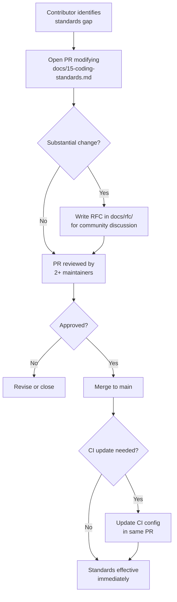
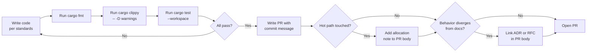

# 15 — Coding Standards

> The contract every contribution is reviewed against — Rust conventions, async discipline, performance budgets, testing policy, and commit conventions for the Tempr codebase.

---

## Purpose

This document is the **single source of truth** for how code is written, reviewed, and merged in Tempr. Every pull request is measured against these standards. They exist to keep the codebase consistent, performant, and maintainable as it grows from a solo prototype into a contributor-friendly project.

The standards here are intentionally opinionated and conservative. Where a rule has a rationale, it is documented. Where a rule is aspirational, it is marked as a future consideration. Contributors should not have to guess — if it is not in this document, it is not yet codified.

---

## Responsibilities

| Concern | Owner | Notes |
|---|---|---|
| Rust edition, formatting, and linting | CI (rustfmt, clippy) | Edition 2024; default rustfmt config; clippy `-D warnings` |
| Unsafe code policy | All contributors, reviewer gate | `#![deny(unsafe_code)]` by default; explicit unsafe requires justification |
| Error handling conventions | Library crate authors | `thiserror` per-crate enums; no `unwrap`/`expect` outside tests |
| Async discipline | Service and driver authors | No blocking calls on UI thread or inside `spawn`/`spawn_local` |
| Performance budgets | Contributors touching hot paths | Allocation notes required for completion, rendering, ingestion paths |
| Naming and design identity | All contributors | Newtype IDs (per [03](03-domain-model.md)); no business logic in `tempr_ui` (per [02](02-architecture.md)); events over direct calls (per [06](06-event-system.md)) |
| Testing policy | All contributors | Unit tests colocated; integration tests in `tests/`; golden-file tests for semantic engine |
| Commit and PR conventions | All contributors | Conventional Commits; linked ADR/RFC when behavior diverges from docs |

Out of scope:

- Runtime configuration and deployment standards (governed by operational runbooks, not this document).
- Plugin authoring standards (governed by [08 — Plugin API](08-plugin-api.md)).

---

## Design Rationale

### Why codify standards early?

Without written standards, a codebase accumulates invisible inconsistencies. One contributor uses `anyhow` everywhere; another uses `thiserror`. One wraps every function in `async`; another has sync functions that block the executor. These inconsistencies are cheap to introduce and expensive to retrofit. Writing the standards document at the start — before there is code to fight over — anchors the conventions in a neutral, reviewable artifact.

### Why these specific rules?

Each rule below is derived from one or more of Tempr's design pillars:

| Pillar (from [01 — Vision](01-vision.md)) | Standard it drives |
|---|---|
| **Responsiveness** | No blocking on UI thread; async service APIs; minimal allocations on hot paths; startup I/O budget |
| **Correctness** | Clippy `-D warnings`; `#![deny(unsafe_code)]`; `thiserror` enums; no `unwrap` in production paths |
| **Modularity** | Events over direct calls; no business logic in `tempr_ui`; newtype IDs for type safety |
| **Maintainability** | Conventional Commits; colocated tests; golden-file regression tests; linked ADRs for design divergence |

### Why default rustfmt config?

Custom `rustfmt.toml` configurations create friction for contributors and churn in diffs. The default config is well-maintained, universally understood, and produces acceptable output. The only formatting rule is: run `cargo fmt` before pushing. CI enforces it. This eliminates bikeshedding on whitespace, indentation, and line width.

### Standards as a living document

This document is version-controlled alongside the code. Changes to standards follow the same PR process as code changes, requiring at least two maintainers' approval. For substantial changes (new tooling, new mandatory checks), an RFC in `docs/rfc/` is recommended before the PR, giving the community time to discuss. When a standard changes, existing code that violates it is addressed through a soft migration (new lint as warning, violations fixed incrementally) or hard cutover (for critical standards like `#![deny(unsafe_code)]`).

---

## Interfaces

The following interface sketches illustrate the coding standards in practice. They are contracts and conventions, not implementation code.

### Crate root — lint and deny annotations

```rust
// Every crate starts with these attributes.
// The workspace lint table (per 14 — Project Layout) defines the
// canonical clippy configuration. This crate inherits it.
#![deny(unsafe_code)]
#![allow(clippy::module_name_repetitions)] // pedantic override — justified in design

mod error;
mod service;
```

### Error handling — thiserror per-crate enum

```rust
use thiserror::Error;

#[derive(Debug, Error)]
pub enum QueryServiceError {
    #[error("connection refused: {0}")]
    ConnectionRefused(String),

    #[error("query cancelled")]
    Cancelled,

    #[error("driver error: {0}")]
    Driver(#[from] DriverError),
}
```

Every library crate defines its own error enum. `anyhow` is permitted only in the binary crate for top-level error reporting. `.unwrap()`, `.expect()`, and `panic!()` are banned outside tests and provably-infallible cases (justified with a comment).

### Newtype IDs (per [03 — Domain Model](03-domain-model.md))

```rust
#[derive(Debug, Clone, Copy, PartialEq, Eq, Hash)]
pub struct ConnectionId(Uuid);

#[derive(Debug, Clone, Copy, PartialEq, Eq, Hash)]
pub struct QueryId(Uuid);

// CORRECT: typed IDs prevent misuse
pub async fn execute_query(
    connection_id: ConnectionId,
    query: QueryId,
) -> Result<QueryStream, QueryServiceError> { ... }

// WRONG: raw strings lose type safety
pub async fn execute_query(connection_id: String, query: String) -> String { ... }
```

### Async service API

```rust
#[async_trait]
pub trait QueryService: Send + Sync {
    /// Opens a new connection. Returns a handle that disconnects on drop.
    async fn connect(&self, params: ConnectionParams) -> Result<Connection, QueryServiceError>;

    /// Executes a query and returns a streaming handle.
    /// CANCELLATION SAFETY: The returned QueryStream is safe to drop at any time.
    /// Dropping it sends a cancel request to the driver and yields partial results.
    async fn execute(
        &self,
        connection: ConnectionId,
        sql: &str,
    ) -> Result<QueryStream, QueryServiceError>;
}
```

All service methods are async. The one exception is pure, infallible accessors returning cached in-memory data (e.g., `fn connection_count(&self) -> usize`).

### Hot path — allocation note pattern

```rust
// COMPLETION HOT PATH — runs on every keystroke.
//
// Allocation note: Vec::push once per candidate (~200 max). No heap
// allocation per frame. Benchmarks: `cargo bench --bench completion`
// shows no regression from this change.
pub fn score_completions(
    candidates: &[CompletionCandidate],
    prefix: &str,
) -> Vec<ScoredCompletion> {
    let mut scored = Vec::with_capacity(candidates.len());
    for candidate in candidates {
        scored.push(score_one(candidate, prefix));
    }
    scored
}
```

PRs touching hot paths include an allocation note in the description. This is a lightweight signal that the contributor considered allocation impact — the reviewer assesses adequacy.

### Business logic boundary — tempr_ui exclusion

```rust
// IN tempr_ui — CORRECT: delegate to service
impl ConnectionPanel {
    fn on_connect_clicked(&mut self, cx: &mut Context<Self>) {
        let params = self.collect_params();
        cx.emit(AppEvent::ConnectionRequested(params));
    }
}

// IN tempr_ui — WRONG: business logic in the UI crate
impl ConnectionPanel {
    fn on_connect_clicked(&mut self, cx: &mut Context<Self>) {
        let conn = postgres::connect(self.host.as_str()); // ❌ DB logic here
        self.connection = Some(conn);
    }
}
```

No business logic (database queries, file I/O, schema parsing, domain rule evaluation) lives in `tempr_ui`. Reviewers check this on every PR that touches the UI crate.

### Regression test pattern (TDD for bug fixes)

```rust
#[cfg(test)]
mod tests {
    use super::*;

    /// Regression test for issue #42: chunk eviction panicked on empty store.
    /// This test MUST fail before the fix is applied.
    #[test]
    fn evict_from_empty_store_does_not_panic() {
        let mut store = RowStore::new(ChunkConfig::default());
        // Should be a no-op, not a panic.
        store.evict_oldest();
        assert_eq!(store.row_count(), 0);
    }
}
```

For bug fixes, the regression test is committed alongside the fix. The reviewer verifies the test fails on `main` and passes on the PR branch.

---

## Data Flow

### How a coding standard change propagates

This document is version-controlled. Changes to standards follow the same PR process as code:



After merge, all subsequent PRs are held to the updated standard. For new lints or checks, a soft migration is preferred: the new lint is enabled as a warning first, violations are tracked in a GitHub issue, and fixes land incrementally. For critical standards (e.g., `#![deny(unsafe_code)]`), hard cutover is appropriate — the violating code is fixed in a prerequisite PR before the standard-enforcing PR merges.

### How a contributor follows the standards on a PR



---

## Future Considerations

### Custom lints via dylint

[dylint](https://github.com/trailofbits/dylint) allows writing custom Rust lints as Cargo plugins. Potential custom lints for Tempr:

- **No blocking in async:** Detect synchronous I/O calls inside `async fn` bodies or `spawn`/`spawn_local` closures.
- **Event bus usage:** Detect direct cross-module method calls that should be events.
- **UI crate boundary:** Detect business logic in `tempr_ui` (heuristic: database/file/parse operations).

Custom lints would be added as optional CI checks (warnings, not errors) initially, promoted to errors after a migration period.

### Benchmark gating in CI

Performance benchmarks are currently advisory. Future consideration: gate PRs on benchmark regression thresholds.

- Run `cargo bench` on every PR and compare against the `main` baseline.
- Fail the PR if any benchmark regresses by more than 5%.
- Use `cargo-criterion` or `divan` with criterion-compatible output for stable benchmark comparison.

This requires a dedicated benchmark runner with consistent hardware (no shared CI runners) to avoid noise. See [Open Questions](#open-questions).

### LSP integration for Tempr

If Tempr exposes an LSP server for plugins or external editors, LSP-specific coding standards will be needed (e.g., response time budgets, diagnostic severity conventions). This is deferred until the plugin API ([08 — Plugin API](08-plugin-api.md)) is stable.

---

## Open Questions

| # | Question | Status | Notes |
|---|---|---|---|
| 1 | **MSRV policy.** Should Tempr pin its MSRV to the latest stable Rust release (aggressive, benefits from new language features immediately) or the latest LTS-equivalent (conservative, allows contributors on slightly older toolchains)? Current leaning: pin to latest stable minus one release, reviewed quarterly. | Open | MSRV affects which language features are available (edition 2024 requires Rust 1.85+). If pinned too aggressively, contributors on company-mandated toolchains are excluded. If pinned too conservatively, we miss ergonomic improvements. |
| 2 | **Benchmark gating in CI.** Should benchmarks block PR merges? The concern is that shared CI runners have inconsistent performance, producing noisy results. Dedicated runners solve this but add cost. | Open | Current approach: benchmarks run in CI but do not block. Results are posted as PR comments for reviewer awareness. Full gating deferred until a dedicated runner is available. |
| 3 | **Clippy pedantic adoption.** The workspace lint table enables `clippy::pedantic`. Some pedantic lints are noisy (e.g., `module_name_repetitions`, `must_use_candidate`). Should we selectively allow specific pedantic lints, or keep them all as errors and fix everything? | Open | Leaning toward selectively allowing the noisiest pedantic lints with `#[allow(...)]` at the specific usage site, not at the crate level. This preserves the pedantic safety net while avoiding noise. |
| 4 | **Test coverage thresholds.** Should CI enforce a minimum test coverage percentage? Coverage tools for Rust (`cargo-tarpaulin`, `cargo-llvm-cov`) exist but have limitations with async code and macros. | Open | Not enforcing coverage thresholds for v1. Rely on reviewer judgment and the testing policy above. May revisit post-v1 when the codebase is more mature. |
| 5 | **Rustfmt configuration.** The document specifies default rustfmt config. Should we adopt `rustfmt.toml` overrides in the future (e.g., `max_width = 100`, `use_field_init_shorthand = true`)? Default config produces 100-char width which is widely accepted but not universal. | Open | No override for now. Revisit if contributor feedback indicates a strong preference. Any change requires a full-repo reformat PR. |

---

## Related Documents

- [14 — Project Layout](14-project-layout.md) — Cargo workspace structure, crate map, and the workspace lint table that defines the canonical clippy configuration for this document.
- [rfc/README.md](../rfc/README.md) — RFC process for proposing substantial changes, including changes to coding standards.
- [adr/README.md](../adr/README.md) — Architecture Decision Records; the permanent record of significant design decisions referenced in PRs when behavior diverges from documented standards.
