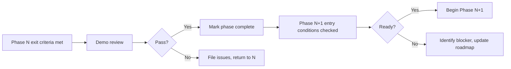

# 16 — Roadmap

> Delivery phases for Tempr — capability-gated milestones that progressively assemble a native Rust Database IDE.

---

## Purpose

This document defines how Tempr is built: a sequence of capability-gated phases, each delivering a concrete, demonstrable increment of value. It replaces date-based milestones with exit criteria that must be met before moving forward. The rationale is simple — a native IDE built on custom infrastructure (GPUI, rope buffers, tree-sitter parsers, async driver stack) cannot ship on a calendar. Dependencies between subsystems are real: the editor cannot run queries without a driver, intelligence cannot operate without a parsed buffer, and plugins cannot be stable before core features have settled. Capability gates keep the team honest about what is actually working, not what a Gantt chart says should be working.

The roadmap also serves as a living index of architecture documents. Each phase lists the specs it implements, linking to the canonical documents that define the target behavior. When a phase is complete, the corresponding docs should reflect shipped reality, not aspirational design.

---

## Responsibilities

- **Define phases** with clear entry conditions, work items, and exit criteria.
- **Link each phase to its implementing documents** so that progress is traceable from spec to code.
- **State demo criteria** — every phase ends with a concrete "you can now…" statement that a reviewer can verify without reading source.
- **Expose dependencies** between phases so that blocking relationships are visible before work begins.
- **Record v1 release criteria** as the aggregate bar that all phases must collectively clear.
- **Update itself** through a quarterly review process (see Data Flow).

This document does not assign dates, individuals, or sprint lengths. Those are project management concerns that belong outside the architecture.

---

## Design Rationale

### Why driver before editor

End-to-end value is the earliest signal that the architecture is correct. A PostgreSQL driver that can connect, execute a statement, and return rows through the event bus proves the async pipeline, the service registry, and the storage layer all work together. This happens before any UI is involved. If the driver phase surfaces a design flaw — say, backpressure handling in the streaming pipeline — it is far cheaper to fix it when the only consumer is a test harness, not a rendering engine layered on top.

The alternative — building the editor first with a mock driver — delays the integration signal and risks accumulating interface assumptions that do not survive contact with a real PostgreSQL connection.

### Why editor before intelligence

Intelligence (completion, diagnostics, hover) requires a substrate: a buffer that holds text, a parser that produces a syntax tree, and a statement boundary detector that slices the buffer into executable units. The editor provides all three. Building intelligence without this substrate means either mocking the buffer (which hides real incremental-update complexity) or coupling intelligence to a raw string (which cannot represent cursor positions, selections, or incremental parse trees). The editor phase delivers the rope buffer, tree-sitter integration, and command palette as a usable — if minimal — SQL editing experience. The intelligence phase then layers semantic analysis on top of a real, functioning editor.

### Why extensions come last

Plugin APIs must be stable surfaces. If the core changes its service contracts, event types, or buffer APIs after plugins depend on them, every plugin breaks. By deferring the plugin API until the core features (editor, driver, intelligence) are settled, the API surface reflects what is actually stable rather than what was imagined to be stable. Themes, layout persistence, and history UI are lower-risk polish work that can overlap with API stabilization.

### Capability gates over date gates

Date-based milestones produce artificial crunch and scope cuts that hide in shipping bugs. Capability gates say "phase N is done when X, Y, and Z work correctly under test." This is stricter — you cannot declare progress by calendar — but it produces a more reliable result. Phases can run in parallel where dependencies allow, or pause when a hard blocker surfaces, without pretending the blocker does not exist.

---

## Interfaces

### Phase structure

Every phase in this roadmap follows a consistent format:

| Field | Description |
|---|---|
| **Name** | Short identifier (e.g., Phase 0 — Foundations). |
| **Documents** | Architecture docs this phase implements, linked by relative path. |
| **Exit criteria** | Observable capabilities that must be verified before the phase is complete. |
| **Demo** | A concrete "you can now…" statement for stakeholder review. |

### Cross-references

Phases reference architecture documents using relative Markdown links:

```text
[09 — Database Engine](./09-database-engine.md)
```

When a phase is marked complete, the linked documents should be updated to reflect any deviations from the original design. This document is the authoritative source for *what ships when*; the individual architecture documents are authoritative for *how it works*.

### Demo verification

Each demo statement is a manual or automated check that a reviewer can execute. "Open a workspace from disk, events visible in logs" means: launch the binary, open a directory, observe structured log output from the event bus. No interpretation required.

---

## Data Flow

### Phase lifecycle



### Quarterly review

Every quarter, the team reviews this document against actual progress:

1. **Status check**: For each active phase, verify exit criteria against current test results and manual testing.
2. **Scope adjustment**: If a phase's scope has shifted (e.g., a new PostgreSQL feature became critical), update the phase description and re-link affected documents.
3. **Dependency update**: If a phase dependency changed (e.g., GPUI rendering was redesigned), update the Gantt graph and affected phases.
4. **Open question resolution**: Review open questions (below) and close any that have been resolved by implementation decisions.

Quarterly reviews are recorded as commits to this document with a summary in the commit message. The review does not change exit criteria retroactively — it only adjusts future phases and resolves questions.

### RFC process for phase changes

Any change to phase scope, ordering, or exit criteria that affects more than one phase requires an RFC. The RFC is a short document (1–2 pages) that:

- States the proposed change.
- Lists the phases affected.
- Explains why the change is necessary.
- Describes the impact on v1 release criteria.

RFCs are stored in `rfc/` and linked from this document. The team reviews RFCs asynchronously; no phase work that depends on the RFC outcome begins until the RFC is accepted or rejected.

---

## Phases

### Phase 0 — Foundations

**Documents**: [02 — Software Architecture](./02-architecture.md), [03 — Domain Model](./03-domain-model.md), [04 — Workspace Model](./04-workspace.md), [05 — Services](./05-services.md), [06 — Event System](./06-event-system.md), [07 — Storage](./07-storage.md), [14 — Project Layout](./14-project-layout.md), [15 — Coding Standards](./15-coding-standards.md)

**Exit criteria**:
- Cargo workspace builds with zero warnings on all three platforms (Linux, macOS, Windows).
- Domain types (`Workspace`, `Connection`, `Query`, `Result`) compile and pass unit tests.
- Event bus dispatches typed events to registered handlers; tests verify ordering and delivery guarantees.
- Service registry supports registration, lookup, and lifecycle (start/stop) with mock services.
- Workspace file format is read/write round-trip safe; malformed files produce structured errors.
- Storage layer writes and reads structured data to the platform-specific data directory.
- CI pipeline runs `cargo fmt --check`, `cargo clippy`, `cargo test`, and `cargo deny` on every push.
- All 16 architecture docs exist and cross-reference correctly.

**Demo**: Open a workspace from disk. Event bus activity is visible in structured log output. A mock service starts, emits events, and shuts down cleanly.

### Phase 1 — Connect & Run

**Documents**: [09 — Database Engine](./09-database-engine.md), [11 — GPUI Usage](./11-gpui.md), [13 — Result Grid](./13-result-grid.md)

**Exit criteria**:
- PostgreSQL driver connects to a live instance over TLS using the connection config from Phase 0.
- `SELECT` and `INSERT` statements execute and return rows or affected-row counts through the event bus.
- Streaming result pipeline delivers rows in batches; memory usage stays bounded regardless of result size.
- GPUI application window renders with a text input area and a scrollable result grid.
- Result grid displays streaming rows as they arrive; scrolling is smooth for result sets up to 100,000 rows.
- Connection errors, auth failures, and query syntax errors produce user-visible messages through the event system.
- Integration tests cover connect, auth failure, query execution, and streaming for at least PostgreSQL.

**Demo**: Connect to a PostgreSQL database. Type a SQL query in a basic text buffer. Execute it. See streamed rows appear in a result grid in real time.

### Phase 2 — Editor

**Documents**: [10 — Editor](./10-editor.md), [05 — Services (CommandService)](./05-services.md)

**Exit criteria**:
- Rope buffer handles documents up to 10 MB with sub-millisecond insert/delete at arbitrary positions.
- Tree-sitter PostgreSQL grammar produces an incremental syntax tree; re-parsing after a single-character edit touches only affected nodes.
- Statement detector correctly identifies statement boundaries (respecting `$$` delimiters, comments, and string literals).
- Command palette opens with a configurable keybinding, lists all registered commands, accepts fuzzy input, and executes the selected command.
- Keybindings are configurable via the workspace format; a default keybinding map is provided.
- Cursor movement, selection, copy/paste, undo/redo, and line operations work on the rope buffer.
- "Execute statement under cursor" works: parser finds the enclosing statement, sends it to the database engine, and displays results.
- No mouse action is required for any editor operation. A keyboard-only audit lists every action and its keybinding.

**Demo**: Keyboard-only workflow — open the command palette, navigate to a query file, edit a statement, execute it under the cursor, see results. No mouse used.

### Phase 3 — Intelligence

**Documents**: [12 — SQL Intelligence](./12-sql-intelligence.md)

**Exit criteria**:
- Catalog cache loads schema metadata (databases, schemas, tables, columns, types, indexes) from a connected PostgreSQL instance and caches it locally.
- Cache refreshes incrementally; full refresh is available on demand.
- Completion provider offers context-aware suggestions (tables, columns, functions, keywords) ranked by relevance.
- Completion latency from keystroke to popup is under 5 ms for cached catalogs with up to 10,000 schema objects.
- Semantic analyzer resolves column references to specific tables, detecting ambiguous and unresolvable names.
- Diagnostics are produced for syntax errors (via tree-sitter) and semantic errors (via the analyzer) in real time.
- Hover information displays column types and table definitions when the cursor rests on a reference.
- All intelligence features work offline from the local cache after initial schema load; no I/O on the request path.

**Demo**: Connect to a database with a populated schema. Type a partial table name and see schema-aware completion suggestions in under 5 ms. Hover over a column reference to see its type. Type an invalid column reference and see a diagnostic underline.

### Phase 4 — Extensibility & Polish

**Documents**: [08 — Plugin API](./08-plugin-api.md), [04 — Workspace Model (remaining surface)](./04-workspace.md), [07 — Storage (remaining surface)](./07-storage.md)

**Exit criteria**:
- Plugin API is declared stable: versioned, documented, and backward-compatible within major versions.
- Core features that can be implemented as plugins (e.g., custom result formatters, export commands) are migrated onto the plugin API as reference implementations.
- Theme system supports light and dark themes with configurable accent colors; at least one default theme ships.
- Query history is persisted and browsable via a dedicated UI panel.
- Layout state (panel sizes, open files, cursor positions) persists across application restarts.
- A third-party-style plugin (developed outside the core crate) adds a working panel and a completion provider using only the public API.
- Packaging produces platform-native bundles (`.deb`, `.rpm`, `.dmg`, `.exe`) with correct icons and metadata.
- A static plugin adds a custom panel and registers a completion provider; both work without modification to core crates.

**Demo**: Install a third-party static plugin. It adds a panel visible in the layout and provides completion suggestions in the editor. No core code was modified to support it.

---

## v1 Release Criteria

All four phases must be complete. Additionally, the following aggregate criteria must be met:

| Criterion | Target | Measurement |
|---|---|---|
| **Startup time** | < 200 ms from launch to first interactive frame | Measured on a cold start on a mid-range machine (ThinkPad X1 Carbon, 16 GB RAM) with no workspace loaded. |
| **Completion latency** | < 5 ms from keystroke to popup | Measured with 10,000 schema objects cached, PostgreSQL connection active. |
| **1M-row result scroll** | Smooth scrolling at 60 fps, peak RSS < 500 MB | Stream 1,000,000 rows into the result grid, scroll to the last row, measure frame time and memory. |
| **Keyboard-first audit** | Every user-facing action has a keybinding; no action requires a mouse | Full audit table published in the release notes. |
| **Docs 01–16** | All architecture documents match shipped behavior | Each document reviewed against the implementation; deviations recorded and linked. |
| **Cross-platform** | Linux, macOS, Windows builds pass CI and manual smoke tests | No platform-specific regressions in editor, driver, or result grid. |
| **Plugin API stability** | At least one external plugin ships against the stable API without core modifications | Demonstrated by the Phase 4 demo plugin. |
| **No known P0 bugs** | Zero open issues classified as P0 (data loss, crash, security) | Tracked in the issue tracker at release time. |

---

## Future Considerations

These items are explicitly **post-v1**. They are not part of the v1 scope but are recorded here to signal intent and guide architecture decisions that might otherwise need to be revisited.

### Additional database engines

MySQL/MariaDB driver support. The driver abstraction in Phase 1 is designed to be engine-agnostic; adding a new engine means implementing the `DatabaseDriver` trait, not restructuring the execution pipeline. SQLite support for local databases and embedded use cases is also anticipated.

### WASM plugins

WebAssembly-based plugin execution. This would allow third-party plugins to run in a sandboxed WASM runtime instead of as native Rust crates, broadening the contributor base to include non-Rust developers. The plugin API surface would need a WASM-compatible ABI layer. This is a significant undertaking and is deferred until the native plugin model is proven.

### AI-assisted query generation

Integration with LLM providers for natural-language-to-SQL translation, query optimization suggestions, and schema documentation generation. This requires a provider abstraction layer, streaming token handling, and careful UX design to avoid interrupting keyboard flow. The intelligence layer from Phase 3 provides the schema context that AI features would consume.

### Collaboration features

Real-time multi-user editing of query files and shared result sets. This is a fundamentally different architecture concern (conflict resolution, presence, permissions) and is out of scope for a single-user v1.

### Theme marketplace

A community-driven theme repository with install, preview, and rating. This depends on the plugin/theme system being stable and having enough adoption to justify the infrastructure.

---

## Open Questions

These are unresolved design or process questions that must be answered before or during the affected phase.

| # | Question | Affects | Status |
|---|---|---|---|
| 1 | **Beta program timing**: Should a closed beta begin after Phase 2 (usable editor) or after Phase 3 (intelligence)? Earlier beta means more feedback but a rougher experience. | v1 timeline, Phase 4 | Open |
| 2 | **Release cadence**: After v1, should Tempr adopt a fixed release schedule (e.g., every 8 weeks) or a rolling release model (ship when ready)? Fixed cadence gives users predictability; rolling avoids artificial crunch. | Post-v1 | Open |
| 3 | **Plugin distribution**: Should plugins be distributed via a central registry, a Git-based model, or both? A central registry enables discovery and trust but requires infrastructure. Git-based is simpler but harder for users to browse. | Phase 4, post-v1 | Open |
| 4 | **Multi-engine catalog caching**: When multiple database engines are supported (post-v1), should each engine have its own cache namespace, or should there be a unified catalog model with engine-specific extensions? | Phase 3 architecture, post-v1 | Open |
| 5 | **GPUI fork strategy**: Should Tempr maintain a fork of GPUI or depend on upstream? Forking gives control but increases maintenance burden; upstream dependency means accepting breaking changes. | Phase 1, ongoing | Open |

---

## Related Documents

- [01 — Vision](./01-vision.md)
- [02 — Software Architecture](./02-architecture.md)
- [03 — Domain Model](./03-domain-model.md)
- [04 — Workspace Model](./04-workspace.md)
- [05 — Services](./05-services.md)
- [06 — Event System](./06-event-system.md)
- [07 — Storage](./07-storage.md)
- [08 — Plugin API](./08-plugin-api.md)
- [09 — Database Engine](./09-database-engine.md)
- [10 — Editor](./10-editor.md)
- [11 — GPUI Usage](./11-gpui.md)
- [12 — SQL Intelligence](./12-sql-intelligence.md)
- [13 — Result Grid](./13-result-grid.md)
- [14 — Project Layout](./14-project-layout.md)
- [15 — Coding Standards](./15-coding-standards.md)
- [RFC Process](../rfc/README.md)
