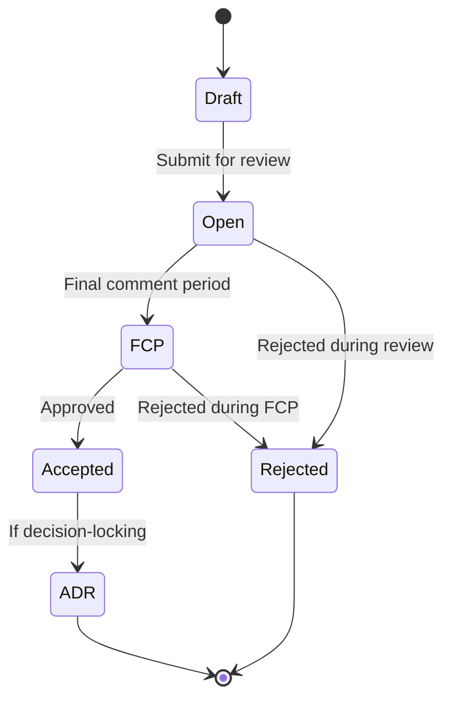

# RFC Process

## Purpose

RFCs are for proposing substantial changes — new features, architecture changes, anything touching a locked decision. ADRs record what was decided.

## When an RFC is Required

An RFC is required whenever a change:

- Alters a documented interface
- Adds a new dependency
- Changes UX conventions
- Contradicts any of docs 01–16

**Rule of thumb:** If a plain PR can be understood, reviewed, and merged without referencing any architectural document, an RFC is not needed.

## Process

### Stages

1. **Draft** — Author writes the RFC. No review timer yet.
2. **Open for Review** — Submitted for review. Minimum 7 days.
3. **Final Comment Period (FCP)** — 72 hours for last-call feedback.
4. **Accepted / Rejected** — Maintainers decide via lazy consensus.
5. **ADR Written** — If the RFC is decision-locking, an ADR is created to record the accepted decision.

## Numbering

Files are named `NNNN-kebab-title.md` with sequential numbers: `0000-`, `0001-`, etc.

## Who Can Propose / Who Decides

- **Anyone** can propose an RFC.
- **Maintainers** decide via lazy consensus.

## Amendments

Accepted RFCs are immutable. Amendments are new RFCs that reference the original.
